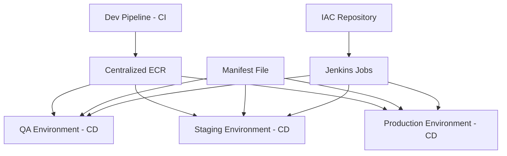
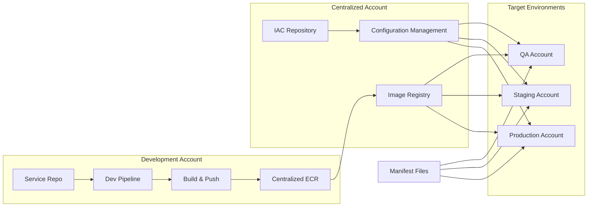
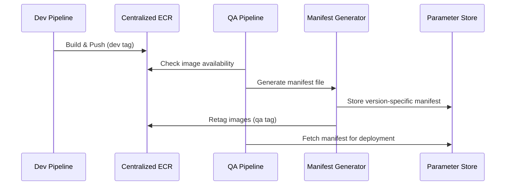
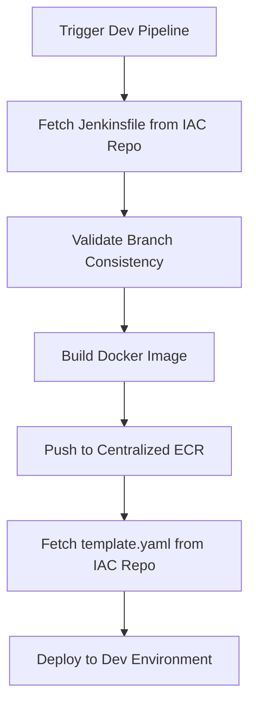
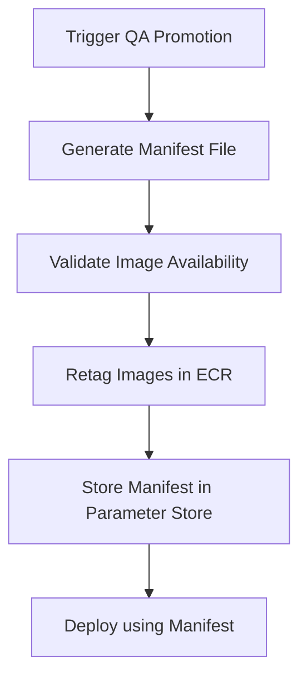
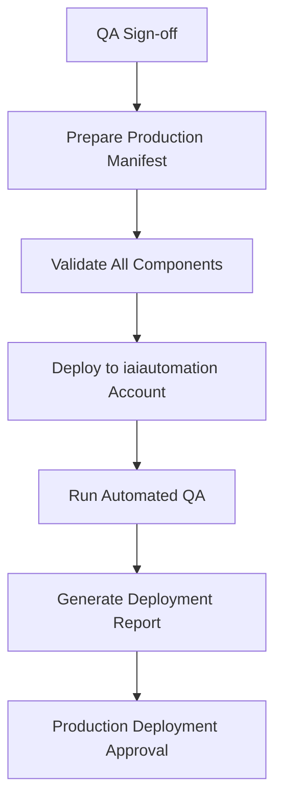

# Manifest-Driven Deployment Project Proposal

## Executive Summary

The Manifest-Driven Deployment initiative aims to revolutionize our DevSecOps pipeline by implementing a centralized ECR (Elastic Container Registry) solution with manifest-based deployment orchestration. This approach will significantly reduce deployment times, eliminate redundant builds, and provide a single source of truth for all container images across environments.

## Table of Contents

1. [Problem Statement](#problem-statement)
2. [Solution Overview](#solution-overview)
3. [Architecture](#architecture)
4. [Implementation Details](#implementation-details)
5. [Benefits](#benefits)
6. [Deployment Flows](#deployment-flows)
7. [Directory Structure](#directory-structure)
8. [Current Status](#current-status)
9. [Next Steps](#next-steps)
10. [Stakeholders](#stakeholders)

## Problem Statement

### Current Challenges

- **Multiple Image Versions**: Purple Fabric platform runs multiple microservices (pods, lambdas) with various image versions
- **Environment Recreation Complexity**: Difficulty in identifying stable/qualified images when deploying to any environment
- **Redundant Builds**: Each environment triggers separate builds, leading to inefficiency
- **Configuration Management**: Hardcoded configurations in K8s and Lambda deployments
- **Deployment Time**: Slow promotion process across environments due to rebuild requirements

## Solution Overview

### Centralized ECR Approach



### Key Principles

1. **Single Build**: Images built once in dev pipeline and promoted via retagging
2. **Manifest-Driven**: Version-specific manifest files act as deployment blueprints
3. **Centralized Configuration**: All infrastructure configurations managed in IAC repository
4. **Automated Promotion**: Streamlined promotion pipeline with automated checks

## Architecture

### High-Level Architecture



### Component Details

#### 1. Centralized ECR
- **Purpose**: Single source of truth for all container images
- **Location**: Dedicated AWS account
- **Access**: Cross-account access policies for all environments
- **Tagging Strategy**: Environment-specific tags (dev, qa, staging, prod)

#### 2. Manifest Files
- **Format**: JSON files containing image URIs and version information
- **Storage**: 
  - IAC Repository (master branch)
  - AWS Parameter Store (version-specific paths)
- **Versioning**: Semantic versioning (e.g., 25.3.0.0)

#### 3. IAC Repository
- **Purpose**: Centralized infrastructure configuration management
- **Contents**: 
  - Helm charts for Kubernetes services
  - CloudFormation templates for Lambda functions
  - Jenkins pipeline definitions
  - Environment-specific configurations

## Implementation Details

### Manifest File Structure

#### Lambda Manifest Example
```json
{
  "version": "25.3.0.0",
  "services": {
    "chunk-asset": {
      "image_uri": "123456789012.dkr.ecr.us-east-1.amazonaws.com/chunk-asset:25.3.0.0",
      "tag": "25.3.0.0"
    },
    "chunk-init-asset": {
      "image_uri": "123456789012.dkr.ecr.us-east-1.amazonaws.com/chunk-init-asset:25.3.0.0",
      "tag": "25.3.0.0"
    }
  }
}
```

#### Parameter Store Paths
```
/PF/lambda/25.3.0.0
/PF/k8s/25.3.0.0
/Fabric/lambda/25.3.0.0
/Fabric/k8s/25.3.0.0
```

### Promotion Pipeline



## Benefits

### Performance Improvements
- **Faster Deployments**: No rebuild required for environment promotion
- **Reduced Build Time**: Single build per code change
- **Parallel Deployments**: Multiple environments can deploy simultaneously

### Operational Benefits
- **Consistency**: Same image across all environments
- **Traceability**: Clear audit trail of image promotions
- **Rollback Capability**: Easy rollback using previous manifest versions
- **Pre-deployment Validation**: Automated checks before deployment

### Cost Optimization
- **Reduced Compute**: Fewer build operations
- **Storage Efficiency**: Single image storage with multiple tags
- **Resource Utilization**: Better utilization of CI/CD resources

## Deployment Flows

### Dev Environment Deployment



### QA Environment Deployment



### Production Deployment



## Directory Structure

### IAC Repository Structure
```
idxp_map_infra_iac_svc/
│
├── <service_name>/
│   ├── <service_name>/                    # Helm chart for K8s microservice
│   │   ├── Chart.yaml
│   │   ├── values.yaml
│   │   └── templates/
│   │       ├── deployment.yaml
│   │       ├── service.yaml
│   │       ├── ingress.yaml
│   │       ├── configmap.yaml
│   │       ├── keda-scaledobject.yaml
│   │       └── _helpers.tpl
│   ├── lambda/                           # Lambda IaC templates
│   │   └── <lambda_service_name>/
│   │       └── lambda/
│   │           ├── template.yaml         # Internal lambda template
│   │           └── template_v1.yaml      # Customer-specific template
│   └── qa-<service_name>.yaml           # Environment-specific overrides
│
└── README.md
```

### Future Lambda Structure
```
├── lambda/                              # Dedicated folder for Lambda IaC
│   ├── <lambda_service_name>/          # Each Lambda service subdirectory
│   │   ├── lambda/
│   │   │   ├── template.yaml           # Primary CloudFormation template
│   │   │   └── template_v1.yaml        # Versioned template
│   │   └── resource/
│   │       └── sns-sqs-template.yaml   # SNS/SQS definitions
```

## Current Status

### Completed Components ✅
1. **Centralized ECR Repository**: Single region setup complete
2. **Centralized IAC Repository**: Synced up to version 25.3.0.0
3. **iaiautomation Account**: Deployed with version 25.3.0.0
4. **Pilot Testing**: Centralized Helm and ECR validation completed

### In Progress 🔄
1. Dev pipeline updates for ECR integration
2. Jenkins file preparation and migration
3. Manifest file generation process
4. Lambda zip-to-image conversion

## Next Steps

### Phase 1: Foundation (Weeks 1-4)
- [ ] Update dev pipelines to push to centralized ECR
- [ ] Migrate all Jenkinsfiles to IAC repository
- [ ] Implement manifest file generation process
- [ ] Create promotion pipeline jobs

### Phase 2: Integration (Weeks 5-8)
- [ ] Convert remaining Lambda functions from zip to container images
- [ ] Implement automated QA integration in iaiautomation account
- [ ] Set up cross-account ECR access policies
- [ ] Create deployment validation scripts

### Phase 3: Optimization (Weeks 9-12)
- [ ] Implement automated template generation
- [ ] Set up monitoring and alerting
- [ ] Create rollback procedures
- [ ] Performance optimization and tuning

## Stakeholders

### Responsibilities Matrix

| Component | Owner | Responsibilities |
|-----------|-------|------------------|
| **PF Service IAC Files** | DevSecOps Team | Jenkins files, K8s Helm charts, IAC repo management |
| **iaiautomation Account** | DevSecOps Team | Account management, deployment validation |
| **Centralized ECR & Docker Hub** | DevOps Team | Image registry management, IAC repo files |
| **Fabric IAC Files** | Fabric Team | External IAC repo management (CodeCommit) |
| **Automated QA Scripts** | QA Team | Test case management, version-specific testing |

### Communication Plan
- **Weekly Status Updates**: Every Friday
- **Milestone Reviews**: End of each phase
- **Issue Escalation**: 24-hour response time for blockers
- **Documentation Updates**: Real-time updates to this document

## Risk Assessment

### Technical Risks
| Risk | Impact | Probability | Mitigation |
|------|--------|-------------|------------|
| ECR Cross-account Access Issues | High | Medium | Thorough testing in dev environment |
| Manifest File Corruption | High | Low | Backup storage in multiple locations |
| Pipeline Failures | Medium | Medium | Comprehensive error handling and rollback |

### Operational Risks
| Risk | Impact | Probability | Mitigation |
|------|--------|-------------|------------|
| Team Adoption Resistance | Medium | Medium | Training and gradual rollout |
| Increased Complexity | Medium | High | Comprehensive documentation and automation |
| Dependency on Central Services | High | Low | Redundancy and failover mechanisms |

## Success Metrics

### Performance Metrics
- **Deployment Time Reduction**: Target 50% reduction in deployment time
- **Build Frequency**: Reduce builds by 70% across environments
- **Error Rate**: Maintain <2% deployment failure rate

### Operational Metrics
- **Mean Time to Recovery (MTTR)**: Target <30 minutes
- **Deployment Frequency**: Enable daily deployments
- **Lead Time**: Reduce feature delivery time by 40%

## Conclusion

The Manifest-Driven Deployment initiative represents a significant advancement in our DevSecOps capabilities. By implementing centralized ECR with manifest-based deployments, we will achieve faster, more reliable, and cost-effective deployments while maintaining the highest standards of security and compliance.

The phased approach ensures minimal disruption to current operations while providing immediate benefits as each component is implemented. With strong stakeholder commitment and clear success metrics, this project will establish a foundation for scalable, efficient deployment practices across all environments.

---

**Document Version**: 1.0  
**Last Updated**: December 13, 2025  
**Next Review**: January 13, 2026  
**Prepared By**: DevSecOps Team  
**Approved By**: [Pending Approval]
