# Product Security & IP Protection Framework
## For Image-Based Lambda + Kubernetes Deployments in Customer Environments

---

## **Executive Summary**

This document provides a comprehensive security framework for deploying containerized products (Lambda + K8s) to customer environments with:
1. ✅ **Anti-Tampering Protection** - Cryptographic verification prevents image modification
2. ✅ **IP Protection** - Prevents copying and unauthorized use of your code
3. ✅ **Kill Switch Mechanism** - Validates product licensing and image integrity, shuts down if violated
4. ✅ **Continuous Verification** - Runtime checks ensure delivered images match running containers

---

## **Table of Contents**

1. [Architecture Overview](#1-architecture-overview)
2. [Image Protection Strategy](#2-image-protection-strategy)
3. [Kill Switch Implementation](#3-kill-switch-implementation)
4. [Lambda Function Protection](#4-lambda-function-protection)
5. [Kubernetes Service Protection](#5-kubernetes-service-protection)
6. [License Validation System](#6-license-validation-system)
7. [Runtime Integrity Monitoring](#7-runtime-integrity-monitoring)
8. [Deployment Process](#8-deployment-process)
9. [Customer Environment Setup](#9-customer-environment-setup)
10. [Monitoring & Alerting](#10-monitoring--alerting)

---

## **1. Architecture Overview**

### **1.1 Your Product Deployment Flow**

```
Your Build Environment
├── Lambda Functions (Container Images)
├── K8s Services (Container Images)
└── License/Validation Server (Your Control)
    ↓
Customer AWS Account
├── Lambda Functions (Verified & Licensed)
├── EKS/K8s Cluster (Verified & Licensed)
└── Validation Agent (Continuous Check)
```

### **1.2 Protection Layers**

| Layer | Technology | Purpose |
|-------|-----------|---------|
| **Image Signing** | Cosign + KMS | Prevents tampering, ensures authenticity |
| **Image Encryption** | AWS ECR Encryption + Custom Layer | Prevents IP theft |
| **SBOM + Attestation** | Syft + in-toto | Supply chain verification |
| **License Validation** | JWT + Your License Server | Product authorization |
| **Runtime Verification** | Sidecar + Init Container | Continuous integrity check |
| **Kill Switch** | Validation Agent | Automatic shutdown on violation |

---

## **2. Image Protection Strategy**

### **2.1 Multi-Layer Image Security**

#### **Layer 1: Image Signing (Anti-Tampering)**

```bash
# Build and sign your images
docker build -t your-product/service:v1.0.0 .

# Sign with your private key (store in AWS KMS)
cosign sign \
  --key awskms:///arn:aws:kms:region:account:key/your-key-id \
  --annotations product-id=your-product \
  --annotations version=v1.0.0 \
  --annotations customer-id=${CUSTOMER_ID} \
  --annotations license-hash=${LICENSE_HASH} \
  ${ECR_REPO}/your-product/service:v1.0.0

# Generate image digest for license binding
IMAGE_DIGEST=$(docker inspect --format='{{.RepoDigests}}' ${ECR_REPO}/your-product/service:v1.0.0)
```

#### **Layer 2: SBOM Generation (Supply Chain Verification)**

```bash
# Generate SBOM
syft ${ECR_REPO}/your-product/service:v1.0.0 \
  --output spdx-json=sbom.spdx.json

# Sign and attach SBOM
cosign attach sbom --sbom sbom.spdx.json ${ECR_REPO}/your-product/service:v1.0.0
cosign sign --key awskms:///... --attachment sbom ${ECR_REPO}/your-product/service:v1.0.0
```

#### **Layer 3: Image Encryption (IP Protection)**

```bash
# Encrypt image layers (prevents customer from extracting code)
# Option 1: Use AWS ECR encryption at rest (basic)
aws ecr put-repository-policy \
  --repository-name your-product/service \
  --policy-text file://encryption-policy.json

# Option 2: Encrypt specific layers before push (advanced)
# This makes the image unusable without decryption key
crane append \
  --base ${IMAGE} \
  --new_layer encrypted-layer.tar.gz \
  --new_tag ${ENCRYPTED_IMAGE}
```

### **2.2 License-Bound Image Deployment**

```json
{
  "product_id": "your-product-xyz",
  "customer_id": "customer-abc-123",
  "license_key": "signed-jwt-token",
  "allowed_images": [
    {
      "image": "your-product/lambda-auth:v1.0.0",
      "digest": "sha256:abc123...",
      "signature": "cosign-signature"
    },
    {
      "image": "your-product/k8s-api:v1.0.0", 
      "digest": "sha256:def456...",
      "signature": "cosign-signature"
    }
  ],
  "expiration": "2025-12-31T23:59:59Z",
  "validation_endpoint": "https://license.yourcompany.com/validate"
}
```

---

## **3. Kill Switch Implementation**

### **3.1 Architecture**

```
┌─────────────────────────────────────────────────────────┐
│                 Customer Environment                      │
│                                                           │
│  ┌─────────────┐         ┌──────────────────┐          │
│  │   Lambda    │◄────────┤ Validation Agent │          │
│  │  Functions  │         └────────┬─────────┘          │
│  └─────────────┘                  │                     │
│                                    │                     │
│  ┌─────────────┐                  │                     │
│  │     K8s     │◄─────────────────┤                     │
│  │  Services   │                  │                     │
│  └─────────────┘                  │                     │
│                                    │                     │
└────────────────────────────────────┼─────────────────────┘
                                     │
                          ┌──────────▼───────────┐
                          │  Your License Server  │
                          │  (Your Control)       │
                          │  - Validate License   │
                          │  - Check Image Hash   │
                          │  - Return Kill Signal │
                          └──────────────────────┘
```

### **3.2 Validation Agent Implementation**

```python
#!/usr/bin/env python3
"""
Product Validation Agent
Runs in customer environment, continuously validates product integrity
"""
import boto3
import requests
import hashlib
import jwt
import time
import json
from datetime import datetime

class ProductValidationAgent:
    def __init__(self, config):
        self.license_server = config['license_server']
        self.customer_id = config['customer_id']
        self.product_id = config['product_id']
        self.license_key = config['license_key']
        self.check_interval = config.get('check_interval', 300)  # 5 minutes
        
        self.ecr_client = boto3.client('ecr')
        self.lambda_client = boto3.client('lambda')
        self.eks_client = boto3.client('eks')
        
    def validate_license(self):
        """Validate license with your server"""
        try:
            response = requests.post(
                f"{self.license_server}/api/v1/validate",
                json={
                    'customer_id': self.customer_id,
                    'product_id': self.product_id,
                    'license_key': self.license_key
                },
                timeout=10
            )
            
            if response.status_code != 200:
                return False, "License validation failed"
                
            data = response.json()
            
            # Check expiration
            expiration = datetime.fromisoformat(data['expiration'])
            if datetime.now() > expiration:
                return False, "License expired"
                
            return True, data
            
        except Exception as e:
            return False, f"Validation error: {str(e)}"
    
    def get_running_image_digests(self):
        """Get digests of currently running images"""
        digests = {}
        
        # Get Lambda function images
        lambda_functions = self.get_product_lambda_functions()
        for func in lambda_functions:
            image_uri = func['ImageUri']
            # Extract digest from image URI
            if '@sha256:' in image_uri:
                digest = image_uri.split('@')[1]
                digests[func['FunctionName']] = {
                    'type': 'lambda',
                    'image': image_uri,
                    'digest': digest
                }
        
        # Get K8s pod images
        k8s_images = self.get_k8s_running_images()
        digests.update(k8s_images)
        
        return digests
    
    def verify_image_integrity(self, running_digests, licensed_images):
        """Verify running images match licensed images"""
        violations = []
        
        for name, running in running_digests.items():
            # Check if image is in licensed list
            licensed = next(
                (img for img in licensed_images 
                 if img['digest'] in running['digest']),
                None
            )
            
            if not licensed:
                violations.append({
                    'type': 'unauthorized_image',
                    'name': name,
                    'digest': running['digest']
                })
            else:
                # Verify signature
                if not self.verify_cosign_signature(running['image'], licensed['signature']):
                    violations.append({
                        'type': 'signature_mismatch',
                        'name': name,
                        'digest': running['digest']
                    })
        
        return violations
    
    def verify_cosign_signature(self, image_uri, expected_signature):
        """Verify image signature using cosign"""
        import subprocess
        try:
            result = subprocess.run(
                ['cosign', 'verify', '--key', '/etc/product/cosign.pub', image_uri],
                capture_output=True,
                timeout=30
            )
            return result.returncode == 0
        except:
            return False
    
    def trigger_kill_switch(self, violations):
        """Shut down all product components"""
        print(f"⚠️  KILL SWITCH ACTIVATED - Violations: {len(violations)}")
        
        # Kill Lambda functions
        lambda_functions = self.get_product_lambda_functions()
        for func in lambda_functions:
            try:
                # Update function to use dummy/error image
                self.lambda_client.update_function_configuration(
                    FunctionName=func['FunctionName'],
                    Environment={
                        'Variables': {
                            'PRODUCT_DISABLED': 'true',
                            'VIOLATION_REASON': json.dumps(violations)
                        }
                    }
                )
                print(f"✓ Disabled Lambda: {func['FunctionName']}")
            except Exception as e:
                print(f"✗ Failed to disable Lambda {func['FunctionName']}: {e}")
        
        # Kill K8s deployments
        self.kill_k8s_deployments()
        
        # Notify your server
        self.notify_kill_switch_activation(violations)
    
    def kill_k8s_deployments(self):
        """Scale down all product deployments to 0"""
        import subprocess
        
        # Get deployments with product label
        cmd = [
            'kubectl', 'get', 'deployments',
            '-l', f'product={self.product_id}',
            '-o', 'json'
        ]
        
        result = subprocess.run(cmd, capture_output=True, text=True)
        deployments = json.loads(result.stdout)
        
        for deployment in deployments.get('items', []):
            name = deployment['metadata']['name']
            namespace = deployment['metadata']['namespace']
            
            # Scale to 0
            subprocess.run([
                'kubectl', 'scale', 'deployment', name,
                '--namespace', namespace,
                '--replicas=0'
            ])
            print(f"✓ Scaled down deployment: {namespace}/{name}")
    
    def notify_kill_switch_activation(self, violations):
        """Notify your server about kill switch activation"""
        try:
            requests.post(
                f"{self.license_server}/api/v1/kill-switch",
                json={
                    'customer_id': self.customer_id,
                    'product_id': self.product_id,
                    'timestamp': datetime.now().isoformat(),
                    'violations': violations
                },
                timeout=10
            )
        except:
            pass  # Best effort notification
    
    def get_product_lambda_functions(self):
        """Get all Lambda functions belonging to product"""
        functions = []
        response = self.lambda_client.list_functions()
        
        for func in response['Functions']:
            # Filter by tags or naming convention
            tags = self.lambda_client.list_tags(Resource=func['FunctionArn'])
            if tags.get('Tags', {}).get('ProductId') == self.product_id:
                functions.append({
                    'FunctionName': func['FunctionName'],
                    'FunctionArn': func['FunctionArn'],
                    'ImageUri': func.get('PackageType') == 'Image' and func.get('Code', {}).get('ImageUri')
                })
        
        return functions
    
    def get_k8s_running_images(self):
        """Get running images from K8s pods"""
        import subprocess
        
        cmd = [
            'kubectl', 'get', 'pods',
            '-l', f'product={self.product_id}',
            '-o', 'json'
        ]
        
        result = subprocess.run(cmd, capture_output=True, text=True)
        pods = json.loads(result.stdout)
        
        images = {}
        for pod in pods.get('items', []):
            for container in pod['spec']['containers']:
                image = container['image']
                if '@sha256:' in image:
                    digest = image.split('@')[1]
                    images[f"{pod['metadata']['name']}/{container['name']}"] = {
                        'type': 'kubernetes',
                        'image': image,
                        'digest': digest
                    }
        
        return images
    
    def run(self):
        """Main validation loop"""
        print(f"🔍 Product Validation Agent Started")
        print(f"   Product ID: {self.product_id}")
        print(f"   Customer ID: {self.customer_id}")
        print(f"   Check Interval: {self.check_interval}s")
        
        while True:
            try:
                # Step 1: Validate license
                license_valid, license_data = self.validate_license()
                
                if not license_valid:
                    print(f"❌ License validation failed: {license_data}")
                    self.trigger_kill_switch([{
                        'type': 'license_invalid',
                        'reason': license_data
                    }])
                    break
                
                print(f"✅ License valid until: {license_data['expiration']}")
                
                # Step 2: Get running images
                running_digests = self.get_running_image_digests()
                print(f"📊 Found {len(running_digests)} running containers")
                
                # Step 3: Verify image integrity
                violations = self.verify_image_integrity(
                    running_digests,
                    license_data['allowed_images']
                )
                
                if violations:
                    print(f"⚠️  Found {len(violations)} violations!")
                    for v in violations:
                        print(f"   - {v['type']}: {v['name']}")
                    
                    self.trigger_kill_switch(violations)
                    break
                
                print(f"✅ All images verified - Product operational")
                
            except Exception as e:
                print(f"❌ Validation error: {str(e)}")
                # Optionally trigger kill switch on repeated failures
            
            time.sleep(self.check_interval)


# Configuration
if __name__ == "__main__":
    config = {
        'license_server': 'https://license.yourcompany.com',
        'customer_id': 'customer-abc-123',
        'product_id': 'your-product-xyz',
        'license_key': 'eyJ0eXAiOiJKV1QiLCJhbGc...',  # JWT token
        'check_interval': 300  # 5 minutes
    }
    
    agent = ProductValidationAgent(config)
    agent.run()
```

---

## **4. Lambda Function Protection**

### **4.1 Lambda Deployment with Validation**

```bash
#!/bin/bash
# deploy-lambda-with-protection.sh

CUSTOMER_ID=$1
FUNCTION_NAME=$2
IMAGE_URI=$3
LICENSE_KEY=$4

# Step 1: Verify image signature before deployment
echo "🔍 Verifying image signature..."
if ! cosign verify --key /path/to/cosign.pub ${IMAGE_URI}; then
    echo "❌ Image signature verification failed!"
    exit 1
fi

# Step 2: Extract image digest
IMAGE_DIGEST=$(aws ecr describe-images \
    --repository-name ${REPO_NAME} \
    --image-ids imageTag=${TAG} \
    --query 'imageDetails[0].imageDigest' \
    --output text)

# Step 3: Deploy Lambda with validation layer
aws lambda create-function \
    --function-name ${FUNCTION_NAME} \
    --package-type Image \
    --code ImageUri=${IMAGE_URI}@${IMAGE_DIGEST} \
    --role ${LAMBDA_ROLE_ARN} \
    --environment Variables="{
        PRODUCT_ID=your-product-xyz,
        CUSTOMER_ID=${CUSTOMER_ID},
        LICENSE_KEY=${LICENSE_KEY},
        VALIDATION_ENDPOINT=https://license.yourcompany.com/validate,
        IMAGE_DIGEST=${IMAGE_DIGEST}
    }" \
    --tags ProductId=your-product-xyz,CustomerID=${CUSTOMER_ID}

echo "✅ Lambda deployed with protection"
```

### **4.2 Lambda Validation Layer (Embedded in Image)**

```python
# lambda_validation.py
# This runs at Lambda cold start to validate before processing

import os
import json
import requests
import hashlib
import boto3
from datetime import datetime

def validate_on_startup():
    """Validate product integrity before allowing Lambda to run"""
    
    # Read environment variables
    product_id = os.environ['PRODUCT_ID']
    customer_id = os.environ['CUSTOMER_ID']
    license_key = os.environ['LICENSE_KEY']
    validation_endpoint = os.environ['VALIDATION_ENDPOINT']
    expected_digest = os.environ['IMAGE_DIGEST']
    
    # Step 1: Validate license
    try:
        response = requests.post(
            f"{validation_endpoint}/validate",
            json={
                'product_id': product_id,
                'customer_id': customer_id,
                'license_key': license_key,
                'image_digest': expected_digest
            },
            timeout=5
        )
        
        if response.status_code != 200:
            raise Exception("License validation failed")
        
        data = response.json()
        
        # Check expiration
        if datetime.now() > datetime.fromisoformat(data['expiration']):
            raise Exception("License expired")
        
    except Exception as e:
        print(f"❌ Validation failed: {str(e)}")
        # Kill Lambda by raising exception
        raise RuntimeError(f"Product validation failed: {str(e)}")
    
    # Step 2: Verify running image digest
    # Get current Lambda configuration
    lambda_client = boto3.client('lambda')
    function_name = os.environ['AWS_LAMBDA_FUNCTION_NAME']
    
    func_config = lambda_client.get_function(FunctionName=function_name)
    current_image = func_config['Code']['ImageUri']
    
    if expected_digest not in current_image:
        raise RuntimeError("Image digest mismatch - potential tampering detected!")
    
    print("✅ Product validation passed")
    return True


# Lambda handler wrapper
def lambda_handler(event, context):
    """Main Lambda handler with validation"""
    
    # Validate on every invocation (or cache validation result)
    if not hasattr(lambda_handler, 'validated'):
        validate_on_startup()
        lambda_handler.validated = True
    
    # Your actual business logic here
    return {
        'statusCode': 200,
        'body': json.dumps({'message': 'Success'})
    }
```

---

## **5. Kubernetes Service Protection**

### **5.1 K8s Deployment with Validation Sidecar**

```yaml
apiVersion: apps/v1
kind: Deployment
metadata:
  name: your-product-api
  namespace: customer-product
  labels:
    product: your-product-xyz
    customer: customer-abc-123
spec:
  replicas: 3
  selector:
    matchLabels:
      app: product-api
      product: your-product-xyz
  template:
    metadata:
      labels:
        app: product-api
        product: your-product-xyz
    spec:
      # Init container - validates before starting main app
      initContainers:
        - name: validation-init
          image: your-registry/product-validator:v1.0.0
          env:
            - name: PRODUCT_ID
              value: "your-product-xyz"
            - name: CUSTOMER_ID
              valueFrom:
                secretKeyRef:
                  name: product-license
                  key: customer-id
            - name: LICENSE_KEY
              valueFrom:
                secretKeyRef:
                  name: product-license
                  key: license-key
            - name: VALIDATION_ENDPOINT
              value: "https://license.yourcompany.com/validate"
            - name: EXPECTED_IMAGE_DIGEST
              value: "sha256:abc123def456..."
          volumeMounts:
            - name: validation-status
              mountPath: /validation
          command:
            - /bin/sh
            - -c
            - |
              #!/bin/sh
              # Validate license and image
              /app/validate.sh
              if [ $? -eq 0 ]; then
                echo "validated" > /validation/status
                exit 0
              else
                echo "failed" > /validation/status
                exit 1
              fi
      
      containers:
        # Main application container
        - name: api
          image: your-registry/product-api:v1.0.0@sha256:abc123def456...
          imagePullPolicy: Always
          env:
            - name: PRODUCT_ID
              value: "your-product-xyz"
            - name: LICENSE_KEY
              valueFrom:
                secretKeyRef:
                  name: product-license
                  key: license-key
          ports:
            - containerPort: 8080
          volumeMounts:
            - name: validation-status
              mountPath: /validation
              readOnly: true
          # Liveness probe checks validation status
          livenessProbe:
            exec:
              command:
                - cat
                - /validation/status
            initialDelaySeconds: 10
            periodSeconds: 60
          # Readiness probe
          readinessProbe:
            httpGet:
              path: /health
              port: 8080
            initialDelaySeconds: 5
            periodSeconds: 10
          securityContext:
            runAsNonRoot: true
            runAsUser: 10001
            readOnlyRootFilesystem: true
            allowPrivilegeEscalation: false
            capabilities:
              drop:
                - ALL
        
        # Validation sidecar - continuous monitoring
        - name: validation-sidecar
          image: your-registry/product-validator:v1.0.0
          env:
            - name: PRODUCT_ID
              value: "your-product-xyz"
            - name: CUSTOMER_ID
              valueFrom:
                secretKeyRef:
                  name: product-license
                  key: customer-id
            - name: LICENSE_KEY
              valueFrom:
                secretKeyRef:
                  name: product-license
                  key: license-key
            - name: VALIDATION_ENDPOINT
              value: "https://license.yourcompany.com/validate"
            - name: CHECK_INTERVAL
              value: "300"  # 5 minutes
            - name: EXPECTED_IMAGE_DIGEST
              value: "sha256:abc123def456..."
          volumeMounts:
            - name: validation-status
              mountPath: /validation
            - name: cosign-pub-key
              mountPath: /keys
              readOnly: true
          command:
            - /app/continuous-validator
          # If sidecar dies, pod is restarted
          livenessProbe:
            httpGet:
              path: /healthz
              port: 9090
            initialDelaySeconds: 30
            periodSeconds: 30
      
      volumes:
        - name: validation-status
          emptyDir: {}
        - name: cosign-pub-key
          secret:
            secretName: cosign-public-key
---
apiVersion: v1
kind: Secret
metadata:
  name: product-license
  namespace: customer-product
type: Opaque
data:
  customer-id: Y3VzdG9tZXItYWJjLTEyMw==  # base64 encoded
  license-key: ZXlKMGVYQWlPaUpLVjFRaUxDSmhiR2M...  # base64 encoded JWT
---
apiVersion: v1
kind: Secret
metadata:
  name: cosign-public-key
  namespace: customer-product
type: Opaque
data:
  cosign.pub: LS0tLS1CRUdJTiBQVUJMSUMgS0VZLS0tLS0K...  # base64 encoded public key
```

### **5.2 Validation Sidecar Code**

```python
#!/usr/bin/env python3
# continuous-validator.py
# Runs as sidecar, continuously validates product

import os
import time
import requests
import subprocess
import signal
import sys
from datetime import datetime
from flask import Flask, jsonify

app = Flask(__name__)

class ContinuousValidator:
    def __init__(self):
        self.product_id = os.environ['PRODUCT_ID']
        self.customer_id = os.environ['CUSTOMER_ID']
        self.license_key = os.environ['LICENSE_KEY']
        self.validation_endpoint = os.environ['VALIDATION_ENDPOINT']
        self.check_interval = int(os.environ.get('CHECK_INTERVAL', 300))
        self.expected_digest = os.environ['EXPECTED_IMAGE_DIGEST']
        self.healthy = True
        
    def validate(self):
        """Perform validation check"""
        try:
            # Validate license
            response = requests.post(
                f"{self.validation_endpoint}/validate",
                json={
                    'product_id': self.product_id,
                    'customer_id': self.customer_id,
                    'license_key': self.license_key,
                    'image_digest': self.expected_digest
                },
                timeout=10
            )
            
            if response.status_code != 200:
                print(f"❌ License validation failed: {response.status_code}")
                return False
            
            data = response.json()
            
            # Check expiration
            expiration = datetime.fromisoformat(data['expiration'])
            if datetime.now() > expiration:
                print(f"❌ License expired: {data['expiration']}")
                return False
            
            # Verify image signature
            if not self.verify_image_signature():
                print(f"❌ Image signature verification failed")
                return False
            
            print(f"✅ Validation passed at {datetime.now().isoformat()}")
            return True
            
        except Exception as e:
            print(f"❌ Validation error: {str(e)}")
            return False
    
    def verify_image_signature(self):
        """Verify running image signature"""
        # Get current pod's image
        pod_name = os.environ.get('HOSTNAME')
        namespace = open('/var/run/secrets/kubernetes.io/serviceaccount/namespace').read()
        
        try:
            cmd = f"kubectl get pod {pod_name} -n {namespace} -o jsonpath='{{.spec.containers[0].image}}'"
            result = subprocess.run(cmd, shell=True, capture_output=True, text=True)
            current_image = result.stdout.strip()
            
            # Verify digest matches
            if self.expected_digest not in current_image:
                print(f"❌ Image digest mismatch!")
                print(f"   Expected: {self.expected_digest}")
                print(f"   Current: {current_image}")
                return False
            
            # Verify cosign signature
            result = subprocess.run(
                ['cosign', 'verify', '--key', '/keys/cosign.pub', current_image],
                capture_output=True,
                timeout=30
            )
            
            return result.returncode == 0
            
        except Exception as e:
            print(f"❌ Signature verification error: {str(e)}")
            return False
    
    def trigger_shutdown(self):
        """Trigger pod shutdown on violation"""
        print("🚨 KILL SWITCH ACTIVATED - Shutting down pod")
        
        # Write failure status
        with open('/validation/status', 'w') as f:
            f.write('failed')
        
        # Mark as unhealthy (causes liveness probe to fail)
        self.healthy = False
        
        # Notify your server
        try:
            requests.post(
                f"{self.validation_endpoint}/kill-switch",
                json={
                    'product_id': self.product_id,
                    'customer_id': self.customer_id,
                    'pod_name': os.environ.get('HOSTNAME'),
                    'timestamp': datetime.now().isoformat(),
                    'reason': 'Validation failed'
                },
                timeout=5
            )
        except:
            pass
        
        # Send SIGTERM to main container (process 1)
        os.kill(1, signal.SIGTERM)
        
        # Exit sidecar
        sys.exit(1)
    
    def run(self):
        """Main validation loop"""
        print(f"🔍 Continuous Validator Started")
        print(f"   Product ID: {self.product_id}")
        print(f"   Check Interval: {self.check_interval}s")
        
        while True:
            if not self.validate():
                self.trigger_shutdown()
                break
            
            time.sleep(self.check_interval)


# Health endpoint for liveness probe
validator = ContinuousValidator()

@app.route('/healthz')
def health():
    if validator.healthy:
        return jsonify({'status': 'healthy'}), 200
    else:
        return jsonify({'status': 'unhealthy'}), 503


if __name__ == '__main__':
    # Start health endpoint in background
    from threading import Thread
    health_thread = Thread(target=lambda: app.run(host='0.0.0.0', port=9090))
    health_thread.daemon = True
    health_thread.start()
    
    # Start validation loop
    validator.run()
```

---

## **6. License Validation System**

### **6.1 Your License Server API**

```python
# license_server.py
# Runs in YOUR infrastructure, validates customer licenses

from flask import Flask, request, jsonify
import jwt
import hashlib
from datetime import datetime, timedelta
from functools import wraps

app = Flask(__name__)

# Your signing key (keep secure!)
LICENSE_SIGNING_KEY = "your-secret-key-store-in-vault"

def verify_request_signature(f):
    """Verify request is from legitimate product instance"""
    @wraps(f)
    def decorated(*args, **kwargs):
        # Verify request signature to prevent spoofing
        signature = request.headers.get('X-Product-Signature')
        if not signature:
            return jsonify({'error': 'Missing signature'}), 401
        
        # Verify signature...
        # Implementation depends on your crypto scheme
        
        return f(*args, **kwargs)
    return decorated


@app.route('/api/v1/validate', methods=['POST'])
@verify_request_signature
def validate_license():
    """Validate product license"""
    data = request.json
    
    product_id = data.get('product_id')
    customer_id = data.get('customer_id')
    license_key = data.get('license_key')
    image_digest = data.get('image_digest')
    
    try:
        # Decode and verify JWT license
        license_data = jwt.decode(
            license_key,
            LICENSE_SIGNING_KEY,
            algorithms=['HS256']
        )
        
        # Verify customer
        if license_data['customer_id'] != customer_id:
            return jsonify({'error': 'Invalid customer'}), 403
        
        # Verify product
        if license_data['product_id'] != product_id:
            return jsonify({'error': 'Invalid product'}), 403
        
        # Check expiration
        expiration = datetime.fromisoformat(license_data['expiration'])
        if datetime.now() > expiration:
            return jsonify({'error': 'License expired'}), 403
        
        # Verify image digest is in allowed list
        allowed_digests = license_data.get('allowed_image_digests', [])
        if image_digest not in allowed_digests:
            return jsonify({'error': 'Unauthorized image'}), 403
        
        # Log validation request
        log_validation_request(customer_id, product_id, image_digest)
        
        # Return success with license details
        return jsonify({
            'status': 'valid',
            'customer_id': customer_id,
            'product_id': product_id,
            'expiration': license_data['expiration'],
            'allowed_images': license_data['allowed_images'],
            'features': license_data.get('features', [])
        }), 200
        
    except jwt.ExpiredSignatureError:
        return jsonify({'error': 'License expired'}), 403
    except jwt.InvalidTokenError:
        return jsonify({'error': 'Invalid license'}), 403
    except Exception as e:
        return jsonify({'error': str(e)}), 500


@app.route('/api/v1/kill-switch', methods=['POST'])
def kill_switch_notification():
    """Receive kill switch activation notifications"""
    data = request.json
    
    # Log kill switch activation
    print(f"🚨 Kill switch activated:")
    print(f"   Customer: {data['customer_id']}")
    print(f"   Product: {data['product_id']}")
    print(f"   Reason: {data.get('reason', 'Unknown')}")
    print(f"   Violations: {data.get('violations', [])}")
    
    # Store in database for monitoring
    store_kill_switch_event(data)
    
    # Optionally notify your team
    send_alert_to_team(data)
    
    return jsonify({'status': 'received'}), 200


def generate_license(customer_id, product_id, expiration_days=365, image_digests=[]):
    """Generate a new license for a customer"""
    expiration = datetime.now() + timedelta(days=expiration_days)
    
    license_data = {
        'customer_id': customer_id,
        'product_id': product_id,
        'expiration': expiration.isoformat(),
        'allowed_image_digests': image_digests,
        'features': ['feature1', 'feature2'],
        'issued_at': datetime.now().isoformat()
    }
    
    # Create JWT token
    license_key = jwt.encode(
        license_data,
        LICENSE_SIGNING_KEY,
        algorithm='HS256'
    )
    
    return license_key


def log_validation_request(customer_id, product_id, image_digest):
    """Log validation request for monitoring"""
    # Store in database
    pass


def store_kill_switch_event(data):
    """Store kill switch event"""
    # Store in database
    pass


def send_alert_to_team(data):
    """Send alert about kill switch activation"""
    # Send email/Slack notification
    pass


if __name__ == '__main__':
    app.run(host='0.0.0.0', port=443, ssl_context='adhoc')
```

---

## **7. Runtime Integrity Monitoring**

### **7.1 Continuous Image Checksum Verification**

```python
#!/usr/bin/env python3
# integrity_monitor.py
# Monitors running containers and compares checksums

import boto3
import hashlib
import subprocess
import json
from datetime import datetime

class IntegrityMonitor:
    def __init__(self, config):
        self.product_id = config['product_id']
        self.customer_id = config['customer_id']
        self.expected_manifests = config['expected_manifests']  # From your delivery
        
    def get_image_manifest(self, image_uri):
        """Get image manifest to verify integrity"""
        try:
            # Use crane or docker to get manifest
            result = subprocess.run(
                ['crane', 'manifest', image_uri],
                capture_output=True,
                text=True,
                timeout=30
            )
            
            if result.returncode == 0:
                manifest = json.loads(result.stdout)
                return manifest
            
            return None
            
        except Exception as e:
            print(f"Error getting manifest: {e}")
            return None
    
    def calculate_manifest_checksum(self, manifest):
        """Calculate checksum of manifest"""
        manifest_str = json.dumps(manifest, sort_keys=True)
        return hashlib.sha256(manifest_str.encode()).hexdigest()
    
    def verify_lambda_integrity(self, function_name):
        """Verify Lambda function image integrity"""
        lambda_client = boto3.client('lambda')
        
        # Get function configuration
        func = lambda_client.get_function(FunctionName=function_name)
        image_uri = func['Code']['ImageUri']
        
        # Get current manifest
        current_manifest = self.get_image_manifest(image_uri)
        current_checksum = self.calculate_manifest_checksum(current_manifest)
        
        # Compare with expected
        expected_checksum = self.expected_manifests.get(function_name)
        
        if current_checksum != expected_checksum:
            return False, f"Checksum mismatch: {current_checksum} != {expected_checksum}"
        
        return True, "Integrity verified"
    
    def verify_k8s_integrity(self, deployment_name, namespace):
        """Verify K8s deployment image integrity"""
        # Get deployment
        cmd = [
            'kubectl', 'get', 'deployment', deployment_name,
            '-n', namespace,
            '-o', 'jsonpath={.spec.template.spec.containers[0].image}'
        ]
        
        result = subprocess.run(cmd, capture_output=True, text=True)
        image_uri = result.stdout.strip()
        
        # Get current manifest
        current_manifest = self.get_image_manifest(image_uri)
        current_checksum = self.calculate_manifest_checksum(current_manifest)
        
        # Compare with expected
        key = f"{namespace}/{deployment_name}"
        expected_checksum = self.expected_manifests.get(key)
        
        if current_checksum != expected_checksum:
            return False, f"Checksum mismatch: {current_checksum} != {expected_checksum}"
        
        return True, "Integrity verified"
    
    def monitor_all(self):
        """Monitor all components"""
        violations = []
        
        # Check all Lambda functions
        for function_name in self.get_product_lambda_functions():
            valid, message = self.verify_lambda_integrity(function_name)
            if not valid:
                violations.append({
                    'type': 'lambda',
                    'name': function_name,
                    'reason': message
                })
        
        # Check all K8s deployments
        for namespace, deployment in self.get_product_deployments():
            valid, message = self.verify_k8s_integrity(deployment, namespace)
            if not valid:
                violations.append({
                    'type': 'kubernetes',
                    'name': f"{namespace}/{deployment}",
                    'reason': message
                })
        
        return violations
```

---

## **8. Deployment Process**

### **8.1 Customer Onboarding Flow**

```bash
#!/bin/bash
# customer-onboarding.sh
# Deploy product to customer environment

CUSTOMER_ID=$1
CUSTOMER_AWS_ACCOUNT=$2
CUSTOMER_EKS_CLUSTER=$3
LICENSE_DURATION_DAYS=${4:-365}

echo "🚀 Onboarding Customer: $CUSTOMER_ID"

# Step 1: Generate customer license
echo "📋 Generating license..."
LICENSE_KEY=$(curl -X POST https://license.yourcompany.com/api/v1/generate-license \
    -H "Authorization: Bearer ${ADMIN_TOKEN}" \
    -d '{
        "customer_id": "'${CUSTOMER_ID}'",
        "product_id": "your-product-xyz",
        "duration_days": '${LICENSE_DURATION_DAYS}',
        "allowed_images": [
            {"digest": "sha256:abc123..."},
            {"digest": "sha256:def456..."}
        ]
    }' | jq -r '.license_key')

echo "✅ License generated: ${LICENSE_KEY:0:20}..."

# Step 2: Push signed images to customer ECR
echo "📦 Pushing images to customer ECR..."
for IMAGE in lambda-auth:v1.0.0 k8s-api:v1.0.0 k8s-worker:v1.0.0; do
    CUSTOMER_ECR="${CUSTOMER_AWS_ACCOUNT}.dkr.ecr.us-east-1.amazonaws.com/your-product/${IMAGE}"
    
    # Tag for customer
    docker tag your-registry/${IMAGE} ${CUSTOMER_ECR}
    
    # Push to customer ECR
    aws ecr get-login-password --region us-east-1 | \
        docker login --username AWS --password-stdin ${CUSTOMER_AWS_ACCOUNT}.dkr.ecr.us-east-1.amazonaws.com
    
    docker push ${CUSTOMER_ECR}
    
    echo "✅ Pushed ${IMAGE}"
done

# Step 3: Deploy validation agent
echo "🔍 Deploying validation agent..."
kubectl apply -f - <<EOF
apiVersion: v1
kind: Namespace
metadata:
  name: product-system
---
apiVersion: v1
kind: Secret
metadata:
  name: product-license
  namespace: product-system
type: Opaque
stringData:
  customer-id: ${CUSTOMER_ID}
  license-key: ${LICENSE_KEY}
---
apiVersion: apps/v1
kind: Deployment
metadata:
  name: validation-agent
  namespace: product-system
spec:
  replicas: 1
  selector:
    matchLabels:
      app: validation-agent
  template:
    metadata:
      labels:
        app: validation-agent
    spec:
      serviceAccountName: validation-agent-sa
      containers:
        - name: agent
          image: your-registry/validation-agent:v1.0.0
          env:
            - name: PRODUCT_ID
              value: "your-product-xyz"
            - name: CUSTOMER_ID
              valueFrom:
                secretKeyRef:
                  name: product-license
                  key: customer-id
            - name: LICENSE_KEY
              valueFrom:
                secretKeyRef:
                  name: product-license
                  key: license-key
            - name: VALIDATION_ENDPOINT
              value: "https://license.yourcompany.com"
            - name: CHECK_INTERVAL
              value: "300"
---
apiVersion: v1
kind: ServiceAccount
metadata:
  name: validation-agent-sa
  namespace: product-system
---
apiVersion: rbac.authorization.k8s.io/v1
kind: ClusterRole
metadata:
  name: validation-agent-role
rules:
  - apiGroups: [""]
    resources: ["pods", "secrets"]
    verbs: ["get", "list", "watch"]
  - apiGroups: ["apps"]
    resources: ["deployments", "statefulsets"]
    verbs: ["get", "list", "watch", "update", "patch"]
---
apiVersion: rbac.authorization.k8s.io/v1
kind: ClusterRoleBinding
metadata:
  name: validation-agent-binding
subjects:
  - kind: ServiceAccount
    name: validation-agent-sa
    namespace: product-system
roleRef:
  kind: ClusterRole
  name: validation-agent-role
  apiGroup: rbac.authorization.k8s.io
EOF

# Step 4: Deploy Lambda functions
echo "⚡ Deploying Lambda functions..."
./deploy-lambda-functions.sh ${CUSTOMER_ID} ${LICENSE_KEY}

# Step 5: Deploy K8s services
echo "☸️  Deploying K8s services..."
./deploy-k8s-services.sh ${CUSTOMER_ID} ${LICENSE_KEY}

echo "✅ Customer onboarding complete!"
echo "   Customer ID: ${CUSTOMER_ID}"
echo "   License Valid Until: $(date -d "+${LICENSE_DURATION_DAYS} days" +%Y-%m-%d)"
```

---

## **9. Customer Environment Setup**

### **9.1 Required Infrastructure**

```yaml
# customer-prerequisites.yaml
# Prerequisites in customer environment

# 1. ECR Repositories (created in customer account)
resources:
  - type: aws_ecr_repository
    properties:
      - name: your-product/lambda-auth
        image_scanning_configuration:
          scan_on_push: true
        encryption_configuration:
          encryption_type: AES256
      
      - name: your-product/k8s-api
        image_scanning_configuration:
          scan_on_push: true
        encryption_configuration:
          encryption_type: AES256

# 2. IAM Roles
  - type: aws_iam_role
    properties:
      - name: product-lambda-role
        assume_role_policy: |
          {
            "Version": "2012-10-17",
            "Statement": [{
              "Effect": "Allow",
              "Principal": {"Service": "lambda.amazonaws.com"},
              "Action": "sts:AssumeRole"
            }]
          }
        policies:
          - AWSLambdaBasicExecutionRole
          - ECRReadOnly

# 3. Network (VPC, Subnets, Security Groups)
  - type: aws_vpc
    cidr: 10.0.0.0/16
    
  - type: aws_subnet
    cidr: 10.0.1.0/24

# 4. EKS Cluster
  - type: aws_eks_cluster
    name: customer-product-cluster
    version: "1.28"
    
# 5. Monitoring (CloudWatch, Prometheus)
  - type: aws_cloudwatch_log_group
    name: /aws/product/logs
    retention_days: 30
```

### **9.2 Network Restrictions**

```yaml
# network-policies.yaml
# Restrict customer from extracting images

apiVersion: networking.k8s.io/v1
kind: NetworkPolicy
metadata:
  name: block-image-extraction
  namespace: customer-product
spec:
  podSelector:
    matchLabels:
      product: your-product-xyz
  policyTypes:
    - Egress
  egress:
    # Allow only to your license server
    - to:
        - ipBlock:
            cidr: YOUR_LICENSE_SERVER_IP/32
      ports:
        - protocol: TCP
          port: 443
    
    # Allow DNS
    - to:
        - namespaceSelector:
            matchLabels:
              name: kube-system
      ports:
        - protocol: UDP
          port: 53
    
    # Allow within namespace
    - to:
        - podSelector: {}
    
    # BLOCK everything else (prevents pushing to external registries)
```

---

## **10. Monitoring & Alerting**

### **10.1 Monitoring Dashboard**

```yaml
# prometheus-rules.yaml
apiVersion: monitoring.coreos.com/v1
kind: PrometheusRule
metadata:
  name: product-security-alerts
spec:
  groups:
    - name: product-integrity
      interval: 30s
      rules:
        - alert: ProductValidationFailed
          expr: product_validation_failures_total > 0
          for: 1m
          labels:
            severity: critical
          annotations:
            summary: "Product validation failed"
            description: "Customer {{ $labels.customer_id }} - Validation failed"
        
        - alert: LicenseExpiringSoon
          expr: product_license_expiry_days < 30
          for: 1h
          labels:
            severity: warning
          annotations:
            summary: "License expiring soon"
            description: "Customer {{ $labels.customer_id }} license expires in {{ $value }} days"
        
        - alert: UnauthorizedImageDetected
          expr: unauthorized_image_instances > 0
          for: 5m
          labels:
            severity: critical
          annotations:
            summary: "Unauthorized image detected"
            description: "Customer {{ $labels.customer_id }} running unauthorized images"
        
        - alert: KillSwitchActivated
          expr: increase(kill_switch_activations_total[5m]) > 0
          for: 1m
          labels:
            severity: critical
          annotations:
            summary: "Kill switch activated"
            description: "Customer {{ $labels.customer_id }} - Kill switch triggered"
```

### **10.2 Your Monitoring Backend**

```python
# monitoring_backend.py
# Receives telemetry from customer environments

from flask import Flask, request, jsonify
from datetime import datetime
import json

app = Flask(__name__)

@app.route('/api/v1/telemetry', methods=['POST'])
def receive_telemetry():
    """Receive telemetry from validation agents"""
    data = request.json
    
    customer_id = data.get('customer_id')
    product_id = data.get('product_id')
    status = data.get('status')  # 'healthy', 'warning', 'critical'
    metrics = data.get('metrics', {})
    
    # Store metrics
    store_metrics({
        'customer_id': customer_id,
        'product_id': product_id,
        'status': status,
        'metrics': metrics,
        'timestamp': datetime.now().isoformat()
    })
    
    # Alert if critical
    if status == 'critical':
        send_alert(customer_id, metrics)
    
    return jsonify({'status': 'received'}), 200


@app.route('/api/v1/customers/<customer_id>/status', methods=['GET'])
def get_customer_status(customer_id):
    """Get customer product status"""
    status = get_customer_metrics(customer_id)
    
    return jsonify({
        'customer_id': customer_id,
        'status': status['status'],
        'last_validation': status['last_validation'],
        'license_expiry': status['license_expiry'],
        'components': {
            'lambda_functions': status['lambda_count'],
            'k8s_services': status['k8s_count']
        },
        'health': status['health']
    }), 200


def store_metrics(data):
    """Store metrics in database"""
    # Implementation
    pass


def send_alert(customer_id, metrics):
    """Send alert to your team"""
    # Implementation
    pass


def get_customer_metrics(customer_id):
    """Get customer metrics from database"""
    # Implementation
    pass
```

---

## **Summary - Complete Protection Stack**

### **Protection Layers:**

1. ✅ **Image Signing (Cosign + KMS)** - Prevents tampering
2. ✅ **SBOM + in-toto Attestations** - Supply chain verification
3. ✅ **License Binding** - Images work only with valid license
4. ✅ **Runtime Validation** - Continuous integrity checks
5. ✅ **Kill Switch** - Automatic shutdown on violation
6. ✅ **Network Policies** - Prevents image extraction
7. ✅ **Checksum Verification** - Delivered == Running verification
8. ✅ **Your License Server** - Central control point

### **Security Guarantees:**

| Threat | Protection | How It Works |
|--------|-----------|--------------|
| **Customer modifies image** | Image signing + Kill switch | Signature verification fails → Kill switch triggers |
| **Customer copies image** | License binding + Encryption | Image won't run without valid license for that customer |
| **Customer extracts code** | Network policies + Encryption | Can't push to external registry, encrypted layers |
| **Image replaced** | Digest verification | Continuous checksum comparison detects replacement |
| **License expired** | Validation agent | Agent checks license validity every 5 minutes |
| **Unauthorized deployment** | Init container validation | Won't start without validation passing |

### **Customer Experience:**

- ✅ Your product runs normally with valid license
- ❌ Product stops immediately if license expires
- ❌ Product stops if images are tampered
- ❌ Product stops if checksums don't match
- ℹ️  Customer gets clear error messages about license/integrity issues


# Product IP Protection & Kill Switch - Visual Architecture

## Diagram 1: Overall System Architecture

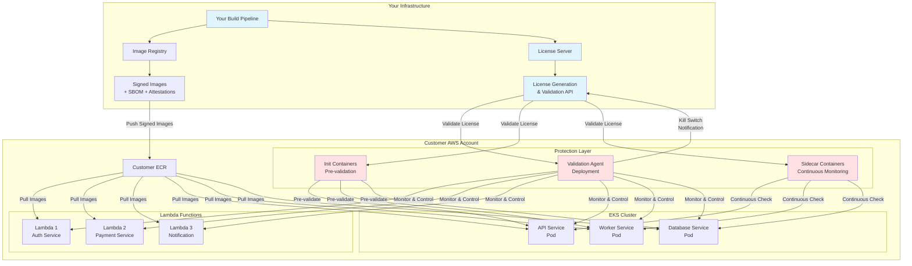

---

## Diagram 2: Image Build & Protection Flow

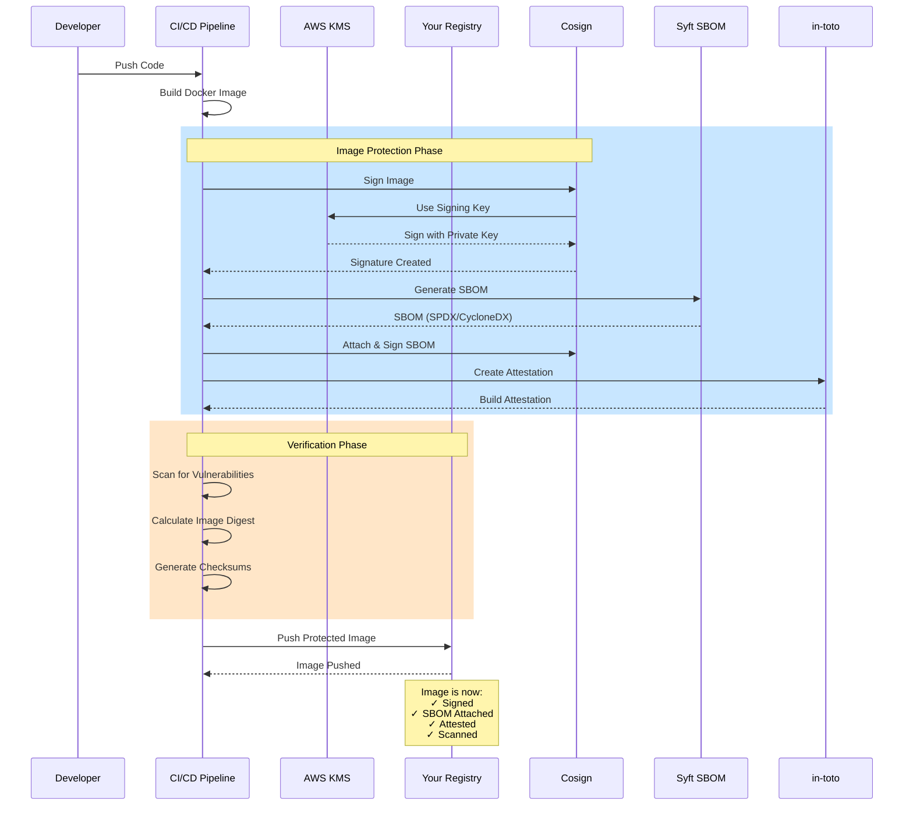

---

## Diagram 3: Customer Onboarding & License Generation

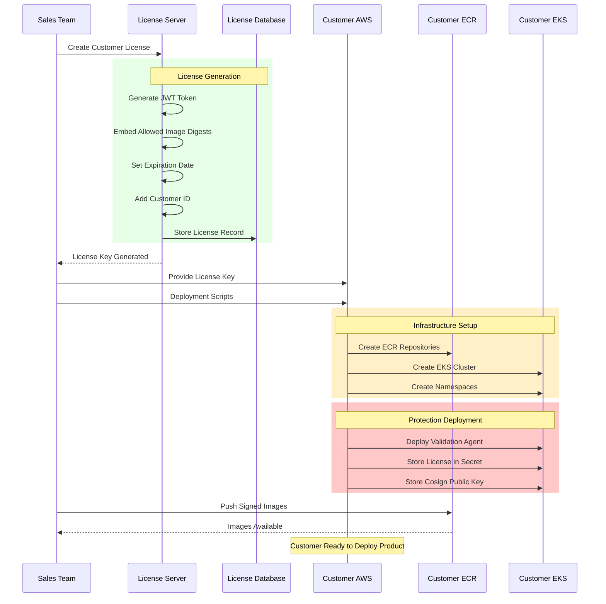

---

## Diagram 4: Lambda Function Deployment & Validation

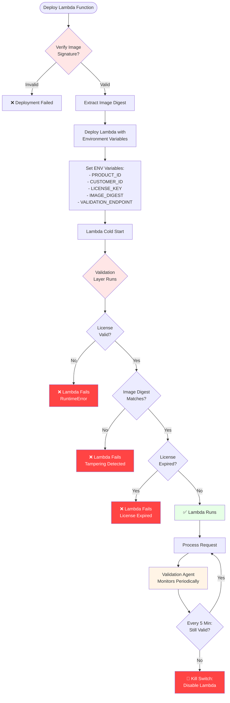

---

## Diagram 5: Kubernetes Pod Deployment with Protection

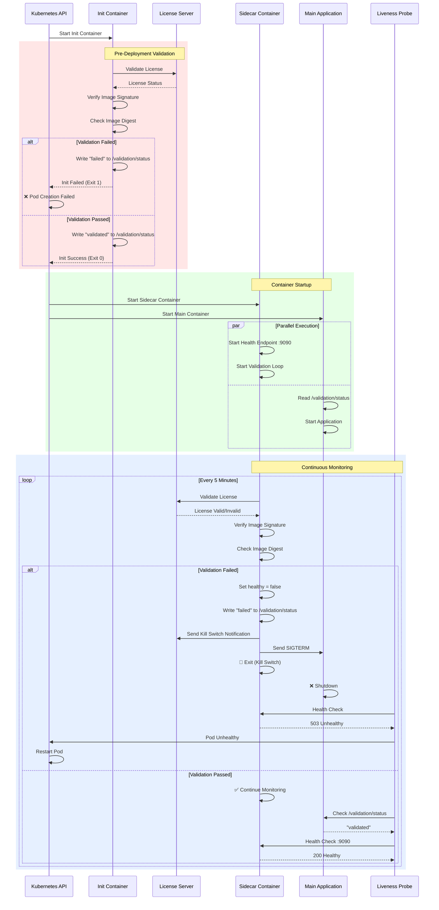

---

## Diagram 6: Kill Switch Activation Flow

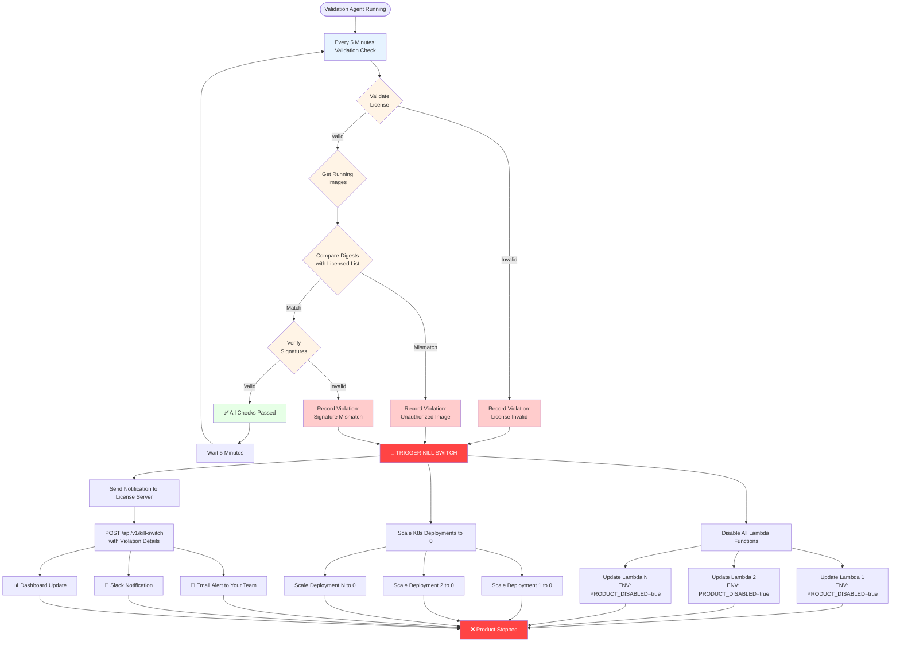

---

## Diagram 7: License Validation Sequence

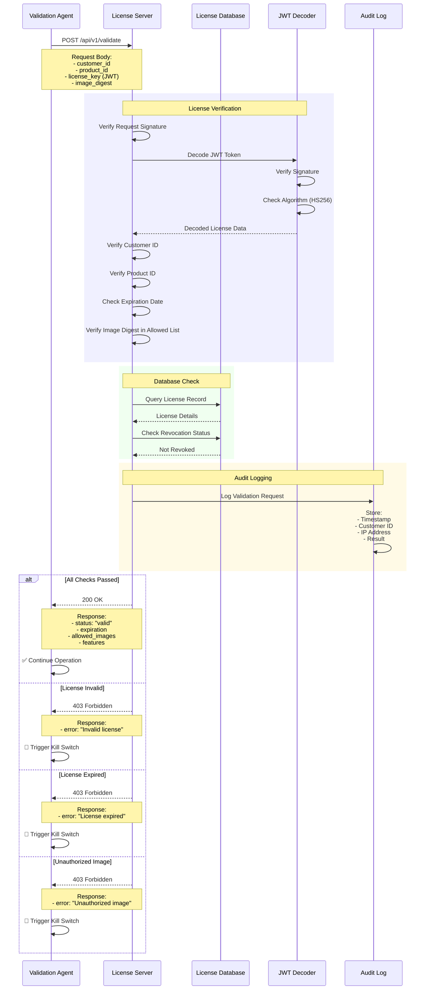

---

## Diagram 8: Image Integrity Verification Process

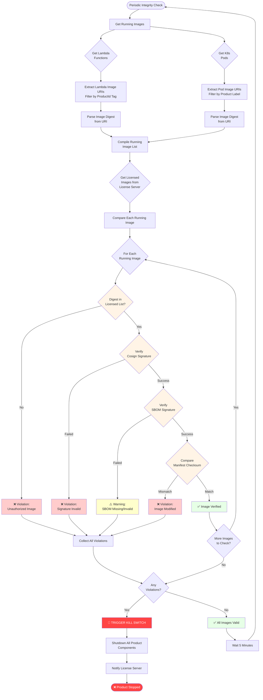

---

## Diagram 9: Multi-Layer Security Protection

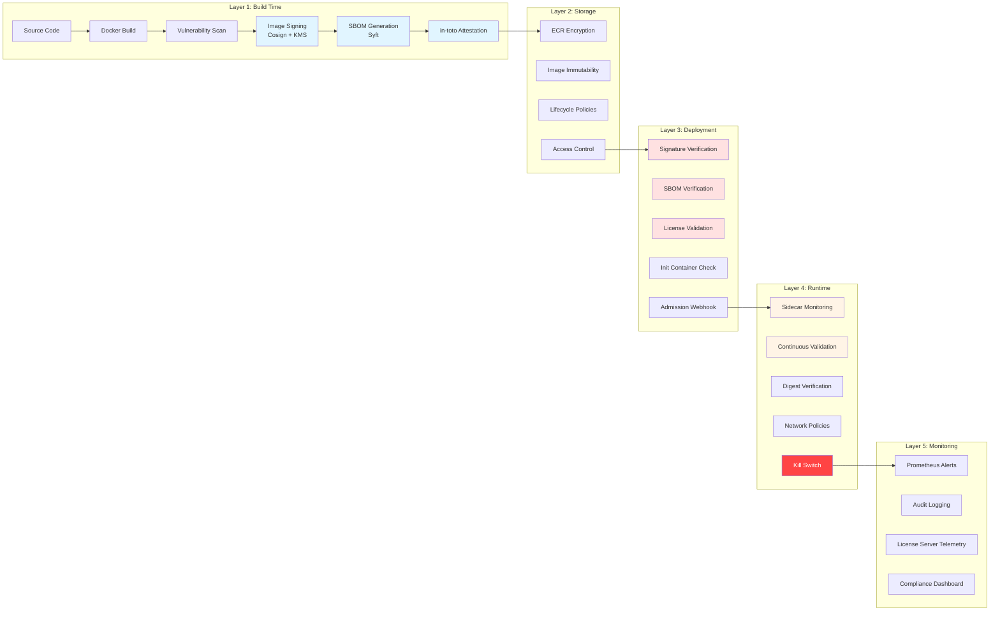

---

## Diagram 10: Complete End-to-End Flow

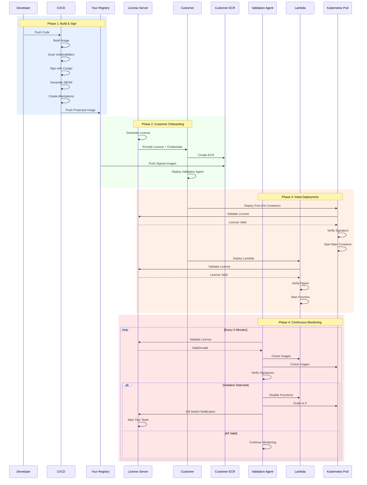

---

## Diagram 11: Threat Response Matrix

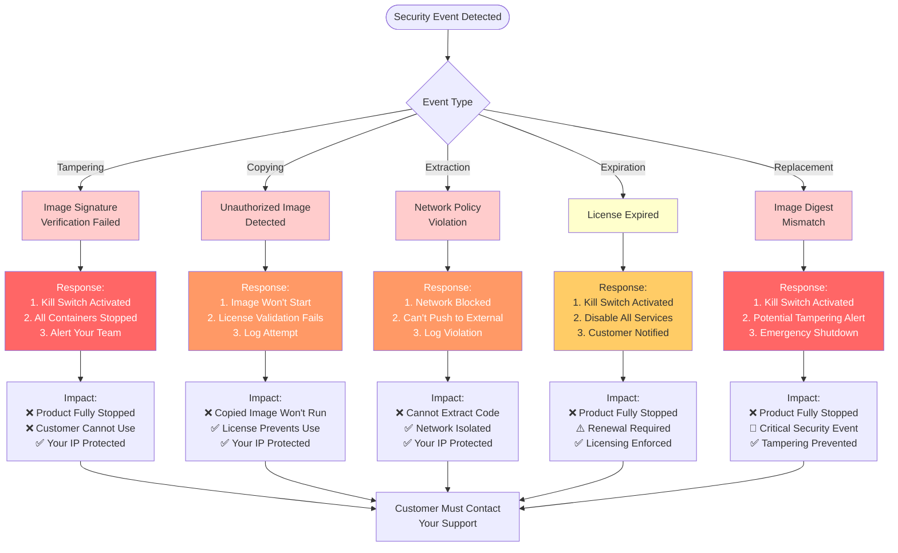

---

## Diagram 12: Data Flow - License Validation

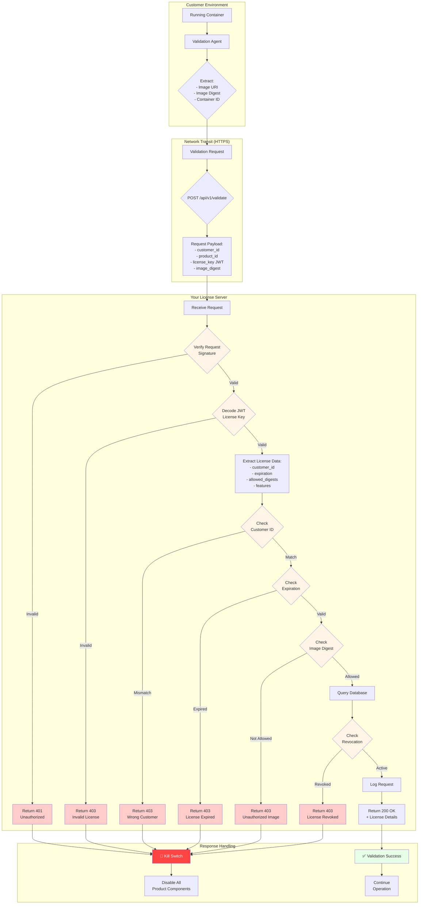

---

## Summary Legend

### Color Coding
- 🔵 **Blue** - Your Infrastructure & Control
- 🔴 **Red** - Security/Protection Components
- 🟡 **Yellow** - Customer Environment
- 🟢 **Green** - Success/Valid State
- ⚫ **Dark Red** - Kill Switch/Failure

### Key Components
- **Cosign** - Image signing and verification
- **SBOM** - Software Bill of Materials
- **in-toto** - Build attestations
- **JWT** - License token format
- **Init Container** - Pre-deployment validation
- **Sidecar** - Continuous runtime monitoring
- **Validation Agent** - Central monitoring daemon
- **Kill Switch** - Emergency shutdown mechanism

### Protection Guarantees
1. ✅ **Anti-Tampering** - Signature verification prevents modification
2. ✅ **IP Protection** - License binding prevents theft
3. ✅ **Kill Switch** - Automatic shutdown on violations
4. ✅ **Continuous Verification** - Runtime integrity checks
5. ✅ **Network Isolation** - Prevents code extraction
6. ✅ **Audit Trail** - Complete monitoring and logging
7. ✅ **License Enforcement** - Time-bound product usage
8. ✅ **Central Control** - Your license server controls all

