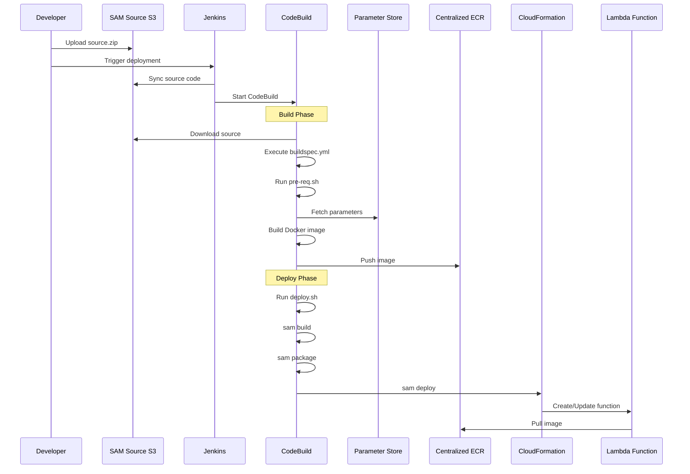
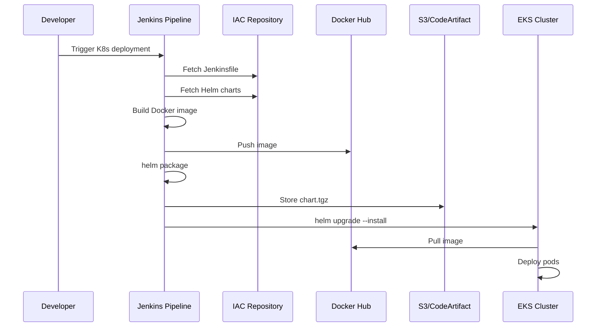
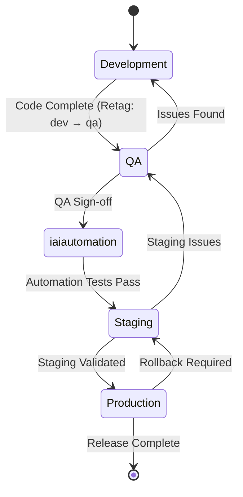
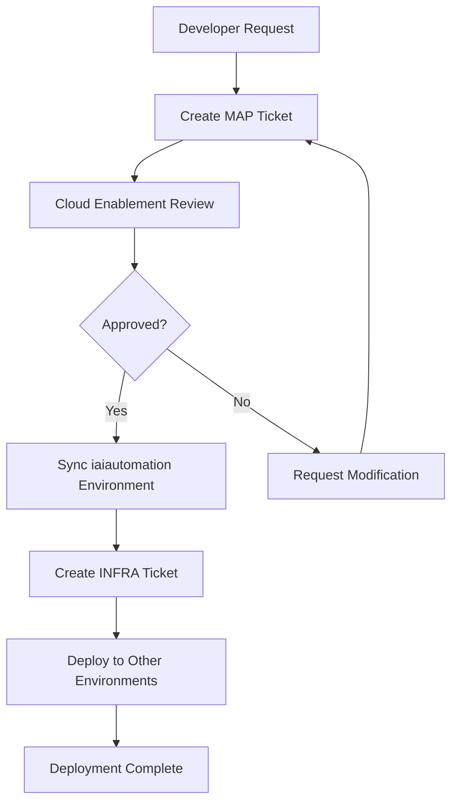
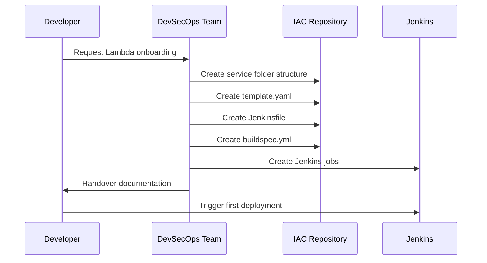

# Engineering Technical Guide
## Centralized ECR & Manifest-Driven Deployment Platform

**Version:** 3.0  
**Date:** December 13, 2025  
**Audience:** Technical Architects, Engineering Teams, DevSecOps Engineers  
**Maintained By:** Cloud Enablement & Governance Team  

---

## Table of Contents

1. [Architecture Overview](#1-architecture-overview)
2. [Core Components](#2-core-components)
3. [Repository & Directory Structure](#3-repository--directory-structure)
4. [Lambda Deployment Guide](#4-lambda-deployment-guide)
5. [Kubernetes Deployment Guide](#5-kubernetes-deployment-guide)
6. [Jenkins Pipeline Reference](#6-jenkins-pipeline-reference)
7. [Cross-Account ECR Configuration](#7-cross-account-ecr-configuration)
8. [Manifest System](#8-manifest-system)
9. [Environment Promotion Workflow](#9-environment-promotion-workflow)
10. [MAP Ticket Governance Process](#10-map-ticket-governance-process)
11. [Service Onboarding Procedures](#11-service-onboarding-procedures)
12. [Operational Runbooks](#12-operational-runbooks)
13. [Troubleshooting Guide](#13-troubleshooting-guide)
14. [Appendix: Code Templates](#14-appendix-code-templates)

---

## 1. Architecture Overview

### 1.1 High-Level Architecture

The platform implements a **"Build Once, Deploy Everywhere"** model with decoupled CI/CD:

```mermaid
graph TB
    subgraph "Central Management Layer"
        ECR[Centralized ECR<br/>Single Source of Truth]
        IAC[IAC Repository<br/>idxp_map_infra_iac_svc]
        PS[Parameter Store<br/>/PF/{env}/*]
        S3[Artifact Storage<br/>Helm Charts & Manifests]
    end
    
    subgraph "Development Environment"
        DEV[Dev Account]
        BUILD[Jenkins CI Pipeline]
        DEVK8S[Dev EKS Cluster]
        DEVLAMBDA[Dev Lambda Functions]
    end
    
    subgraph "Target Environments"
        QA[QA Account]
        STG[Staging Account]
        PROD[Production Account]
        CUST[Customer Accounts]
        AUTO[iaiautomation Account]
    end
    
    BUILD -->|Push Images| ECR
    BUILD -->|Push Charts| S3
    IAC -->|Sync Configs| PS
    
    ECR -->|Pull Images| QA
    ECR -->|Pull Images| STG
    ECR -->|Pull Images| PROD
    ECR -->|Pull Images| CUST
    ECR -->|Pull Images| AUTO
```

### 1.2 Core Architecture Principles

| Principle | Implementation | Benefit |
|-----------|----------------|---------|
| **Build Once** | Docker images built only in Dev pipeline | Eliminates environment drift |
| **Centralized ECR** | Single ECR repository for all images | Single source of truth |
| **Manifest-Driven** | JSON manifests define deployments | Version-controlled deployments |
| **Cross-Account Access** | IAM resource policies | Secure multi-account access |
| **Configuration Injection** | Parameter Store at runtime | Environment-agnostic images |

### 1.3 Technology Stack

| Component | Technology | Purpose |
|-----------|------------|---------|
| **Container Registry** | Amazon ECR | Centralized image storage |
| **CI/CD** | Jenkins | Build and deployment orchestration |
| **Lambda Deployment** | AWS SAM + CloudFormation | Serverless function deployment |
| **K8s Deployment** | Helm 3 | Kubernetes package management |
| **Configuration** | AWS SSM Parameter Store | Environment-specific configs |
| **Artifacts** | Amazon S3 / CodeArtifact | Helm chart storage |
| **Secrets** | HashiCorp Vault | Secret management |
| **Build** | AWS CodeBuild | Docker image builds |

---

## 2. Core Components

### 2.1 Centralized ECR

**Account:** Central AWS Account  
**Region:** us-east-1 (primary)

#### Repository Naming Convention
```
{account-id}.dkr.ecr.{region}.amazonaws.com/{service-name}
```

#### Tagging Strategy
| Environment | Tag Format | Example |
|-------------|------------|---------|
| Development | `dev-{branch}-{build}` | `dev-feature-123-456` |
| QA | `qa-{version}` | `qa-25.3.0.0` |
| Staging | `stg-{version}` | `stg-25.3.0.0` |
| Production | `prod-{version}` | `prod-25.3.0.0` |

#### ECR Resource Policy (Cross-Account Access)
```json
{
  "Version": "2012-10-17",
  "Statement": [
    {
      "Sid": "AllowCrossAccountPull",
      "Effect": "Allow",
      "Principal": {
        "AWS": [
          "arn:aws:iam::QA-ACCOUNT-ID:role/LambdaExecutionRole",
          "arn:aws:iam::QA-ACCOUNT-ID:role/EKSNodeRole",
          "arn:aws:iam::PROD-ACCOUNT-ID:role/LambdaExecutionRole",
          "arn:aws:iam::CUSTOMER-ACCOUNT-ID:role/LambdaExecutionRole"
        ]
      },
      "Action": [
        "ecr:GetDownloadUrlForLayer",
        "ecr:BatchGetImage",
        "ecr:BatchCheckLayerAvailability"
      ]
    }
  ]
}
```

### 2.2 IAC Repository Structure

**Repository:** `idxp_map_infra_iac_svc` (iGit)

```
idxp_map_infra_iac_svc/
├── services/
│   ├── chunk-asset/
│   │   ├── chunk-asset/              # Helm chart directory
│   │   │   ├── Chart.yaml
│   │   │   ├── values.yaml
│   │   │   └── templates/
│   │   │       ├── deployment.yaml
│   │   │       ├── service.yaml
│   │   │       ├── ingress.yaml
│   │   │       ├── configmap.yaml
│   │   │       ├── keda-scaledobject.yaml
│   │   │       └── _helpers.tpl
│   │   ├── lambda/
│   │   │   └── chunk-asset/
│   │   │       └── lambda/
│   │   │           ├── template.yaml       # SAM/CFN template
│   │   │           └── template_v1.yaml    # Customer version
│   │   ├── jenkins/
│   │   │   └── Jenkinsfile
│   │   └── qa-chunk-asset.yaml             # QA overrides
│   │
│   ├── chunk-init-asset/
│   ├── embedding-gen-asset/
│   ├── embedding-init-asset/
│   ├── file-text-extraction/
│   ├── file-img-conversion/
│   ├── asset-dlq-listener/
│   ├── gen-ai-tools/
│   ├── data-service/
│   ├── datacollection/
│   ├── web-scraper-static/
│   └── web-scraper-dynamic/
│
├── shared/
│   ├── networking/
│   ├── security/
│   └── monitoring/
│
├── environments/
│   ├── dev/
│   ├── qa/
│   ├── staging/
│   └── production/
│
├── manifests/
│   ├── 25.3.0.0/
│   │   ├── lambda-manifest.json
│   │   └── k8s-manifest.json
│   └── 25.2.0.0/
│
└── README.md
```

### 2.3 Parameter Store Structure

```
/PF/
├── dev/
│   ├── vpc/
│   │   ├── vpc-id
│   │   ├── private-subnet-1
│   │   └── private-subnet-2
│   ├── database/
│   │   ├── host
│   │   ├── username
│   │   └── password (SecureString)
│   ├── redis/
│   │   └── endpoint
│   ├── s3/
│   │   └── chunk-bucket
│   └── logging/
│       └── level
├── qa/
├── stg/
├── prod/
└── lambda/
    └── 25.3.0.0/                    # Version-specific manifest
        └── manifest.json
```

---

## 3. Repository & Directory Structure

### 3.1 Service Repository (Application Code)

Each microservice has its own repository containing only application code:

```
chunk-asset-service/
├── src/
│   ├── main.py
│   ├── processor.py
│   └── utils/
├── tests/
├── requirements.txt
├── Dockerfile
└── README.md
```

### 3.2 Lambda Source Package Structure

For SAM-based Lambda deployments:

```
source.zip
├── buildspec-chunk-asset.yml
├── chunk-asset/
│   ├── app_code/
│   ├── idxp_config/
│   ├── lambda/
│   │   └── template.yaml
│   ├── LambdaDockerfile
│   └── resources/
├── deploy-chunk-asset.sh
└── pre-req-chunk-asset.sh
```

---

## 4. Lambda Deployment Guide

### 4.1 SAM-Based Lambda Deployment Flow



### 4.2 Key Deployment Scripts

#### buildspec.yml
```yaml
version: 0.2

env:
  variables:
    FUNCTION_NAME: "chunk-asset"
    ENVIRONMENT: "dev"
    REGION: "us-east-1"

phases:
  install:
    runtime-versions:
      python: 3.9
      docker: 20
    commands:
      - pip install aws-sam-cli

  pre_build:
    commands:
      - echo "Running pre-requisites..."
      - chmod +x pre-req-${FUNCTION_NAME}.sh
      - ./pre-req-${FUNCTION_NAME}.sh ${FUNCTION_NAME} ${ENVIRONMENT} ${REGION}
      
  build:
    commands:
      - echo "Building Docker image..."
      - chmod +x deploy-${FUNCTION_NAME}.sh
      - ./deploy-${FUNCTION_NAME}.sh ${FUNCTION_NAME} ${ENVIRONMENT} ${REGION}

  post_build:
    commands:
      - echo "Deployment completed"

artifacts:
  files:
    - '**/*'
```

#### deploy.sh (Key Functions)
```bash
#!/bin/bash

# Input validation
FUNCTION_NAME=$1
ENVIRONMENT=$2
REGION=$3
BUILD_NUMBER=${CODEBUILD_BUILD_NUMBER:-1}

# Set AWS region
export AWS_DEFAULT_REGION=$REGION

# Navigate to Lambda directory
cd ${FUNCTION_NAME}

# Fetch parameters from SSM
get_parameter() {
    aws ssm get-parameter --name "$1" --with-decryption --query 'Parameter.Value' --output text
}

VPC_SG=$(get_parameter "/PF/${ENVIRONMENT}/vpc/security-group")
VPC_SUBNETS=$(get_parameter "/PF/${ENVIRONMENT}/vpc/subnets")
FS_ARN=$(get_parameter "/PF/${ENVIRONMENT}/efs/arn")
CHUNK_QUEUE=$(get_parameter "/PF/${ENVIRONMENT}/sqs/chunk-queue")

# ECR Setup
ACCOUNT_ID=$(aws sts get-caller-identity --query Account --output text)
ECR_REPO="${ACCOUNT_ID}.dkr.ecr.${REGION}.amazonaws.com/${FUNCTION_NAME}"
IMAGE_TAG="${ENVIRONMENT}-${BUILD_NUMBER}"

# Docker login to ECR
aws ecr get-login-password --region ${REGION} | docker login --username AWS --password-stdin ${ECR_REPO}

# Create ECR repo if not exists
aws ecr describe-repositories --repository-names ${FUNCTION_NAME} || \
    aws ecr create-repository --repository-name ${FUNCTION_NAME}

# Build Docker image
docker build -t ${FUNCTION_NAME}:${IMAGE_TAG} -f LambdaDockerfile .
docker tag ${FUNCTION_NAME}:${IMAGE_TAG} ${ECR_REPO}:${IMAGE_TAG}
docker push ${ECR_REPO}:${IMAGE_TAG}

# SAM Deploy
cd lambda
sam build --template-file template.yaml
sam package --output-template-file packaged.yaml --s3-bucket ${SAM_BUCKET}

sam deploy \
    --template-file packaged.yaml \
    --stack-name ${FUNCTION_NAME}-${ENVIRONMENT} \
    --parameter-overrides \
        ImageUri=${ECR_REPO}:${IMAGE_TAG} \
        EnvironmentType=${ENVIRONMENT} \
        VPCSG=${VPC_SG} \
        VPCSubnetIDS=${VPC_SUBNETS} \
        FSArn=${FS_ARN} \
        ChunkQueue=${CHUNK_QUEUE} \
    --capabilities CAPABILITY_IAM \
    --no-fail-on-empty-changeset
```

### 4.3 Lambda CloudFormation Template

```yaml
AWSTemplateFormatVersion: '2010-09-09'
Transform: AWS::Serverless-2016-10-31
Description: 'Chunk Asset Lambda Function'

Parameters:
  ImageUri:
    Type: String
    Description: 'ECR Image URI'
  
  EnvironmentType:
    Type: String
    AllowedValues: [dev, qa, staging, prod]
  
  VPCSG:
    Type: String
    Description: 'VPC Security Group ID'
  
  VPCSubnetIDS:
    Type: CommaDelimitedList
    Description: 'VPC Subnet IDs'
  
  FSArn:
    Type: String
    Description: 'EFS File System ARN'
  
  FSMountPath:
    Type: String
    Default: '/mnt/MagicPlatform'
  
  ChunkQueue:
    Type: String
    Description: 'SQS Queue ARN for chunk processing'

Globals:
  Function:
    Timeout: 900
    MemorySize: 1024

Resources:
  ChunkAssetFunction:
    Type: AWS::Serverless::Function
    Properties:
      FunctionName: !Sub 'chunk-asset-${EnvironmentType}'
      PackageType: Image
      ImageUri: !Ref ImageUri
      Role: !GetAtt ExecutionRole.Arn
      
      VpcConfig:
        SecurityGroupIds:
          - !Ref VPCSG
        SubnetIds: !Ref VPCSubnetIDS
      
      FileSystemConfigs:
        - Arn: !Ref FSArn
          LocalMountPath: !Ref FSMountPath
      
      Environment:
        Variables:
          ENVIRONMENT: !Ref EnvironmentType
          LOG_LEVEL: 'DEBUG'
      
      Events:
        SQSEvent:
          Type: SQS
          Properties:
            Queue: !Ref ChunkQueue
            BatchSize: 1
      
      Tags:
        Environment: !Ref EnvironmentType
        Service: 'chunk-asset'
        ManagedBy: 'SAM'

  ExecutionRole:
    Type: AWS::IAM::Role
    Properties:
      RoleName: !Sub 'chunk-asset-${EnvironmentType}-role'
      AssumeRolePolicyDocument:
        Version: '2012-10-17'
        Statement:
          - Effect: Allow
            Principal:
              Service: lambda.amazonaws.com
            Action: sts:AssumeRole
      
      ManagedPolicyArns:
        - arn:aws:iam::aws:policy/service-role/AWSLambdaVPCAccessExecutionRole
      
      Policies:
        - PolicyName: LambdaPolicy
          PolicyDocument:
            Version: '2012-10-17'
            Statement:
              - Effect: Allow
                Action:
                  - ssm:GetParameter
                  - ssm:GetParameters
                Resource: !Sub 'arn:aws:ssm:${AWS::Region}:${AWS::AccountId}:parameter/PF/${EnvironmentType}/*'
              
              - Effect: Allow
                Action:
                  - sqs:ReceiveMessage
                  - sqs:DeleteMessage
                  - sqs:GetQueueAttributes
                Resource: !Ref ChunkQueue
              
              - Effect: Allow
                Action:
                  - elasticfilesystem:ClientMount
                  - elasticfilesystem:ClientWrite
                Resource: !Ref FSArn

Outputs:
  FunctionArn:
    Value: !GetAtt ChunkAssetFunction.Arn
    Export:
      Name: !Sub 'chunk-asset-${EnvironmentType}-arn'
```

### 4.4 Lambda Services & SQS Mappings

| Lambda Name | SQS Queues |
|-------------|------------|
| **chunk-asset** | `{env}_map_chunk_1_queue.fifo` through `{env}_map_chunk_5_queue.fifo`, `{env}_map_chunk_queue.fifo` |
| **chunk-init-asset** | `{env}_map_chunk_automation_queue.fifo`, `{env}_map_kb_doc_import_queue.fifo` |
| **embedding-gen-asset** | `{env}_map_embedding_1_queue.fifo` through `{env}_map_embedding_5_queue.fifo` |
| **embedding-init-asset** | `{env}_map_embedding_init_lambda_queue.fifo` |
| **file-text-extraction** | `{env}_map_textextraction_asset_queue.fifo`, `{env}_map_textract_v2_queue.fifo` |
| **file-img-conversion** | `{env}_map_file2image_asset_queue.fifo`, `{env}_map_file_image_conversion_automation_queue.fifo` |
| **asset-dlq-listener** | Multiple DLQ queues for error handling |
| **gen-ai-tools** | No SQS trigger |

---

## 5. Kubernetes Deployment Guide

### 5.1 Helm-Based Deployment Flow



### 5.2 Helm Chart Structure

#### Chart.yaml
```yaml
apiVersion: v2
name: chunk-asset
description: Chunk Asset Processing Service
type: application
version: 1.0.0
appVersion: "25.3.0.0"
```

#### values.yaml
```yaml
replicaCount: 2

image:
  repository: ""  # Injected from manifest
  tag: ""         # Injected from manifest
  pullPolicy: IfNotPresent

service:
  type: ClusterIP
  port: 80
  targetPort: 8080

ingress:
  enabled: true
  className: nginx
  annotations:
    kubernetes.io/ingress.class: nginx
    nginx.ingress.kubernetes.io/ssl-redirect: "true"
  hosts:
    - host: chunk-asset.example.com
      paths:
        - path: /
          pathType: Prefix

resources:
  limits:
    cpu: 500m
    memory: 512Mi
  requests:
    cpu: 250m
    memory: 256Mi

autoscaling:
  enabled: true
  minReplicas: 2
  maxReplicas: 10
  targetCPUUtilizationPercentage: 80

configMap:
  enabled: true
  data:
    ENVIRONMENT: "dev"
    LOG_LEVEL: "INFO"

secrets:
  enabled: false

keda:
  enabled: true
  pollingInterval: 30
  cooldownPeriod: 300
  minReplicaCount: 1
  maxReplicaCount: 10
```

#### templates/deployment.yaml
```yaml
apiVersion: apps/v1
kind: Deployment
metadata:
  name: {{ include "chunk-asset.fullname" . }}
  labels:
    {{- include "chunk-asset.labels" . | nindent 4 }}
spec:
  {{- if not .Values.autoscaling.enabled }}
  replicas: {{ .Values.replicaCount }}
  {{- end }}
  selector:
    matchLabels:
      {{- include "chunk-asset.selectorLabels" . | nindent 6 }}
  template:
    metadata:
      labels:
        {{- include "chunk-asset.selectorLabels" . | nindent 8 }}
    spec:
      containers:
        - name: {{ .Chart.Name }}
          image: "{{ .Values.image.repository }}:{{ .Values.image.tag }}"
          imagePullPolicy: {{ .Values.image.pullPolicy }}
          ports:
            - name: http
              containerPort: {{ .Values.service.targetPort }}
              protocol: TCP
          livenessProbe:
            httpGet:
              path: /health
              port: http
            initialDelaySeconds: 30
            periodSeconds: 10
          readinessProbe:
            httpGet:
              path: /ready
              port: http
            initialDelaySeconds: 5
            periodSeconds: 5
          resources:
            {{- toYaml .Values.resources | nindent 12 }}
          envFrom:
            {{- if .Values.configMap.enabled }}
            - configMapRef:
                name: {{ include "chunk-asset.fullname" . }}-config
            {{- end }}
```

### 5.3 Helm Deployment Commands

```bash
# Package Helm chart
helm package ./chunk-asset -d ./dist

# Upload to S3
aws s3 cp ./dist/chunk-asset-1.0.0.tgz s3://pf-artifacts/idxp-mapchunk-svc/Release_QA/25.3.0.0/

# Deploy to cluster
helm upgrade --install chunk-asset ./chunk-asset \
  --namespace purple-fabric \
  --set image.repository=123456789012.dkr.ecr.us-east-1.amazonaws.com/chunk-asset \
  --set image.tag=qa-25.3.0.0 \
  --values ./environments/qa/values.yaml \
  --wait --timeout 10m

# Rollback if needed
helm rollback chunk-asset 1 --namespace purple-fabric
```

---

## 6. Jenkins Pipeline Reference

### 6.1 Development Pipeline (Full CI/CD)

```groovy
pipeline {
    agent {
        kubernetes {
            yaml """
                apiVersion: v1
                kind: Pod
                spec:
                  containers:
                  - name: docker
                    image: docker:20.10.16-dind
                    securityContext:
                      privileged: true
                  - name: aws-cli
                    image: amazon/aws-cli:2.7.16
                    command: ['sleep']
                    args: ['infinity']
                  - name: sam-cli
                    image: amazon/aws-sam-cli-build-image-python3.9:1.53.0
                    command: ['sleep']
                    args: ['infinity']
            """
        }
    }
    
    parameters {
        string(name: 'BRANCH_NAME', defaultValue: 'develop', description: 'Branch to build')
        string(name: 'SERVICE_NAME', defaultValue: 'chunk-asset', description: 'Service name')
        booleanParam(name: 'SKIP_TESTS', defaultValue: false, description: 'Skip tests')
    }
    
    environment {
        AWS_REGION = 'us-east-1'
        ECR_REGISTRY = '123456789012.dkr.ecr.us-east-1.amazonaws.com'
        SERVICE_NAME = "${params.SERVICE_NAME}"
        BUILD_TAG = "${SERVICE_NAME}:dev-${params.BRANCH_NAME}-${BUILD_NUMBER}"
    }
    
    stages {
        stage('Checkout') {
            parallel {
                stage('Service Code') {
                    steps {
                        checkout([
                            $class: 'GitSCM',
                            branches: [[name: "*/${params.BRANCH_NAME}"]],
                            userRemoteConfigs: [[
                                url: "https://git.company.com/services/${SERVICE_NAME}-service.git",
                                credentialsId: 'git-credentials'
                            ]]
                        ])
                    }
                }
                stage('IAC Code') {
                    steps {
                        dir('iac') {
                            checkout([
                                $class: 'GitSCM',
                                branches: [[name: "*/${params.BRANCH_NAME}"]],
                                userRemoteConfigs: [[
                                    url: 'https://git.company.com/iac/idxp_map_infra_iac_svc.git',
                                    credentialsId: 'git-credentials'
                                ]]
                            ])
                        }
                    }
                }
            }
        }
        
        stage('Branch Validation') {
            steps {
                script {
                    // Validate IAC files exist for this service
                    sh """
                        if [ ! -f "iac/services/${SERVICE_NAME}/jenkins/Jenkinsfile" ]; then
                            echo "ERROR: Jenkinsfile not found for ${SERVICE_NAME}"
                            exit 1
                        fi
                        
                        if [ ! -f "iac/services/${SERVICE_NAME}/lambda/${SERVICE_NAME}/lambda/template.yaml" ]; then
                            echo "ERROR: CloudFormation template not found"
                            exit 1
                        fi
                        
                        echo "✅ Branch validation passed"
                    """
                }
            }
        }
        
        stage('Unit Tests') {
            when { not { expression { params.SKIP_TESTS } } }
            steps {
                sh '''
                    pip install -r requirements.txt
                    python -m pytest tests/ -v --junitxml=test-results.xml
                '''
                junit 'test-results.xml'
            }
        }
        
        stage('Docker Build & Push') {
            steps {
                container('docker') {
                    script {
                        sh """
                            aws ecr get-login-password --region ${AWS_REGION} | \
                                docker login --username AWS --password-stdin ${ECR_REGISTRY}
                            
                            docker build -t ${BUILD_TAG} .
                            docker tag ${BUILD_TAG} ${ECR_REGISTRY}/${BUILD_TAG}
                            docker push ${ECR_REGISTRY}/${BUILD_TAG}
                        """
                        
                        env.IMAGE_URI = "${ECR_REGISTRY}/${BUILD_TAG}"
                    }
                }
            }
        }
        
        stage('Deploy to Dev') {
            steps {
                container('sam-cli') {
                    dir("iac/services/${SERVICE_NAME}/lambda/${SERVICE_NAME}/lambda") {
                        sh """
                            sam deploy \
                                --template-file template.yaml \
                                --stack-name ${SERVICE_NAME}-dev \
                                --parameter-overrides ImageUri=${IMAGE_URI} EnvironmentType=dev \
                                --capabilities CAPABILITY_IAM \
                                --no-fail-on-empty-changeset
                        """
                    }
                }
            }
        }
        
        stage('Smoke Test') {
            steps {
                sh '''
                    aws lambda wait function-updated --function-name ${SERVICE_NAME}-dev
                    aws lambda invoke --function-name ${SERVICE_NAME}-dev response.json
                    cat response.json
                '''
            }
        }
    }
    
    post {
        success {
            slackSend channel: '#deployments', color: 'good',
                message: "✅ ${SERVICE_NAME} deployed to dev successfully"
        }
        failure {
            slackSend channel: '#deployments', color: 'danger',
                message: "❌ ${SERVICE_NAME} deployment failed"
        }
    }
}
```

### 6.2 QA Promotion Pipeline (CD Only)

```groovy
pipeline {
    agent any
    
    parameters {
        string(name: 'VERSION', defaultValue: '25.3.0.0', description: 'Release version')
        string(name: 'SERVICE_NAME', description: 'Service to promote (or "all")')
    }
    
    environment {
        AWS_REGION = 'us-east-1'
        ECR_REGISTRY = '123456789012.dkr.ecr.us-east-1.amazonaws.com'
    }
    
    stages {
        stage('Validate Dev Images') {
            steps {
                script {
                    // Check dev images exist
                    sh """
                        aws ecr describe-images \
                            --repository-name ${params.SERVICE_NAME} \
                            --image-ids imageTag=dev-develop-latest \
                            --region ${AWS_REGION}
                    """
                }
            }
        }
        
        stage('Generate Manifest') {
            steps {
                script {
                    def manifest = [
                        version: params.VERSION,
                        services: [:]
                    ]
                    
                    // Get image details
                    def imageUri = sh(
                        script: "aws ecr describe-images --repository-name ${params.SERVICE_NAME} --image-ids imageTag=dev-develop-latest --query 'imageDetails[0].imageDigest' --output text",
                        returnStdout: true
                    ).trim()
                    
                    manifest.services[params.SERVICE_NAME] = [
                        image_uri: "${ECR_REGISTRY}/${params.SERVICE_NAME}:qa-${params.VERSION}",
                        digest: imageUri
                    ]
                    
                    writeJSON file: "manifest-${params.VERSION}.json", json: manifest
                }
            }
        }
        
        stage('Retag Images for QA') {
            steps {
                sh """
                    # Get manifest from dev image
                    MANIFEST=\$(aws ecr batch-get-image \
                        --repository-name ${params.SERVICE_NAME} \
                        --image-ids imageTag=dev-develop-latest \
                        --query 'images[0].imageManifest' \
                        --output text)
                    
                    # Retag as QA
                    aws ecr put-image \
                        --repository-name ${params.SERVICE_NAME} \
                        --image-tag qa-${params.VERSION} \
                        --image-manifest "\$MANIFEST"
                """
            }
        }
        
        stage('Store Manifest') {
            parallel {
                stage('IAC Repo') {
                    steps {
                        sh """
                            git checkout qa
                            cp manifest-${params.VERSION}.json manifests/${params.VERSION}/
                            git add .
                            git commit -m "Add manifest for ${params.VERSION}"
                            git push origin qa
                        """
                    }
                }
                stage('Parameter Store') {
                    steps {
                        sh """
                            aws ssm put-parameter \
                                --name "/PF/lambda/${params.VERSION}" \
                                --value file://manifest-${params.VERSION}.json \
                                --type String \
                                --overwrite
                        """
                    }
                }
            }
        }
        
        stage('Deploy to QA') {
            steps {
                build job: 'QA-Lambda-Deploy', parameters: [
                    string(name: 'VERSION', value: params.VERSION),
                    string(name: 'SERVICE_NAME', value: params.SERVICE_NAME)
                ]
            }
        }
    }
}
```

---

## 7. Cross-Account ECR Configuration

### 7.1 Central Account Setup

```bash
#!/bin/bash
# setup_central_ecr.sh

CENTRAL_ACCOUNT="123456789012"
REGION="us-east-1"
SERVICES=("chunk-asset" "chunk-init-asset" "embedding-gen-asset" "embedding-init-asset")

for SERVICE in "${SERVICES[@]}"; do
    echo "Creating ECR repository: ${SERVICE}"
    
    aws ecr create-repository \
        --repository-name ${SERVICE} \
        --image-scanning-configuration scanOnPush=true \
        --region ${REGION}
    
    # Set lifecycle policy
    aws ecr put-lifecycle-policy \
        --repository-name ${SERVICE} \
        --lifecycle-policy-text file://lifecycle-policy.json \
        --region ${REGION}
done
```

### 7.2 Target Account IAM Role

```json
{
  "Version": "2012-10-17",
  "Statement": [
    {
      "Effect": "Allow",
      "Action": [
        "ecr:GetDownloadUrlForLayer",
        "ecr:BatchGetImage",
        "ecr:BatchCheckLayerAvailability"
      ],
      "Resource": "arn:aws:ecr:us-east-1:123456789012:repository/*"
    },
    {
      "Effect": "Allow",
      "Action": "ecr:GetAuthorizationToken",
      "Resource": "*"
    }
  ]
}
```

### 7.3 Cross-Account Trust Policy

```json
{
  "Version": "2012-10-17",
  "Statement": [
    {
      "Effect": "Allow",
      "Principal": {
        "AWS": "arn:aws:iam::CENTRAL-ACCOUNT:role/JenkinsDeploymentRole"
      },
      "Action": "sts:AssumeRole",
      "Condition": {
        "StringEquals": {
          "sts:ExternalId": "deployment-external-id"
        }
      }
    }
  ]
}
```

---

## 8. Manifest System

### 8.1 Manifest File Structure

```json
{
  "version": "25.3.0.0",
  "release_date": "2025-12-13",
  "environment": "qa",
  "services": {
    "chunk-asset": {
      "image_uri": "123456789012.dkr.ecr.us-east-1.amazonaws.com/chunk-asset:qa-25.3.0.0",
      "digest": "sha256:abc123...",
      "config_version": "25.3.0.0",
      "dependencies": ["chunk-init-asset"]
    },
    "chunk-init-asset": {
      "image_uri": "123456789012.dkr.ecr.us-east-1.amazonaws.com/chunk-init-asset:qa-25.3.0.0",
      "digest": "sha256:def456...",
      "config_version": "25.3.0.0"
    },
    "embedding-gen-asset": {
      "image_uri": "123456789012.dkr.ecr.us-east-1.amazonaws.com/embedding-gen-asset:qa-25.3.0.0",
      "digest": "sha256:ghi789..."
    }
  },
  "infrastructure": {
    "lambda_templates": "s3://iac-artifacts/lambda/25.3.0.0/",
    "helm_charts": "s3://iac-artifacts/k8s/25.3.0.0/",
    "parameter_store_path": "/PF/25.3.0.0/"
  }
}
```

### 8.2 Manifest Storage Locations

| Location | Purpose | Access |
|----------|---------|--------|
| **IAC Repo (master branch)** | Audit history, version control | Git access |
| **Parameter Store** | Runtime deployment access | IAM-based |
| **S3** | Backup, artifact distribution | Cross-account |

### 8.3 Parameter Store Paths

```
/PF/lambda/25.3.0.0     # Lambda manifest for v25.3.0.0
/PF/k8s/25.3.0.0        # K8s manifest for v25.3.0.0
/Fabric/lambda/25.3.0.0 # Fabric Lambda manifest
/Fabric/k8s/25.3.0.0    # Fabric K8s manifest
```

---

## 9. Environment Promotion Workflow

### 9.1 Promotion Flow Diagram



### 9.2 Retagging Commands

```bash
# Dev → QA Promotion
SOURCE_TAG="dev-develop-latest"
TARGET_TAG="qa-25.3.0.0"
REPO="chunk-asset"

# Get manifest
MANIFEST=$(aws ecr batch-get-image \
    --repository-name $REPO \
    --image-ids imageTag=$SOURCE_TAG \
    --query 'images[0].imageManifest' \
    --output text)

# Retag
aws ecr put-image \
    --repository-name $REPO \
    --image-tag $TARGET_TAG \
    --image-manifest "$MANIFEST"

# QA → Staging Promotion
aws ecr put-image \
    --repository-name $REPO \
    --image-tag stg-25.3.0.0 \
    --image-manifest "$MANIFEST"

# Staging → Production Promotion
aws ecr put-image \
    --repository-name $REPO \
    --image-tag prod-25.3.0.0 \
    --image-manifest "$MANIFEST"
```

### 9.3 Pre-Deployment Validation Checklist

```yaml
pre_deployment_checks:
  - name: "Image Availability"
    command: "aws ecr describe-images --repository-name {service} --image-ids imageTag={tag}"
    
  - name: "Template Exists"
    command: "test -f iac/services/{service}/lambda/{service}/lambda/template.yaml"
    
  - name: "Parameter Store Config"
    command: "aws ssm get-parameter --name /PF/{env}/{service}/config"
    
  - name: "Dependencies Available"
    command: "check_dependencies.sh {service}"
    
  - name: "Manifest Consistency"
    command: "validate_manifest.sh {version}"
```

---

## 10. MAP Ticket Governance Process

### 10.1 Process Flow



### 10.2 MAP Ticket Template

| Field | Description | Example |
|-------|-------------|---------|
| **Service Type** | Create / Update / Delete | Create |
| **AWS Service Name** | Specific AWS service | Lambda, EKS |
| **Environment** | Target environment | Automation → Dev → QA → Prod |
| **Service Description** | What to provision/change | "Create new Lambda for chunk processing" |
| **Business Justification** | Why needed | "Support new document processing feature" |
| **Required Configurations** | VPC, IAM, etc. | VPC: vpc-123, Subnet: subnet-456 |
| **Attachments** | Design docs, IaC refs | Link to architecture document |

### 10.3 SLA by Complexity

| Category | Complexity | SLA | Examples |
|----------|------------|-----|----------|
| **1** | Simple | 1-3 Days | S3 buckets, IAM roles, simple Lambda |
| **2** | Medium | 3-5 Days | POC services, simple integrations |
| **3** | Complex | 5-10 Days | Cross-account setups, multi-service |

### 10.4 Covered Services

**AWS Services:**
- Compute & Containers (EC2, Lambda, EKS, ECS)
- Networking & Storage (VPC, S3, EFS)
- Databases & Messaging (RDS, DynamoDB, SQS, SNS)
- Security & AI (IAM, KMS, SageMaker, Bedrock)

**Third-Party Services:**
- MongoDB Atlas
- HashiCorp Vault & Consul
- Elasticsearch
- DockerHub

---

## 11. Service Onboarding Procedures

### 11.1 Lambda Service Onboarding



#### Onboarding Checklist

- [ ] Create service folder in IAC repo
- [ ] Create Lambda CloudFormation template
- [ ] Create Jenkinsfile for CI/CD
- [ ] Create buildspec.yml for CodeBuild
- [ ] Set up Parameter Store entries
- [ ] Configure SQS queues (if needed)
- [ ] Set up ECR repository
- [ ] Create Jenkins jobs (dev, qa, stg, prod)
- [ ] Document deployment procedure
- [ ] Handover to development team

### 11.2 Kubernetes Service Onboarding

#### Onboarding Checklist

- [ ] Create service folder in IAC repo
- [ ] Create Helm chart (Chart.yaml, values.yaml, templates/)
- [ ] Create Jenkinsfile
- [ ] Create environment-specific values files
- [ ] Configure Docker Hub / ECR access
- [ ] Set up KEDA scaled objects (if needed)
- [ ] Configure Ingress rules
- [ ] Create ConfigMaps/Secrets
- [ ] Create Jenkins jobs
- [ ] Document deployment procedure

---

## 12. Operational Runbooks

### 12.1 Rollback Procedure

```bash
#!/bin/bash
# rollback.sh

SERVICE_NAME=$1
TARGET_VERSION=$2
ENVIRONMENT=$3

echo "Rolling back ${SERVICE_NAME} to ${TARGET_VERSION} in ${ENVIRONMENT}"

# Get previous manifest
MANIFEST=$(aws ssm get-parameter \
    --name "/PF/lambda/${TARGET_VERSION}" \
    --query 'Parameter.Value' \
    --output text)

IMAGE_URI=$(echo $MANIFEST | jq -r ".services[\"${SERVICE_NAME}\"].image_uri")

# Update Lambda function
aws lambda update-function-code \
    --function-name ${SERVICE_NAME}-${ENVIRONMENT} \
    --image-uri ${IMAGE_URI}

# Wait for update
aws lambda wait function-updated \
    --function-name ${SERVICE_NAME}-${ENVIRONMENT}

echo "✅ Rollback complete"
```

### 12.2 Health Check Script

```bash
#!/bin/bash
# health_check.sh

SERVICE_NAME=$1
ENVIRONMENT=$2

# Check Lambda function
STATUS=$(aws lambda get-function \
    --function-name ${SERVICE_NAME}-${ENVIRONMENT} \
    --query 'Configuration.State' \
    --output text)

if [ "$STATUS" == "Active" ]; then
    echo "✅ ${SERVICE_NAME} is healthy"
    
    # Test invocation
    aws lambda invoke \
        --function-name ${SERVICE_NAME}-${ENVIRONMENT} \
        --payload '{"test": true}' \
        response.json
    
    cat response.json
else
    echo "❌ ${SERVICE_NAME} is in state: ${STATUS}"
    exit 1
fi
```

### 12.3 Image Cleanup Script

```bash
#!/bin/bash
# cleanup_ecr.sh

REPO_NAME=$1
KEEP_COUNT=10

# Get all image tags
IMAGES=$(aws ecr describe-images \
    --repository-name $REPO_NAME \
    --query 'imageDetails[?imageTags!=`null`]|sort_by(@, &imagePushedAt)' \
    --output json)

# Count images
TOTAL=$(echo $IMAGES | jq length)

if [ $TOTAL -gt $KEEP_COUNT ]; then
    DELETE_COUNT=$((TOTAL - KEEP_COUNT))
    
    echo "Deleting $DELETE_COUNT old images..."
    
    # Get images to delete
    DELETE_IMAGES=$(echo $IMAGES | jq -r ".[:${DELETE_COUNT}][].imageDigest")
    
    for DIGEST in $DELETE_IMAGES; do
        aws ecr batch-delete-image \
            --repository-name $REPO_NAME \
            --image-ids imageDigest=$DIGEST
    done
fi
```

---

## 13. Troubleshooting Guide

### 13.1 Common Issues

| Issue | Cause | Solution |
|-------|-------|----------|
| **ECR Access Denied** | Missing cross-account permissions | Verify ECR resource policy includes target account |
| **Branch Validation Failure** | IAC/Service branch mismatch | Ensure same branch exists in both repos |
| **Lambda Timeout** | Image pull slow | Check VPC endpoints, consider regional ECR |
| **Manifest Not Found** | Parameter Store path wrong | Verify path: `/PF/lambda/{version}` |
| **Helm Deploy Failure** | Values mismatch | Check values.yaml and environment overrides |

### 13.2 Debug Commands

```bash
# Check ECR permissions
aws ecr get-repository-policy --repository-name chunk-asset

# List image tags
aws ecr list-images --repository-name chunk-asset

# Check Lambda configuration
aws lambda get-function --function-name chunk-asset-dev

# View CloudFormation stack events
aws cloudformation describe-stack-events --stack-name chunk-asset-dev

# Check Parameter Store
aws ssm get-parameters-by-path --path /PF/dev/ --recursive

# Verify Helm release
helm list -n purple-fabric
helm history chunk-asset -n purple-fabric
```

---

## 14. Appendix: Code Templates

### 14.1 Dockerfile Template

```dockerfile
FROM python:3.9-slim as builder

WORKDIR /app

RUN apt-get update && apt-get install -y \
    gcc \
    && rm -rf /var/lib/apt/lists/*

COPY requirements.txt .
RUN pip install --no-cache-dir --user -r requirements.txt

FROM python:3.9-slim

WORKDIR /app

COPY --from=builder /root/.local /root/.local
COPY src/ ./src/

RUN useradd --create-home app
USER app

ENV PYTHONPATH=/app/src
ENV PATH=/root/.local/bin:$PATH

EXPOSE 8080

HEALTHCHECK --interval=30s --timeout=10s CMD python -c "import requests; requests.get('http://localhost:8080/health')"

CMD ["python", "src/main.py"]
```

### 14.2 Parameter Store Setup Script

```bash
#!/bin/bash
# setup_parameters.sh

AWS_REGION="us-east-1"
ENVIRONMENT=$1

echo "Setting up Parameter Store for ${ENVIRONMENT}..."

params=(
    "/PF/${ENVIRONMENT}/vpc/vpc-id:vpc-12345abcde"
    "/PF/${ENVIRONMENT}/vpc/private-subnet-1:subnet-abc123"
    "/PF/${ENVIRONMENT}/vpc/private-subnet-2:subnet-def456"
    "/PF/${ENVIRONMENT}/database/host:postgres-${ENVIRONMENT}.cluster.amazonaws.com"
    "/PF/${ENVIRONMENT}/redis/endpoint:redis-${ENVIRONMENT}.cache.amazonaws.com:6379"
    "/PF/${ENVIRONMENT}/logging/level:INFO"
)

for param in "${params[@]}"; do
    NAME="${param%%:*}"
    VALUE="${param#*:}"
    
    aws ssm put-parameter \
        --name "$NAME" \
        --value "$VALUE" \
        --type String \
        --overwrite \
        --region ${AWS_REGION}
done

echo "✅ Parameter Store setup complete"
```

---

## Document Information

| Property | Value |
|----------|-------|
| **Version** | 3.0 |
| **Last Updated** | December 13, 2025 |
| **Review Cycle** | Monthly |
| **Owner** | Cloud Enablement & Governance Team |
| **Contacts** | Sabarinath S, Selva Priya |
| **Approval** | Madhavan |

---

**End of Document**

