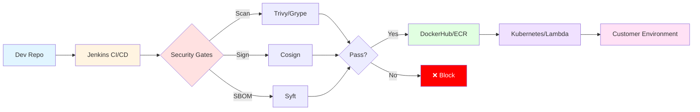
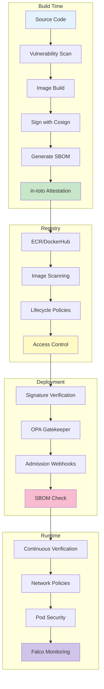
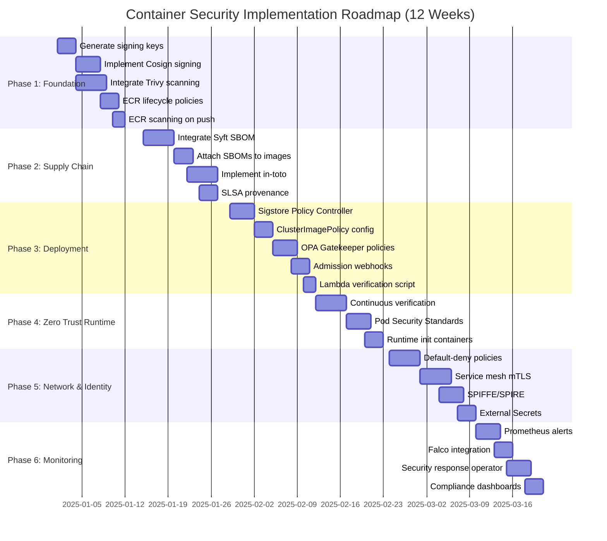
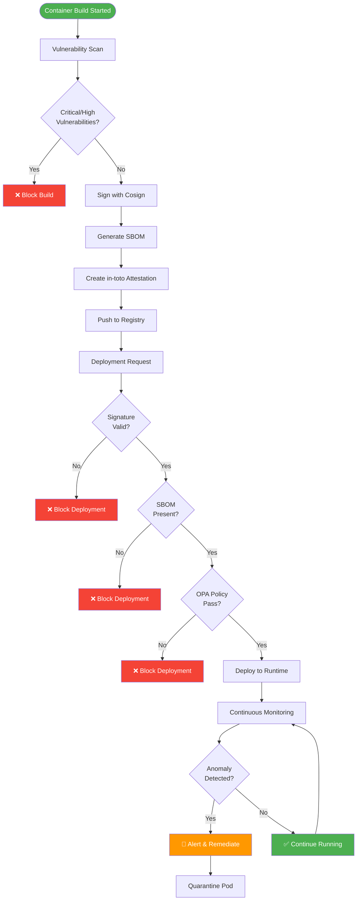
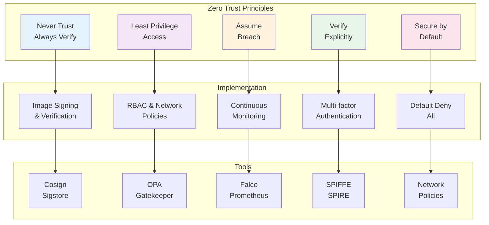
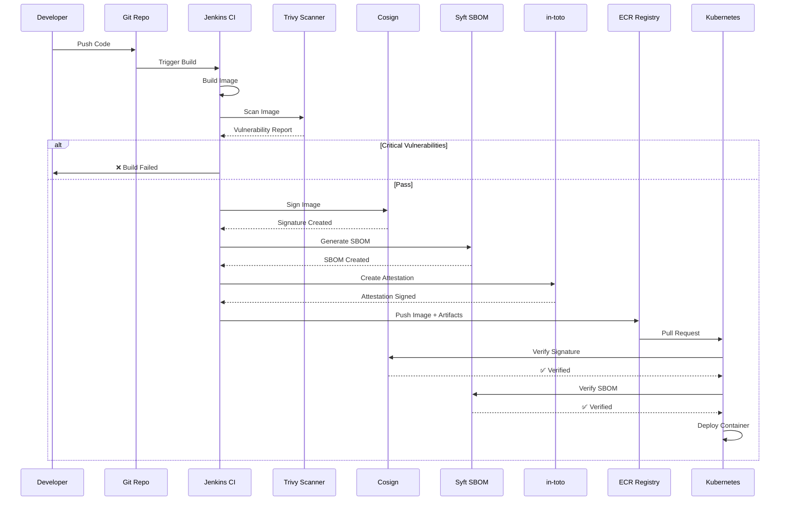
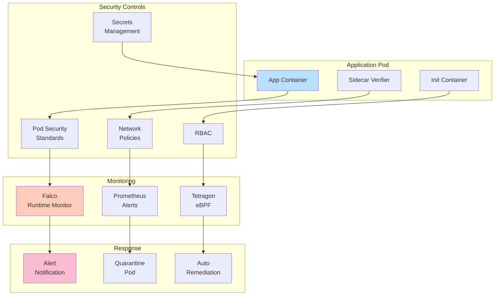
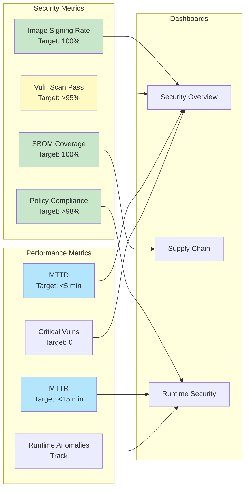
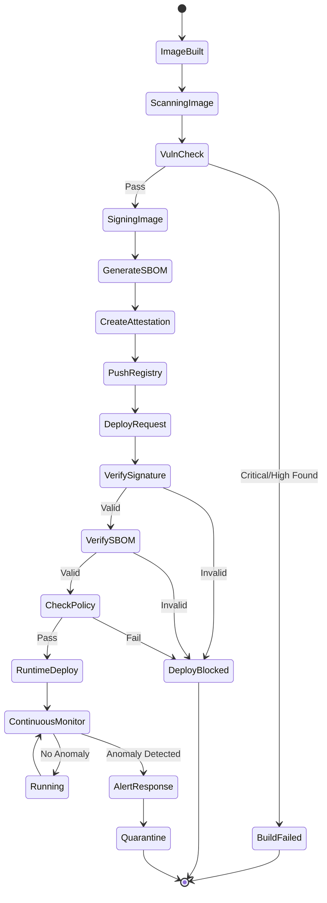
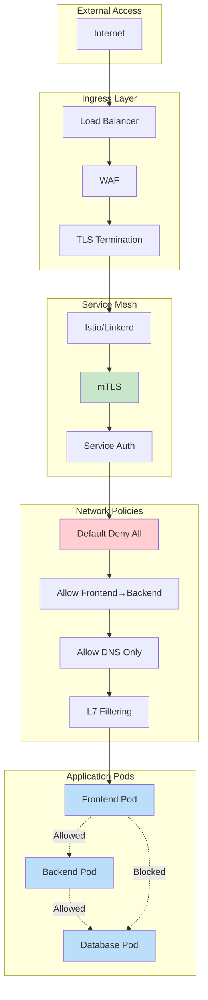

# Container Security & Zero Trust - Visual Diagrams

## 1. Overall Security Pipeline Architecture



## 2. Zero Trust Security Layers



## 3. Implementation Roadmap Timeline



## 4. Security Decision Flow



## 5. Zero Trust Principles Matrix



## 6. Supply Chain Security Flow



## 7. Runtime Security Architecture



## 8. Security Metrics Dashboard



## 9. Deployment Verification Process



## 10. Network Security Layers



---

## How to Use These Diagrams

### Viewing Diagrams:
1. **GitHub/GitLab**: These Mermaid diagrams render automatically
2. **VS Code**: Install "Markdown Preview Mermaid Support" extension
3. **Online**: Use [Mermaid Live Editor](https://mermaid.live/)
4. **Documentation Tools**: Most modern tools support Mermaid (Confluence, Notion, etc.)

### Exporting Diagrams:
```bash
# Install mermaid-cli
npm install -g @mermaid-js/mermaid-cli

# Export to PNG
mmdc -i SECURITY-DIAGRAMS.md -o diagram1.png

# Export to SVG
mmdc -i SECURITY-DIAGRAMS.md -o diagram1.svg

# Export to PDF
mmdc -i SECURITY-DIAGRAMS.md -o diagram1.pdf
```

### Integration with Documentation:
- Copy individual diagrams into presentation slides
- Embed in Confluence pages
- Include in architecture documents
- Use in training materials

