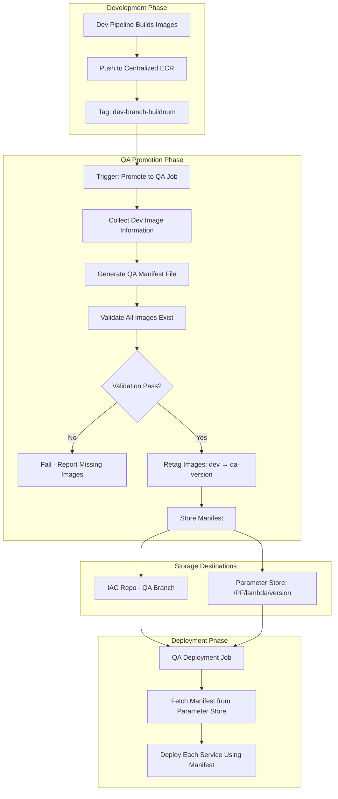
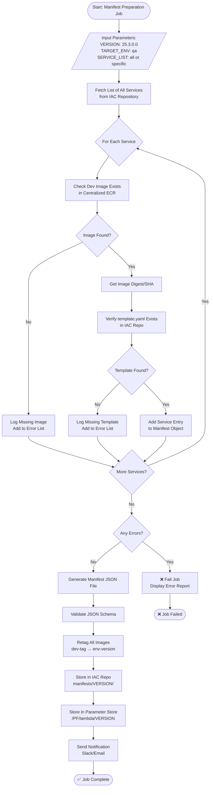
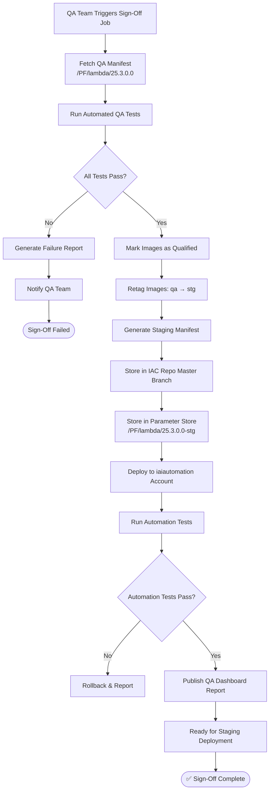

# Manifest File Preparation Job Guide
## Complete Technical Reference for Manifest Generation & Management

**Version:** 1.0  
**Date:** December 13, 2025  
**Audience:** DevSecOps Engineers, Platform Engineers, Release Managers  
**Owner:** Cloud Enablement & Governance Team  

---

## Table of Contents

1. [Overview](#1-overview)
2. [Manifest Preparation Flowcharts](#2-manifest-preparation-flowcharts)
3. [Detailed Job Specifications](#3-detailed-job-specifications)
4. [Sample Manifest Files](#4-sample-manifest-files)
5. [Jenkins Pipeline Implementation](#5-jenkins-pipeline-implementation)
6. [Storage & Distribution](#6-storage--distribution)
7. [Validation & Verification](#7-validation--verification)
8. [Troubleshooting](#8-troubleshooting)

---

## 1. Overview

### 1.1 What is a Manifest File?

A **Manifest File** is a version-specific JSON document that serves as the **single source of truth** for deploying the Purple Fabric platform. It contains:

- All service image URIs from Centralized ECR
- Version tags for each service
- Configuration references
- Dependency mappings

**Key Principle:** *By providing this manifest file, we must be able to deploy/recreate the entire environment, provided the infrastructure configuration remains the same.*

### 1.2 Why Manifest Files?

| Problem | Solution with Manifest |
|---------|------------------------|
| Multiple microservices with various image versions | Single file lists all qualified images |
| Difficulty identifying stable/qualified images | Manifest acts as "qualified" seal of approval |
| Hardcoded configurations in deployments | Manifest + Parameter Store = dynamic injection |
| Environment recreation complexity | Deploy entire environment from one manifest |

### 1.3 Manifest File Naming Convention

```
{type}-manifest-{version}.json
```

**Examples:**
- `lambda-manifest-25.3.0.0.json`
- `k8s-manifest-25.3.0.0.json`
- `full-manifest-25.3.0.0.json`

---

## 2. Manifest Preparation Flowcharts

### 2.1 Overall Manifest Lifecycle



### 2.2 Manifest Preparation Job Flow (Detailed)



### 2.3 QA Sign-Off & Staging Manifest Flow



### 2.4 Environment-Specific Manifest Flow

```mermaid
flowchart LR
    subgraph "Dev Environment"
        DEV_BUILD[Build Image] --> DEV_TAG[Tag: dev-feature-123]
    end
    
    subgraph "QA Promotion"
        DEV_TAG --> QA_MANIFEST[Generate QA Manifest]
        QA_MANIFEST --> QA_TAG[Retag: qa-25.3.0.0]
    end
    
    subgraph "QA Sign-Off"
        QA_TAG --> QA_TEST[QA Testing]
        QA_TEST --> STG_MANIFEST[Generate Staging Manifest]
        STG_MANIFEST --> STG_TAG[Retag: stg-25.3.0.0]
    end
    
    subgraph "Production"
        STG_TAG --> PROD_MANIFEST[Generate Prod Manifest]
        PROD_MANIFEST --> PROD_TAG[Retag: prod-25.3.0.0]
    end
```



---

## 3. Detailed Job Specifications

### 3.1 Job: `manifest-preparation-job`

**Purpose:** Generate manifest file for environment promotion

**Trigger:** Manual (Product Owner / Release Manager)

#### Input Parameters

| Parameter | Type | Required | Description | Example |
|-----------|------|----------|-------------|---------|
| `VERSION` | String | Yes | Release version | `25.3.0.0` |
| `TARGET_ENV` | Choice | Yes | Target environment | `qa`, `stg`, `prod` |
| `SERVICE_LIST` | String | No | Comma-separated services or "all" | `all` or `chunk-asset,embedding-gen-asset` |
| `SOURCE_ENV` | String | No | Source environment for images | `dev` (default) |
| `DRY_RUN` | Boolean | No | Validate only, don't store | `false` |

#### Job Steps

| Step | Description | Actions |
|------|-------------|---------|
| 1 | **Initialize** | Clone IAC repo, set up AWS credentials |
| 2 | **Discover Services** | List all services from IAC repo structure |
| 3 | **Validate Images** | Check each service image exists in ECR |
| 4 | **Validate Templates** | Verify template.yaml exists for each service |
| 5 | **Generate Manifest** | Create JSON manifest with all service URIs |
| 6 | **Retag Images** | Copy ECR tags from source to target env |
| 7 | **Store Manifest** | Push to IAC repo and Parameter Store |
| 8 | **Notify** | Send success/failure notification |

#### Output

- Manifest JSON file stored in IAC repo
- Manifest stored in AWS Parameter Store
- Slack/Email notification with summary

---

### 3.2 Job: `qa-signoff-job`

**Purpose:** Qualify images after QA testing and prepare for staging

**Trigger:** QA Team after testing completion

#### Input Parameters

| Parameter | Type | Required | Description |
|-----------|------|----------|-------------|
| `VERSION` | String | Yes | Version to sign off |
| `QA_REPORT_LINK` | String | No | Link to QA test report |
| `SKIP_AUTOMATION` | Boolean | No | Skip iaiautomation deployment |

#### Job Steps

| Step | Description |
|------|-------------|
| 1 | Fetch QA manifest from Parameter Store |
| 2 | Validate all services are deployed in QA |
| 3 | Run automated regression tests |
| 4 | Generate staging manifest |
| 5 | Retag images: `qa-version` → `stg-version` |
| 6 | Store staging manifest in IAC repo (master branch) |
| 7 | Deploy to iaiautomation account |
| 8 | Run automation tests |
| 9 | Publish QA dashboard report |

---

### 3.3 Job: `manifest-deployment-job`

**Purpose:** Deploy services using manifest file

**Trigger:** After manifest is prepared

#### Input Parameters

| Parameter | Type | Required | Description |
|-----------|------|----------|-------------|
| `VERSION` | String | Yes | Manifest version to deploy |
| `ENVIRONMENT` | Choice | Yes | Target environment |
| `SERVICE_NAME` | String | No | Specific service or "all" |

#### Job Steps

| Step | Description |
|------|-------------|
| 1 | Fetch manifest from Parameter Store |
| 2 | Validate manifest matches IAC repo |
| 3 | Pre-deployment checks (images, templates) |
| 4 | Deploy each service using SAM/Helm |
| 5 | Post-deployment health checks |
| 6 | Update deployment status |

---

## 4. Sample Manifest Files

### 4.1 Lambda Manifest (Full Example)

**File:** `lambda-manifest-25.3.0.0.json`

```json
{
  "manifest_version": "1.0",
  "release_version": "25.3.0.0",
  "environment": "qa",
  "created_at": "2025-12-13T10:30:00Z",
  "created_by": "jenkins-manifest-job",
  "build_number": "456",
  
  "ecr_registry": "123456789012.dkr.ecr.us-east-1.amazonaws.com",
  
  "services": {
    "chunk-asset": {
      "image_uri": "123456789012.dkr.ecr.us-east-1.amazonaws.com/chunk-asset:qa-25.3.0.0",
      "image_tag": "qa-25.3.0.0",
      "image_digest": "sha256:abc123def456789...",
      "source_tag": "dev-develop-456",
      "template_path": "services/chunk-asset/lambda/chunk-asset/lambda/template.yaml",
      "config_version": "25.3.0.0",
      "memory_size": 1024,
      "timeout": 900,
      "dependencies": ["chunk-init-asset"],
      "sqs_queues": [
        "qa_map_chunk_1_queue.fifo",
        "qa_map_chunk_2_queue.fifo",
        "qa_map_chunk_3_queue.fifo",
        "qa_map_chunk_4_queue.fifo",
        "qa_map_chunk_5_queue.fifo",
        "qa_map_chunk_queue.fifo"
      ]
    },
    
    "chunk-init-asset": {
      "image_uri": "123456789012.dkr.ecr.us-east-1.amazonaws.com/chunk-init-asset:qa-25.3.0.0",
      "image_tag": "qa-25.3.0.0",
      "image_digest": "sha256:def789ghi012345...",
      "source_tag": "dev-develop-455",
      "template_path": "services/chunk-init-asset/lambda/chunk-init-asset/lambda/template.yaml",
      "config_version": "25.3.0.0",
      "memory_size": 512,
      "timeout": 300,
      "dependencies": [],
      "sqs_queues": [
        "qa_map_chunk_automation_queue.fifo",
        "qa_map_kb_doc_import_queue.fifo"
      ]
    },
    
    "embedding-gen-asset": {
      "image_uri": "123456789012.dkr.ecr.us-east-1.amazonaws.com/embedding-gen-asset:qa-25.3.0.0",
      "image_tag": "qa-25.3.0.0",
      "image_digest": "sha256:ghi456jkl789012...",
      "source_tag": "dev-develop-457",
      "template_path": "services/embedding-gen-asset/lambda/embedding-gen-asset/lambda/template.yaml",
      "config_version": "25.3.0.0",
      "memory_size": 2048,
      "timeout": 900,
      "dependencies": ["embedding-init-asset"],
      "sqs_queues": [
        "qa_map_embedding_1_queue.fifo",
        "qa_map_embedding_2_queue.fifo",
        "qa_map_embedding_3_queue.fifo",
        "qa_map_embedding_4_queue.fifo",
        "qa_map_embedding_5_queue.fifo"
      ]
    },
    
    "embedding-init-asset": {
      "image_uri": "123456789012.dkr.ecr.us-east-1.amazonaws.com/embedding-init-asset:qa-25.3.0.0",
      "image_tag": "qa-25.3.0.0",
      "image_digest": "sha256:jkl012mno345678...",
      "source_tag": "dev-develop-454",
      "template_path": "services/embedding-init-asset/lambda/embedding-init-asset/lambda/template.yaml",
      "config_version": "25.3.0.0",
      "memory_size": 512,
      "timeout": 300,
      "dependencies": [],
      "sqs_queues": [
        "qa_map_embedding_init_lambda_queue.fifo"
      ]
    },
    
    "file-text-extraction": {
      "image_uri": "123456789012.dkr.ecr.us-east-1.amazonaws.com/file-text-extraction:qa-25.3.0.0",
      "image_tag": "qa-25.3.0.0",
      "image_digest": "sha256:mno678pqr901234...",
      "source_tag": "dev-develop-458",
      "template_path": "services/file-text-extraction/lambda/file-text-extraction/lambda/template.yaml",
      "config_version": "25.3.0.0",
      "memory_size": 1024,
      "timeout": 600,
      "dependencies": [],
      "sqs_queues": [
        "qa_map_textextraction_asset_queue.fifo",
        "qa_map_textract_v2_queue.fifo"
      ]
    },
    
    "file-img-conversion": {
      "image_uri": "123456789012.dkr.ecr.us-east-1.amazonaws.com/file-img-conversion:qa-25.3.0.0",
      "image_tag": "qa-25.3.0.0",
      "image_digest": "sha256:pqr234stu567890...",
      "source_tag": "dev-develop-459",
      "template_path": "services/file-img-conversion/lambda/file-img-conversion/lambda/template.yaml",
      "config_version": "25.3.0.0",
      "memory_size": 1024,
      "timeout": 600,
      "dependencies": [],
      "sqs_queues": [
        "qa_map_file2image_asset_queue.fifo",
        "qa_map_file_image_conversion_automation_queue.fifo"
      ]
    },
    
    "asset-dlq-listener": {
      "image_uri": "123456789012.dkr.ecr.us-east-1.amazonaws.com/asset-dlq-listener:qa-25.3.0.0",
      "image_tag": "qa-25.3.0.0",
      "image_digest": "sha256:stu890vwx123456...",
      "source_tag": "dev-develop-460",
      "template_path": "services/asset-dlq-listener/lambda/asset-dlq-listener/lambda/template.yaml",
      "config_version": "25.3.0.0",
      "memory_size": 512,
      "timeout": 300,
      "dependencies": [],
      "sqs_queues": [
        "qa_map_chunk_automation_queue_dlq.fifo",
        "qa_map_chunk_queue_dlq.fifo",
        "qa_map_embedding_automation_queue_dlq.fifo",
        "qa_map_embedding_queue_dlq.fifo"
      ]
    },
    
    "gen-ai-tools": {
      "image_uri": "123456789012.dkr.ecr.us-east-1.amazonaws.com/gen-ai-tools:qa-25.3.0.0",
      "image_tag": "qa-25.3.0.0",
      "image_digest": "sha256:vwx456yza789012...",
      "source_tag": "dev-develop-461",
      "template_path": "services/gen-ai-tools/lambda/gen-ai-tools/lambda/template.yaml",
      "config_version": "25.3.0.0",
      "memory_size": 2048,
      "timeout": 900,
      "dependencies": [],
      "sqs_queues": []
    },
    
    "web-scraper-static": {
      "image_uri": "123456789012.dkr.ecr.us-east-1.amazonaws.com/web-scraper-static:qa-25.3.0.0",
      "image_tag": "qa-25.3.0.0",
      "image_digest": "sha256:yza012bcd345678...",
      "source_tag": "dev-develop-462",
      "template_path": "services/web-scraper/lambda/web-scraper-static/lambda/template.yaml",
      "config_version": "25.3.0.0",
      "memory_size": 1024,
      "timeout": 600,
      "dependencies": [],
      "sqs_queues": [
        "qa-scrap-request-queue",
        "qa-site-data-request-queue"
      ]
    },
    
    "web-scraper-dynamic": {
      "image_uri": "123456789012.dkr.ecr.us-east-1.amazonaws.com/web-scraper-dynamic:qa-25.3.0.0",
      "image_tag": "qa-25.3.0.0",
      "image_digest": "sha256:bcd678efg901234...",
      "source_tag": "dev-develop-463",
      "template_path": "services/web-scraper/lambda/web-scraper-dynamic/lambda/template.yaml",
      "config_version": "25.3.0.0",
      "memory_size": 2048,
      "timeout": 900,
      "dependencies": [],
      "sqs_queues": [
        "qa-site-data-request-queue"
      ]
    }
  },
  
  "infrastructure": {
    "iac_repo": "idxp_map_infra_iac_svc",
    "iac_branch": "qa",
    "iac_commit": "a1b2c3d4e5f6",
    "parameter_store_path": "/PF/qa/",
    "s3_artifacts_path": "s3://pf-artifacts/lambda/25.3.0.0/"
  },
  
  "metadata": {
    "total_services": 10,
    "source_environment": "dev",
    "promotion_type": "scheduled",
    "approver": "product-manager@company.com",
    "jira_ticket": "MAP-1234"
  }
}
```

### 4.2 K8s Manifest (Full Example)

**File:** `k8s-manifest-25.3.0.0.json`

```json
{
  "manifest_version": "1.0",
  "release_version": "25.3.0.0",
  "environment": "qa",
  "created_at": "2025-12-13T10:30:00Z",
  "created_by": "jenkins-manifest-job",
  
  "docker_registry": "dockerhub.company.com",
  
  "services": {
    "idxp-map-api-gateway": {
      "image_uri": "dockerhub.company.com/idxp-map-api-gateway:qa-25.3.0.0",
      "image_tag": "qa-25.3.0.0",
      "helm_chart_path": "services/idxp-map-api-gateway/idxp-map-api-gateway/",
      "helm_chart_version": "1.0.0",
      "replicas": 2,
      "resources": {
        "limits": {"cpu": "500m", "memory": "512Mi"},
        "requests": {"cpu": "250m", "memory": "256Mi"}
      }
    },
    
    "idxp-map-core-service": {
      "image_uri": "dockerhub.company.com/idxp-map-core-service:qa-25.3.0.0",
      "image_tag": "qa-25.3.0.0",
      "helm_chart_path": "services/idxp-map-core-service/idxp-map-core-service/",
      "helm_chart_version": "1.0.0",
      "replicas": 3,
      "resources": {
        "limits": {"cpu": "1000m", "memory": "1024Mi"},
        "requests": {"cpu": "500m", "memory": "512Mi"}
      }
    }
  },
  
  "infrastructure": {
    "iac_repo": "idxp_map_infra_iac_svc",
    "iac_branch": "qa",
    "helm_repo_url": "s3://pf-artifacts/helm-charts/25.3.0.0/",
    "eks_cluster": "pf-qa-cluster",
    "namespace": "purple-fabric"
  }
}
```

### 4.3 Minimal Manifest (Quick Reference)

```json
{
  "version": "25.3.0.0",
  "services": {
    "chunk-asset": {
      "image_uri": "123456789012.dkr.ecr.us-east-1.amazonaws.com/chunk-asset:qa-25.3.0.0",
      "tag": "qa-25.3.0.0"
    },
    "chunk-init-asset": {
      "image_uri": "123456789012.dkr.ecr.us-east-1.amazonaws.com/chunk-init-asset:qa-25.3.0.0",
      "tag": "qa-25.3.0.0"
    },
    "embedding-gen-asset": {
      "image_uri": "123456789012.dkr.ecr.us-east-1.amazonaws.com/embedding-gen-asset:qa-25.3.0.0",
      "tag": "qa-25.3.0.0"
    }
  }
}
```

---

## 5. Jenkins Pipeline Implementation

### 5.1 Manifest Preparation Jenkinsfile

```groovy
// Jenkinsfile: manifest-preparation-job
// Location: idxp_map_infra_iac_svc/jenkins/manifest-preparation/Jenkinsfile

pipeline {
    agent any
    
    parameters {
        string(
            name: 'VERSION', 
            defaultValue: '', 
            description: 'Release version (e.g., 25.3.0.0)'
        )
        choice(
            name: 'TARGET_ENV', 
            choices: ['qa', 'stg', 'prod'], 
            description: 'Target environment'
        )
        string(
            name: 'SERVICE_LIST', 
            defaultValue: 'all', 
            description: 'Comma-separated services or "all"'
        )
        string(
            name: 'SOURCE_ENV', 
            defaultValue: 'dev', 
            description: 'Source environment for images'
        )
        booleanParam(
            name: 'DRY_RUN', 
            defaultValue: false, 
            description: 'Validate only, do not store'
        )
    }
    
    environment {
        AWS_REGION = 'us-east-1'
        ECR_REGISTRY = '123456789012.dkr.ecr.us-east-1.amazonaws.com'
        IAC_REPO = 'idxp_map_infra_iac_svc'
        MANIFEST_DIR = 'manifests'
    }
    
    stages {
        stage('Validate Input') {
            steps {
                script {
                    if (!params.VERSION?.trim()) {
                        error "VERSION parameter is required"
                    }
                    
                    // Validate version format
                    if (!params.VERSION.matches(/^\d+\.\d+\.\d+\.\d+$/)) {
                        error "VERSION must be in format X.X.X.X (e.g., 25.3.0.0)"
                    }
                    
                    echo "📋 Preparing manifest for version: ${params.VERSION}"
                    echo "🎯 Target environment: ${params.TARGET_ENV}"
                }
            }
        }
        
        stage('Checkout IAC Repository') {
            steps {
                checkout([
                    $class: 'GitSCM',
                    branches: [[name: "*/${params.TARGET_ENV}"]],
                    userRemoteConfigs: [[
                        url: "https://git.company.com/iac/${IAC_REPO}.git",
                        credentialsId: 'git-credentials'
                    ]]
                ])
                
                script {
                    env.IAC_COMMIT = sh(
                        script: 'git rev-parse HEAD',
                        returnStdout: true
                    ).trim()
                }
            }
        }
        
        stage('Discover Services') {
            steps {
                script {
                    def serviceList = []
                    
                    if (params.SERVICE_LIST == 'all') {
                        // Auto-discover from IAC repo structure
                        def services = sh(
                            script: '''
                                find services -mindepth 1 -maxdepth 1 -type d -exec basename {} \\; | sort
                            ''',
                            returnStdout: true
                        ).trim().split('\n')
                        serviceList = services.toList()
                    } else {
                        serviceList = params.SERVICE_LIST.split(',').collect { it.trim() }
                    }
                    
                    env.SERVICES = serviceList.join(',')
                    echo "📦 Services to process: ${env.SERVICES}"
                }
            }
        }
        
        stage('Validate Images & Templates') {
            steps {
                script {
                    def services = env.SERVICES.split(',')
                    def manifest = [
                        manifest_version: "1.0",
                        release_version: params.VERSION,
                        environment: params.TARGET_ENV,
                        created_at: new Date().format("yyyy-MM-dd'T'HH:mm:ss'Z'"),
                        created_by: "jenkins-manifest-job",
                        build_number: env.BUILD_NUMBER,
                        ecr_registry: env.ECR_REGISTRY,
                        services: [:],
                        errors: []
                    ]
                    
                    services.each { serviceName ->
                        echo "🔍 Validating: ${serviceName}"
                        
                        // Check ECR image exists
                        def sourceTag = "${params.SOURCE_ENV}-develop-latest"
                        def imageCheck = sh(
                            script: """
                                aws ecr describe-images \
                                    --repository-name ${serviceName} \
                                    --image-ids imageTag=${sourceTag} \
                                    --region ${AWS_REGION} \
                                    --query 'imageDetails[0].imageDigest' \
                                    --output text 2>/dev/null || echo "NOT_FOUND"
                            """,
                            returnStdout: true
                        ).trim()
                        
                        if (imageCheck == "NOT_FOUND") {
                            manifest.errors.add("Image not found: ${serviceName}:${sourceTag}")
                            echo "❌ Image not found: ${serviceName}:${sourceTag}"
                            return
                        }
                        
                        // Check template exists
                        def templatePath = "services/${serviceName}/lambda/${serviceName}/lambda/template.yaml"
                        def templateExists = fileExists(templatePath)
                        
                        if (!templateExists) {
                            manifest.errors.add("Template not found: ${templatePath}")
                            echo "❌ Template not found: ${templatePath}"
                            return
                        }
                        
                        // Add to manifest
                        def targetTag = "${params.TARGET_ENV}-${params.VERSION}"
                        manifest.services[serviceName] = [
                            image_uri: "${ECR_REGISTRY}/${serviceName}:${targetTag}",
                            image_tag: targetTag,
                            image_digest: imageCheck,
                            source_tag: sourceTag,
                            template_path: templatePath,
                            config_version: params.VERSION
                        ]
                        
                        echo "✅ Validated: ${serviceName}"
                    }
                    
                    // Store manifest for later stages
                    env.MANIFEST_JSON = groovy.json.JsonOutput.toJson(manifest)
                    env.ERROR_COUNT = manifest.errors.size()
                    
                    // Write to file for inspection
                    writeJSON file: "manifest-${params.VERSION}.json", json: manifest, pretty: 4
                }
            }
        }
        
        stage('Check Validation Results') {
            steps {
                script {
                    if (env.ERROR_COUNT.toInteger() > 0) {
                        def manifest = readJSON text: env.MANIFEST_JSON
                        echo "❌ Validation failed with ${env.ERROR_COUNT} errors:"
                        manifest.errors.each { error ->
                            echo "  - ${error}"
                        }
                        error "Manifest validation failed. Please fix the above issues."
                    }
                    
                    echo "✅ All validations passed!"
                }
            }
        }
        
        stage('Retag Images') {
            when {
                expression { !params.DRY_RUN }
            }
            steps {
                script {
                    def manifest = readJSON text: env.MANIFEST_JSON
                    
                    manifest.services.each { serviceName, serviceConfig ->
                        echo "🏷️ Retagging: ${serviceName}"
                        
                        sh """
                            # Get image manifest from source tag
                            IMAGE_MANIFEST=\$(aws ecr batch-get-image \
                                --repository-name ${serviceName} \
                                --image-ids imageTag=${serviceConfig.source_tag} \
                                --region ${AWS_REGION} \
                                --query 'images[0].imageManifest' \
                                --output text)
                            
                            # Put with new tag
                            aws ecr put-image \
                                --repository-name ${serviceName} \
                                --image-tag ${serviceConfig.image_tag} \
                                --image-manifest "\$IMAGE_MANIFEST" \
                                --region ${AWS_REGION}
                            
                            echo "✅ Retagged ${serviceName}: ${serviceConfig.source_tag} → ${serviceConfig.image_tag}"
                        """
                    }
                }
            }
        }
        
        stage('Store Manifest') {
            when {
                expression { !params.DRY_RUN }
            }
            parallel {
                stage('Store in IAC Repo') {
                    steps {
                        script {
                            sh """
                                mkdir -p ${MANIFEST_DIR}/${params.VERSION}
                                cp manifest-${params.VERSION}.json ${MANIFEST_DIR}/${params.VERSION}/lambda-manifest.json
                                
                                git config user.email "jenkins@company.com"
                                git config user.name "Jenkins CI"
                                git add ${MANIFEST_DIR}/
                                git commit -m "Add manifest for version ${params.VERSION}" || true
                                git push origin ${params.TARGET_ENV}
                            """
                        }
                    }
                }
                
                stage('Store in Parameter Store') {
                    steps {
                        script {
                            def paramPath = "/PF/lambda/${params.VERSION}"
                            
                            sh """
                                aws ssm put-parameter \
                                    --name "${paramPath}" \
                                    --value file://manifest-${params.VERSION}.json \
                                    --type String \
                                    --overwrite \
                                    --region ${AWS_REGION}
                                
                                echo "✅ Stored manifest at: ${paramPath}"
                            """
                        }
                    }
                }
            }
        }
        
        stage('Generate Report') {
            steps {
                script {
                    def manifest = readJSON text: env.MANIFEST_JSON
                    def serviceCount = manifest.services.size()
                    
                    def summary = """
╔════════════════════════════════════════════════════════════════╗
║             MANIFEST PREPARATION COMPLETE                       ║
╠════════════════════════════════════════════════════════════════╣
║ Version:      ${params.VERSION.padRight(47)}║
║ Environment:  ${params.TARGET_ENV.padRight(47)}║
║ Services:     ${serviceCount.toString().padRight(47)}║
║ Dry Run:      ${params.DRY_RUN.toString().padRight(47)}║
╠════════════════════════════════════════════════════════════════╣
║ Storage Locations:                                              ║
║   • IAC Repo: manifests/${params.VERSION}/lambda-manifest.json${' '.padRight(20)}║
║   • SSM:      /PF/lambda/${params.VERSION}${' '.padRight(30)}║
╚════════════════════════════════════════════════════════════════╝
                    """
                    
                    echo summary
                }
            }
        }
    }
    
    post {
        success {
            slackSend(
                channel: '#deployments',
                color: 'good',
                message: """
✅ *Manifest Preparation Successful*
• Version: `${params.VERSION}`
• Environment: `${params.TARGET_ENV}`
• Build: #${env.BUILD_NUMBER}
• Services: ${env.SERVICES}
                """
            )
        }
        
        failure {
            slackSend(
                channel: '#deployments',
                color: 'danger',
                message: """
❌ *Manifest Preparation Failed*
• Version: `${params.VERSION}`
• Environment: `${params.TARGET_ENV}`
• Build: #${env.BUILD_NUMBER}
• Check: ${env.BUILD_URL}
                """
            )
        }
        
        always {
            archiveArtifacts artifacts: 'manifest-*.json', allowEmptyArchive: true
        }
    }
}
```

### 5.2 Manifest Deployment Jenkinsfile

```groovy
// Jenkinsfile: manifest-deployment-job
// Location: idxp_map_infra_iac_svc/jenkins/manifest-deployment/Jenkinsfile

pipeline {
    agent any
    
    parameters {
        string(name: 'VERSION', description: 'Manifest version to deploy')
        choice(name: 'ENVIRONMENT', choices: ['qa', 'stg', 'prod'])
        string(name: 'SERVICE_NAME', defaultValue: 'all', description: 'Service to deploy or "all"')
    }
    
    environment {
        AWS_REGION = 'us-east-1'
    }
    
    stages {
        stage('Fetch Manifest') {
            steps {
                script {
                    def paramPath = "/PF/lambda/${params.VERSION}"
                    
                    env.MANIFEST_JSON = sh(
                        script: """
                            aws ssm get-parameter \
                                --name "${paramPath}" \
                                --query 'Parameter.Value' \
                                --output text \
                                --region ${AWS_REGION}
                        """,
                        returnStdout: true
                    ).trim()
                    
                    writeJSON file: 'manifest.json', text: env.MANIFEST_JSON
                    
                    echo "📋 Fetched manifest for version: ${params.VERSION}"
                }
            }
        }
        
        stage('Pre-Deployment Checks') {
            steps {
                script {
                    def manifest = readJSON text: env.MANIFEST_JSON
                    
                    manifest.services.each { serviceName, config ->
                        if (params.SERVICE_NAME != 'all' && params.SERVICE_NAME != serviceName) {
                            return
                        }
                        
                        echo "🔍 Checking: ${serviceName}"
                        
                        // Verify image exists
                        sh """
                            aws ecr describe-images \
                                --repository-name ${serviceName} \
                                --image-ids imageTag=${config.image_tag} \
                                --region ${AWS_REGION}
                        """
                        
                        echo "✅ ${serviceName} - Image verified"
                    }
                }
            }
        }
        
        stage('Deploy Services') {
            steps {
                script {
                    def manifest = readJSON text: env.MANIFEST_JSON
                    
                    manifest.services.each { serviceName, config ->
                        if (params.SERVICE_NAME != 'all' && params.SERVICE_NAME != serviceName) {
                            return
                        }
                        
                        echo "🚀 Deploying: ${serviceName}"
                        
                        // Deploy using SAM
                        dir("services/${serviceName}/lambda/${serviceName}/lambda") {
                            sh """
                                sam deploy \
                                    --template-file template.yaml \
                                    --stack-name ${serviceName}-${params.ENVIRONMENT} \
                                    --parameter-overrides \
                                        ImageUri=${config.image_uri} \
                                        EnvironmentType=${params.ENVIRONMENT} \
                                    --capabilities CAPABILITY_IAM \
                                    --no-fail-on-empty-changeset \
                                    --region ${AWS_REGION}
                            """
                        }
                        
                        echo "✅ Deployed: ${serviceName}"
                    }
                }
            }
        }
        
        stage('Post-Deployment Validation') {
            steps {
                script {
                    def manifest = readJSON text: env.MANIFEST_JSON
                    
                    manifest.services.each { serviceName, config ->
                        if (params.SERVICE_NAME != 'all' && params.SERVICE_NAME != serviceName) {
                            return
                        }
                        
                        // Wait for function to be ready
                        sh """
                            aws lambda wait function-updated \
                                --function-name ${serviceName}-${params.ENVIRONMENT} \
                                --region ${AWS_REGION}
                            
                            aws lambda get-function \
                                --function-name ${serviceName}-${params.ENVIRONMENT} \
                                --query 'Configuration.State' \
                                --output text \
                                --region ${AWS_REGION}
                        """
                        
                        echo "✅ ${serviceName} - Health check passed"
                    }
                }
            }
        }
    }
    
    post {
        success {
            echo "🎉 Deployment completed successfully!"
        }
        failure {
            echo "❌ Deployment failed. Check logs for details."
        }
    }
}
```

---

## 6. Storage & Distribution

### 6.1 Storage Locations

| Location | Path | Purpose | Access |
|----------|------|---------|--------|
| **IAC Repository** | `manifests/{VERSION}/` | Version control, audit trail | Git |
| **Parameter Store** | `/PF/lambda/{VERSION}` | Runtime deployment access | IAM |
| **Parameter Store** | `/PF/k8s/{VERSION}` | K8s manifest | IAM |
| **Parameter Store** | `/Fabric/lambda/{VERSION}` | Fabric services | IAM |

### 6.2 Parameter Store Commands

```bash
# Store manifest
aws ssm put-parameter \
    --name "/PF/lambda/25.3.0.0" \
    --value file://lambda-manifest-25.3.0.0.json \
    --type String \
    --overwrite

# Retrieve manifest
aws ssm get-parameter \
    --name "/PF/lambda/25.3.0.0" \
    --query 'Parameter.Value' \
    --output text > manifest.json

# List all manifests
aws ssm get-parameters-by-path \
    --path "/PF/lambda/" \
    --query 'Parameters[].Name'
```

---

## 7. Validation & Verification

### 7.1 Manifest Validation Script

```bash
#!/bin/bash
# validate_manifest.sh

MANIFEST_FILE=$1
ENVIRONMENT=$2

echo "🔍 Validating manifest: ${MANIFEST_FILE}"

# Check JSON validity
if ! jq empty "${MANIFEST_FILE}" 2>/dev/null; then
    echo "❌ Invalid JSON format"
    exit 1
fi

echo "✅ JSON format valid"

# Check required fields
VERSION=$(jq -r '.release_version' "${MANIFEST_FILE}")
if [ -z "$VERSION" ] || [ "$VERSION" == "null" ]; then
    echo "❌ Missing release_version"
    exit 1
fi

echo "✅ Version: ${VERSION}"

# Validate each service
SERVICES=$(jq -r '.services | keys[]' "${MANIFEST_FILE}")

for SERVICE in $SERVICES; do
    echo "🔍 Validating service: ${SERVICE}"
    
    IMAGE_URI=$(jq -r ".services[\"${SERVICE}\"].image_uri" "${MANIFEST_FILE}")
    IMAGE_TAG=$(jq -r ".services[\"${SERVICE}\"].image_tag" "${MANIFEST_FILE}")
    
    # Check image exists in ECR
    REPO_NAME=$(echo $IMAGE_URI | sed 's/.*\///' | cut -d: -f1)
    
    aws ecr describe-images \
        --repository-name "$REPO_NAME" \
        --image-ids imageTag="$IMAGE_TAG" \
        --query 'imageDetails[0].imagePushedAt' \
        --output text > /dev/null 2>&1
    
    if [ $? -eq 0 ]; then
        echo "  ✅ Image exists: ${IMAGE_TAG}"
    else
        echo "  ❌ Image not found: ${IMAGE_TAG}"
        exit 1
    fi
done

echo ""
echo "✅ Manifest validation complete!"
```

### 7.2 Compare Manifests Script

```bash
#!/bin/bash
# compare_manifests.sh

MANIFEST_1=$1
MANIFEST_2=$2

echo "📊 Comparing manifests..."
echo "  File 1: ${MANIFEST_1}"
echo "  File 2: ${MANIFEST_2}"
echo ""

# Get versions
V1=$(jq -r '.release_version' "${MANIFEST_1}")
V2=$(jq -r '.release_version' "${MANIFEST_2}")

echo "Versions: ${V1} vs ${V2}"
echo ""

# Compare services
SERVICES_1=$(jq -r '.services | keys[]' "${MANIFEST_1}" | sort)
SERVICES_2=$(jq -r '.services | keys[]' "${MANIFEST_2}" | sort)

echo "Services comparison:"
diff <(echo "$SERVICES_1") <(echo "$SERVICES_2")

# Compare tags
echo ""
echo "Image tag changes:"
for SERVICE in $SERVICES_1; do
    TAG_1=$(jq -r ".services[\"${SERVICE}\"].image_tag" "${MANIFEST_1}")
    TAG_2=$(jq -r ".services[\"${SERVICE}\"].image_tag" "${MANIFEST_2}")
    
    if [ "$TAG_1" != "$TAG_2" ]; then
        echo "  ${SERVICE}: ${TAG_1} → ${TAG_2}"
    fi
done
```

---

## 8. Troubleshooting

### 8.1 Common Issues

| Issue | Cause | Solution |
|-------|-------|----------|
| Image not found | Dev build not pushed | Run dev pipeline first |
| Template not found | Service not in IAC repo | Add template.yaml to IAC |
| Retag failed | Image already exists with tag | Use --force or different version |
| SSM access denied | Missing IAM permissions | Check role has ssm:PutParameter |
| Manifest mismatch | SSM and IAC repo differ | Re-run manifest preparation |

### 8.2 Debug Commands

```bash
# List all images for a service
aws ecr describe-images \
    --repository-name chunk-asset \
    --query 'imageDetails[*].[imageTags,imagePushedAt]' \
    --output table

# Check manifest in Parameter Store
aws ssm get-parameter \
    --name "/PF/lambda/25.3.0.0" \
    --query 'Parameter.Value' \
    --output text | jq .

# Verify service count
jq '.services | keys | length' manifest.json

# List all manifests
aws ssm get-parameters-by-path \
    --path "/PF/" \
    --recursive \
    --query 'Parameters[?contains(Name, `manifest`)].Name'
```

---

## Document Information

| Property | Value |
|----------|-------|
| **Version** | 1.0 |
| **Created** | December 13, 2025 |
| **Owner** | Cloud Enablement & Governance Team |
| **Review Cycle** | Monthly |

---

**End of Document**

