# Comprehensive Sequence Diagrams
## Deployment and Process Flows Documentation

### Document Information
- **Version**: 1.0
- **Date**: December 13, 2025
- **Scope**: All deployment flows and processes
- **Source**: Consolidated from all architecture documents

---

## Table of Contents

1. [Manifest-Driven Deployment Flows](#manifest-driven-deployment-flows)
2. [Lambda Deployment Sequences](#lambda-deployment-sequences)
3. [Kubernetes Deployment Flows](#kubernetes-deployment-flows)
4. [Cross-Account ECR Flows](#cross-account-ecr-flows)
5. [DevSecOps Process Flows](#devsecops-process-flows)
6. [Governance and Approval Flows](#governance-and-approval-flows)
7. [Error Handling and Rollback Flows](#error-handling-and-rollback-flows)
8. [Integration and Third-Party Flows](#integration-and-third-party-flows)

---

## Manifest-Driven Deployment Flows

### 1. Development Environment - Initial Build and Deploy

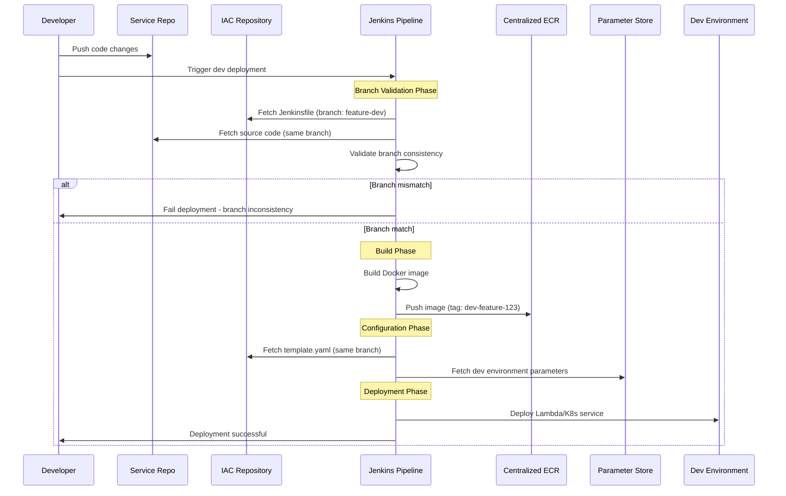
```mermaid
sequenceDiagram
    participant Dev as Developer
    participant Git as Service Repo
    participant IAC as IAC Repository
    participant Jenkins as Jenkins Pipeline
    participant ECR as Centralized ECR
    participant PS as Parameter Store
    participant DevEnv as Dev Environment
    
    Dev->>Git: Push code changes
    Dev->>Jenkins: Trigger dev deployment
    
    Note over Jenkins: Branch Validation Phase
    Jenkins->>IAC: Fetch Jenkinsfile (branch: feature-dev)
    Jenkins->>Git: Fetch source code (same branch)
    Jenkins->>Jenkins: Validate branch consistency
    
    alt Branch mismatch
        Jenkins->>Dev: Fail deployment - branch inconsistency
    else Branch match
        Note over Jenkins: Build Phase
        Jenkins->>Jenkins: Build Docker image
        Jenkins->>ECR: Push image (tag: dev-feature-123)
        
        Note over Jenkins: Configuration Phase
        Jenkins->>IAC: Fetch template.yaml (same branch)
        Jenkins->>PS: Fetch dev environment parameters
        
        Note over Jenkins: Deployment Phase
        Jenkins->>DevEnv: Deploy Lambda/K8s service
        Jenkins->>Dev: Deployment successful
    end
```

### 2. QA Environment - Promotion and Manifest Generation

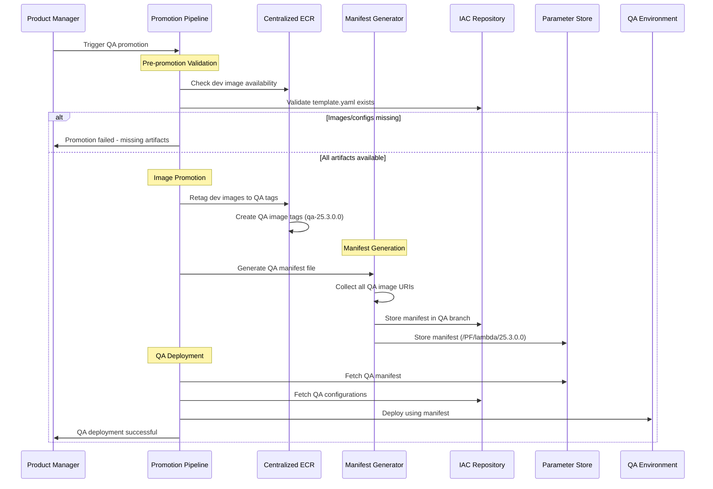
```mermaid
sequenceDiagram
    participant PM as Product Manager
    participant Jenkins as Promotion Pipeline
    participant ECR as Centralized ECR
    participant Manifest as Manifest Generator
    participant IAC as IAC Repository
    participant PS as Parameter Store
    participant QAEnv as QA Environment
    
    PM->>Jenkins: Trigger QA promotion
    
    Note over Jenkins: Pre-promotion Validation
    Jenkins->>ECR: Check dev image availability
    Jenkins->>IAC: Validate template.yaml exists
    
    alt Images/configs missing
        Jenkins->>PM: Promotion failed - missing artifacts
    else All artifacts available
        Note over Jenkins: Image Promotion
        Jenkins->>ECR: Retag dev images to QA tags
        ECR->>ECR: Create QA image tags (qa-25.3.0.0)
        
        Note over Manifest: Manifest Generation
        Jenkins->>Manifest: Generate QA manifest file
        Manifest->>Manifest: Collect all QA image URIs
        Manifest->>IAC: Store manifest in QA branch
        Manifest->>PS: Store manifest (/PF/lambda/25.3.0.0)
        
        Note over Jenkins: QA Deployment
        Jenkins->>PS: Fetch QA manifest
        Jenkins->>IAC: Fetch QA configurations
        Jenkins->>QAEnv: Deploy using manifest
        Jenkins->>PM: QA deployment successful
    end
```

### 3. QA Sign-off and Staging Preparation

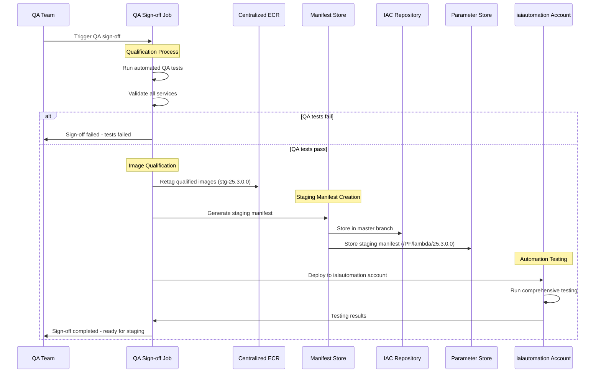
```mermaid
sequenceDiagram
    participant QA as QA Team
    participant Jenkins as QA Sign-off Job
    participant ECR as Centralized ECR
    participant Manifest as Manifest Store
    participant IAC as IAC Repository
    participant PS as Parameter Store
    participant Auto as iaiautomation Account
    
    QA->>Jenkins: Trigger QA sign-off
    
    Note over Jenkins: Qualification Process
    Jenkins->>Jenkins: Run automated QA tests
    Jenkins->>Jenkins: Validate all services
    
    alt QA tests fail
        Jenkins->>QA: Sign-off failed - tests failed
    else QA tests pass
        Note over Jenkins: Image Qualification
        Jenkins->>ECR: Retag qualified images (stg-25.3.0.0)
        
        Note over Manifest: Staging Manifest Creation
        Jenkins->>Manifest: Generate staging manifest
        Manifest->>IAC: Store in master branch
        Manifest->>PS: Store staging manifest (/PF/lambda/25.3.0.0)
        
        Note over Auto: Automation Testing
        Jenkins->>Auto: Deploy to iaiautomation account
        Auto->>Auto: Run comprehensive testing
        Auto->>Jenkins: Testing results
        
        Jenkins->>QA: Sign-off completed - ready for staging
    end
```

### 4. Production Deployment Flow

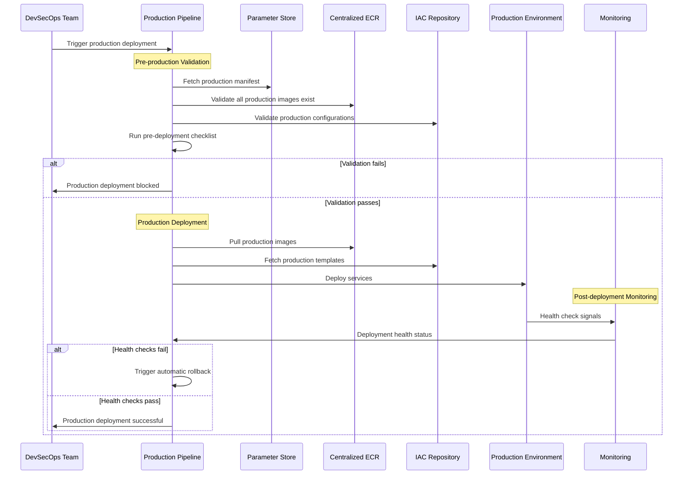
```mermaid
sequenceDiagram
    participant DevSecOps as DevSecOps Team
    participant Jenkins as Production Pipeline
    participant PS as Parameter Store
    participant ECR as Centralized ECR
    participant IAC as IAC Repository
    participant Prod as Production Environment
    participant Monitor as Monitoring
    
    DevSecOps->>Jenkins: Trigger production deployment
    
    Note over Jenkins: Pre-production Validation
    Jenkins->>PS: Fetch production manifest
    Jenkins->>ECR: Validate all production images exist
    Jenkins->>IAC: Validate production configurations
    Jenkins->>Jenkins: Run pre-deployment checklist
    
    alt Validation fails
        Jenkins->>DevSecOps: Production deployment blocked
    else Validation passes
        Note over Jenkins: Production Deployment
        Jenkins->>ECR: Pull production images
        Jenkins->>IAC: Fetch production templates
        Jenkins->>Prod: Deploy services
        
        Note over Monitor: Post-deployment Monitoring
        Prod->>Monitor: Health check signals
        Monitor->>Jenkins: Deployment health status
        
        alt Health checks fail
            Jenkins->>Jenkins: Trigger automatic rollback
        else Health checks pass
            Jenkins->>DevSecOps: Production deployment successful
        end
    end
```

---

## Lambda Deployment Sequences

### 1. SAM-Based Lambda Deployment

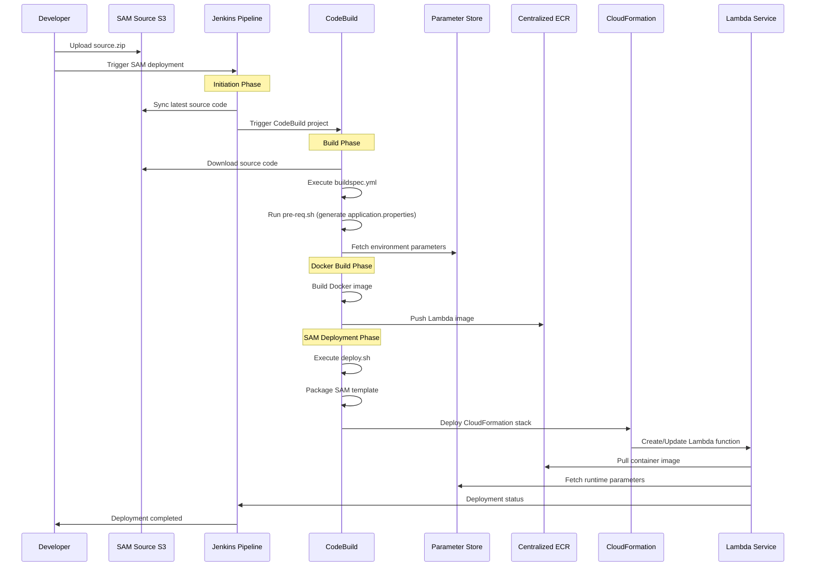
```mermaid
sequenceDiagram
    participant Dev as Developer
    participant S3 as SAM Source S3
    participant Jenkins as Jenkins Pipeline
    participant CB as CodeBuild
    participant PS as Parameter Store
    participant ECR as Centralized ECR
    participant CF as CloudFormation
    participant Lambda as Lambda Service
    
    Dev->>S3: Upload source.zip
    Dev->>Jenkins: Trigger SAM deployment
    
    Note over Jenkins: Initiation Phase
    Jenkins->>S3: Sync latest source code
    Jenkins->>CB: Trigger CodeBuild project
    
    Note over CB: Build Phase
    CB->>S3: Download source code
    CB->>CB: Execute buildspec.yml
    CB->>CB: Run pre-req.sh (generate application.properties)
    CB->>PS: Fetch environment parameters
    
    Note over CB: Docker Build Phase
    CB->>CB: Build Docker image
    CB->>ECR: Push Lambda image
    
    Note over CB: SAM Deployment Phase
    CB->>CB: Execute deploy.sh
    CB->>CB: Package SAM template
    CB->>CF: Deploy CloudFormation stack
    CF->>Lambda: Create/Update Lambda function
    
    Lambda->>ECR: Pull container image
    Lambda->>PS: Fetch runtime parameters
    Lambda->>Jenkins: Deployment status
    Jenkins->>Dev: Deployment completed
```

### 2. Cross-Account Lambda Deployment

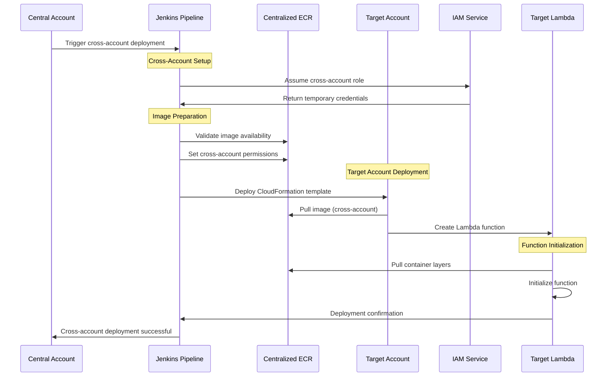
```mermaid
sequenceDiagram
    participant Central as Central Account
    participant Jenkins as Jenkins Pipeline
    participant ECR as Centralized ECR
    participant Target as Target Account
    participant IAM as IAM Service
    participant Lambda as Target Lambda
    
    Central->>Jenkins: Trigger cross-account deployment
    
    Note over Jenkins: Cross-Account Setup
    Jenkins->>IAM: Assume cross-account role
    IAM->>Jenkins: Return temporary credentials
    
    Note over Jenkins: Image Preparation
    Jenkins->>ECR: Validate image availability
    Jenkins->>ECR: Set cross-account permissions
    
    Note over Target: Target Account Deployment
    Jenkins->>Target: Deploy CloudFormation template
    Target->>ECR: Pull image (cross-account)
    Target->>Lambda: Create Lambda function
    
    Note over Lambda: Function Initialization
    Lambda->>ECR: Pull container layers
    Lambda->>Lambda: Initialize function
    Lambda->>Jenkins: Deployment confirmation
    
    Jenkins->>Central: Cross-account deployment successful
```

---

## Kubernetes Deployment Flows

### 1. Helm-Based Kubernetes Deployment

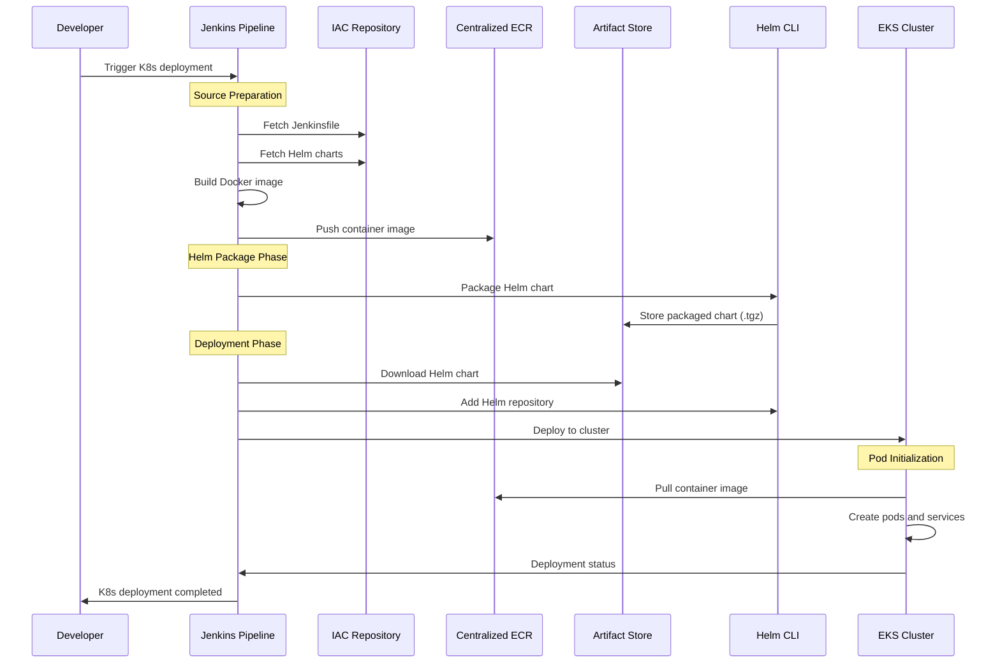
```mermaid
sequenceDiagram
    participant Dev as Developer
    participant Jenkins as Jenkins Pipeline
    participant IAC as IAC Repository
    participant ECR as Centralized ECR
    participant S3 as Artifact Store
    participant Helm as Helm CLI
    participant EKS as EKS Cluster
    
    Dev->>Jenkins: Trigger K8s deployment
    
    Note over Jenkins: Source Preparation
    Jenkins->>IAC: Fetch Jenkinsfile
    Jenkins->>IAC: Fetch Helm charts
    Jenkins->>Jenkins: Build Docker image
    Jenkins->>ECR: Push container image
    
    Note over Jenkins: Helm Package Phase
    Jenkins->>Helm: Package Helm chart
    Helm->>S3: Store packaged chart (.tgz)
    
    Note over Jenkins: Deployment Phase
    Jenkins->>S3: Download Helm chart
    Jenkins->>Helm: Add Helm repository
    Jenkins->>EKS: Deploy to cluster
    
    Note over EKS: Pod Initialization
    EKS->>ECR: Pull container image
    EKS->>EKS: Create pods and services
    EKS->>Jenkins: Deployment status
    
    Jenkins->>Dev: K8s deployment completed
```

### 2. CodeArtifact-Based Helm Deployment

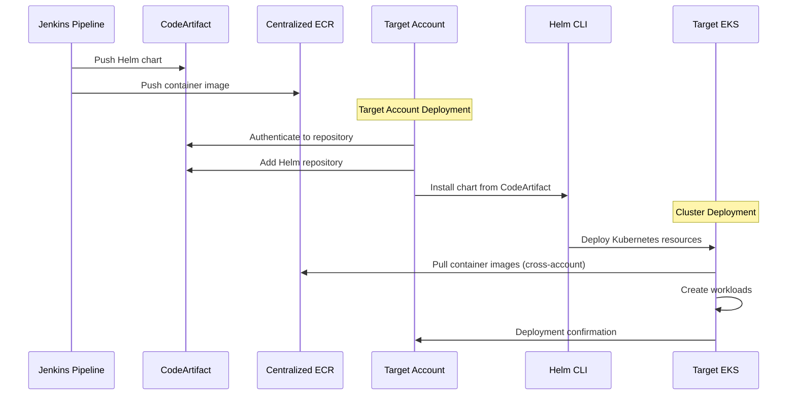
```mermaid
sequenceDiagram
    participant Jenkins as Jenkins Pipeline
    participant CodeArt as CodeArtifact
    participant ECR as Centralized ECR
    participant Target as Target Account
    participant Helm as Helm CLI
    participant EKS as Target EKS
    
    Jenkins->>CodeArt: Push Helm chart
    Jenkins->>ECR: Push container image
    
    Note over Target: Target Account Deployment
    Target->>CodeArt: Authenticate to repository
    Target->>CodeArt: Add Helm repository
    Target->>Helm: Install chart from CodeArtifact
    
    Note over EKS: Cluster Deployment
    Helm->>EKS: Deploy Kubernetes resources
    EKS->>ECR: Pull container images (cross-account)
    EKS->>EKS: Create workloads
    EKS->>Target: Deployment confirmation
```

---

## Cross-Account ECR Flows

### 1. ECR Cross-Account Access Setup

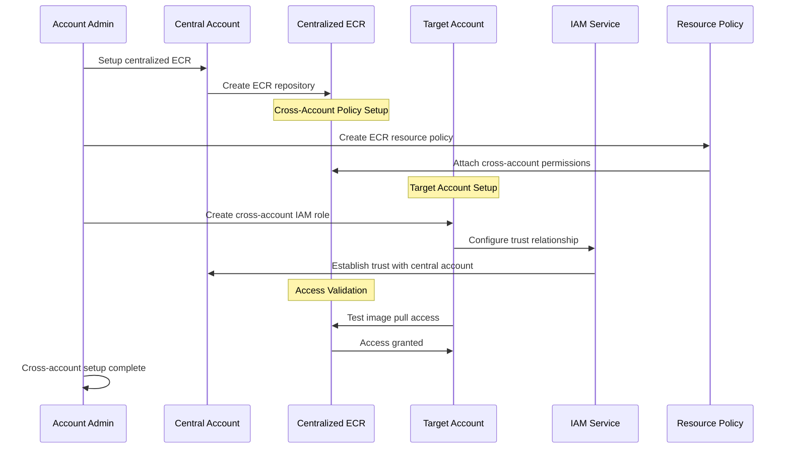
```mermaid
sequenceDiagram
    participant Admin as Account Admin
    participant Central as Central Account
    participant ECR as Centralized ECR
    participant Target as Target Account
    participant IAM as IAM Service
    participant Policy as Resource Policy
    
    Admin->>Central: Setup centralized ECR
    Central->>ECR: Create ECR repository
    
    Note over ECR: Cross-Account Policy Setup
    Admin->>Policy: Create ECR resource policy
    Policy->>ECR: Attach cross-account permissions
    
    Note over Target: Target Account Setup
    Admin->>Target: Create cross-account IAM role
    Target->>IAM: Configure trust relationship
    IAM->>Central: Establish trust with central account
    
    Note over ECR: Access Validation
    Target->>ECR: Test image pull access
    ECR->>Target: Access granted
    Admin->>Admin: Cross-account setup complete
```

### 2. Image Promotion Across Accounts

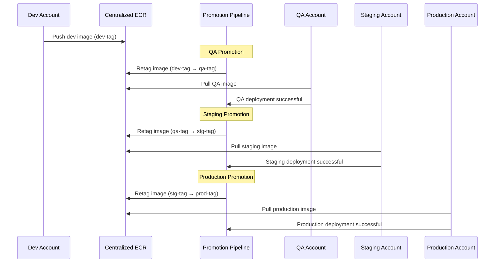
```mermaid
sequenceDiagram
    participant Dev as Dev Account
    participant ECR as Centralized ECR
    participant Jenkins as Promotion Pipeline
    participant QA as QA Account
    participant Staging as Staging Account
    participant Prod as Production Account
    
    Dev->>ECR: Push dev image (dev-tag)
    
    Note over Jenkins: QA Promotion
    Jenkins->>ECR: Retag image (dev-tag → qa-tag)
    QA->>ECR: Pull QA image
    QA->>Jenkins: QA deployment successful
    
    Note over Jenkins: Staging Promotion
    Jenkins->>ECR: Retag image (qa-tag → stg-tag)
    Staging->>ECR: Pull staging image
    Staging->>Jenkins: Staging deployment successful
    
    Note over Jenkins: Production Promotion
    Jenkins->>ECR: Retag image (stg-tag → prod-tag)
    Prod->>ECR: Pull production image
    Prod->>Jenkins: Production deployment successful
```

---

## DevSecOps Process Flows

### 1. Lambda Service Onboarding Flow

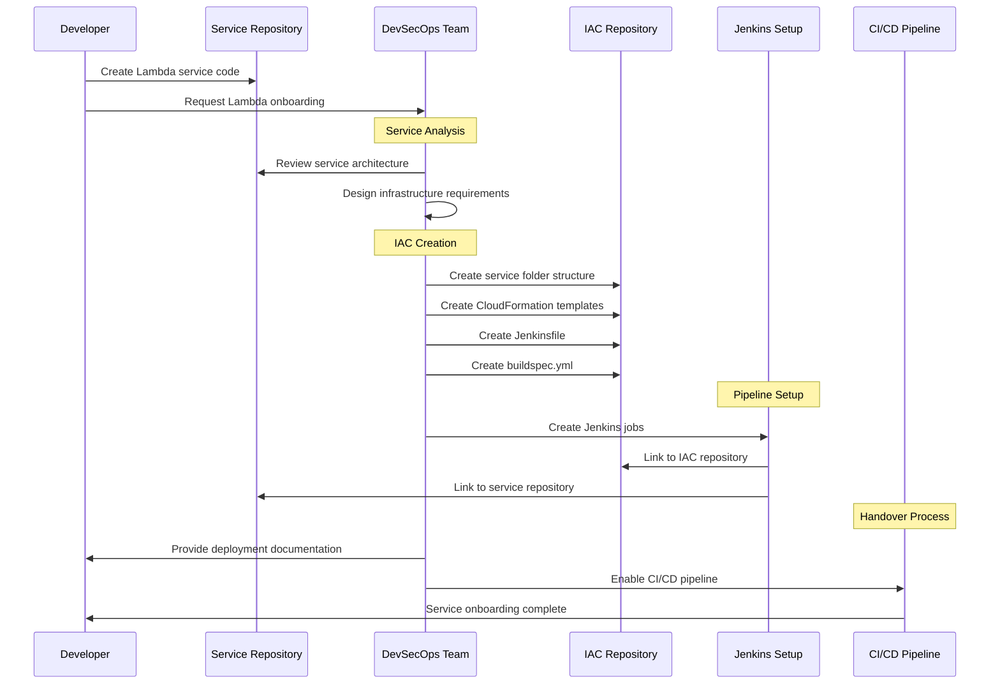
```mermaid
sequenceDiagram
    participant Dev as Developer
    participant ServiceRepo as Service Repository
    participant DevSecOps as DevSecOps Team
    participant IACRepo as IAC Repository
    participant Jenkins as Jenkins Setup
    participant Pipeline as CI/CD Pipeline
    
    Dev->>ServiceRepo: Create Lambda service code
    Dev->>DevSecOps: Request Lambda onboarding
    
    Note over DevSecOps: Service Analysis
    DevSecOps->>ServiceRepo: Review service architecture
    DevSecOps->>DevSecOps: Design infrastructure requirements
    
    Note over DevSecOps: IAC Creation
    DevSecOps->>IACRepo: Create service folder structure
    DevSecOps->>IACRepo: Create CloudFormation templates
    DevSecOps->>IACRepo: Create Jenkinsfile
    DevSecOps->>IACRepo: Create buildspec.yml
    
    Note over Jenkins: Pipeline Setup
    DevSecOps->>Jenkins: Create Jenkins jobs
    Jenkins->>IACRepo: Link to IAC repository
    Jenkins->>ServiceRepo: Link to service repository
    
    Note over Pipeline: Handover Process
    DevSecOps->>Dev: Provide deployment documentation
    DevSecOps->>Pipeline: Enable CI/CD pipeline
    Pipeline->>Dev: Service onboarding complete
```

### 2. Kubernetes Service Onboarding Flow

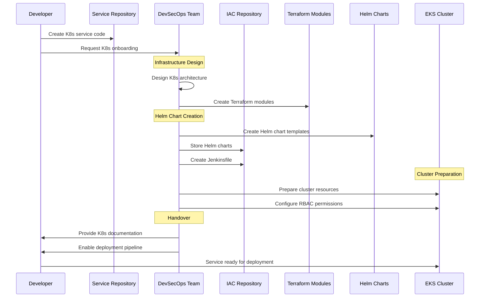
```mermaid
sequenceDiagram
    participant Dev as Developer
    participant ServiceRepo as Service Repository
    participant DevSecOps as DevSecOps Team
    participant IACRepo as IAC Repository
    participant Terraform as Terraform Modules
    participant Helm as Helm Charts
    participant EKS as EKS Cluster
    
    Dev->>ServiceRepo: Create K8s service code
    Dev->>DevSecOps: Request K8s onboarding
    
    Note over DevSecOps: Infrastructure Design
    DevSecOps->>DevSecOps: Design K8s architecture
    DevSecOps->>Terraform: Create Terraform modules
    
    Note over DevSecOps: Helm Chart Creation
    DevSecOps->>Helm: Create Helm chart templates
    DevSecOps->>IACRepo: Store Helm charts
    DevSecOps->>IACRepo: Create Jenkinsfile
    
    Note over EKS: Cluster Preparation
    DevSecOps->>EKS: Prepare cluster resources
    DevSecOps->>EKS: Configure RBAC permissions
    
    Note over DevSecOps: Handover
    DevSecOps->>Dev: Provide K8s documentation
    DevSecOps->>Dev: Enable deployment pipeline
    Dev->>EKS: Service ready for deployment
```

---

## Governance and Approval Flows

### 1. MAP Ticket Workflow

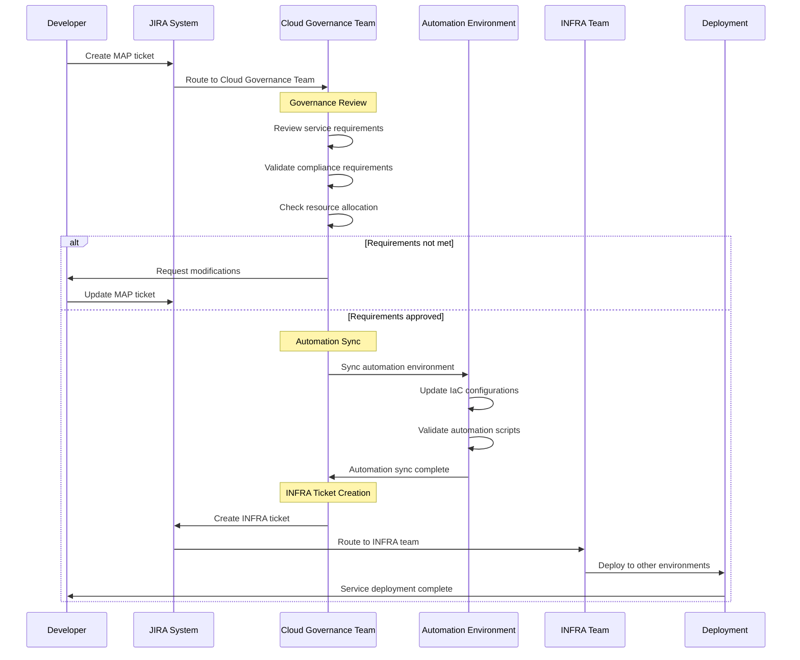
```mermaid
sequenceDiagram
    participant Dev as Developer
    participant JIRA as JIRA System
    participant CloudGov as Cloud Governance Team
    participant Auto as Automation Environment
    participant INFRA as INFRA Team
    participant Deploy as Deployment
    
    Dev->>JIRA: Create MAP ticket
    JIRA->>CloudGov: Route to Cloud Governance Team
    
    Note over CloudGov: Governance Review
    CloudGov->>CloudGov: Review service requirements
    CloudGov->>CloudGov: Validate compliance requirements
    CloudGov->>CloudGov: Check resource allocation
    
    alt Requirements not met
        CloudGov->>Dev: Request modifications
        Dev->>JIRA: Update MAP ticket
    else Requirements approved
        Note over CloudGov: Automation Sync
        CloudGov->>Auto: Sync automation environment
        Auto->>Auto: Update IaC configurations
        Auto->>Auto: Validate automation scripts
        Auto->>CloudGov: Automation sync complete
        
        Note over CloudGov: INFRA Ticket Creation
        CloudGov->>JIRA: Create INFRA ticket
        JIRA->>INFRA: Route to INFRA team
        INFRA->>Deploy: Deploy to other environments
        Deploy->>Dev: Service deployment complete
    end
```

### 2. Service Request Approval Flow

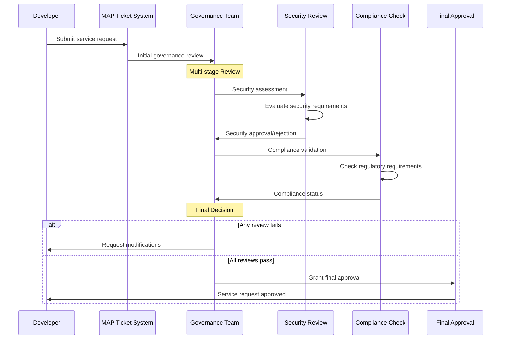
```mermaid
sequenceDiagram
    participant Dev as Developer
    participant MAP as MAP Ticket System
    participant Gov as Governance Team
    participant Security as Security Review
    participant Compliance as Compliance Check
    participant Approval as Final Approval
    
    Dev->>MAP: Submit service request
    MAP->>Gov: Initial governance review
    
    Note over Gov: Multi-stage Review
    Gov->>Security: Security assessment
    Security->>Security: Evaluate security requirements
    Security->>Gov: Security approval/rejection
    
    Gov->>Compliance: Compliance validation
    Compliance->>Compliance: Check regulatory requirements
    Compliance->>Gov: Compliance status
    
    Note over Gov: Final Decision
    alt Any review fails
        Gov->>Dev: Request modifications
    else All reviews pass
        Gov->>Approval: Grant final approval
        Approval->>Dev: Service request approved
    end
```

---

## Error Handling and Rollback Flows

### 1. Deployment Failure and Rollback

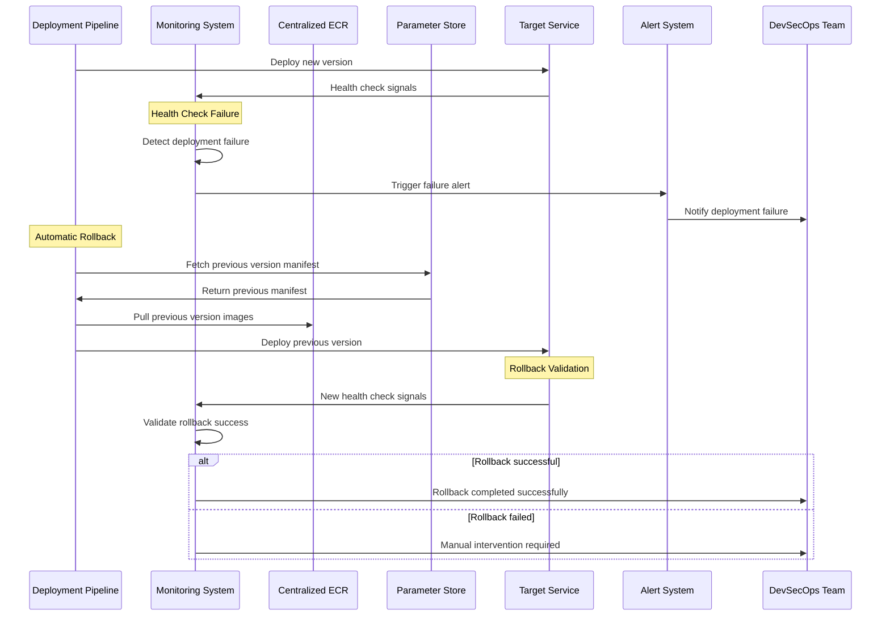
```mermaid
sequenceDiagram
    participant Pipeline as Deployment Pipeline
    participant Monitor as Monitoring System
    participant ECR as Centralized ECR
    participant PS as Parameter Store
    participant Service as Target Service
    participant Alert as Alert System
    participant Team as DevSecOps Team
    
    Pipeline->>Service: Deploy new version
    Service->>Monitor: Health check signals
    
    Note over Monitor: Health Check Failure
    Monitor->>Monitor: Detect deployment failure
    Monitor->>Alert: Trigger failure alert
    Alert->>Team: Notify deployment failure
    
    Note over Pipeline: Automatic Rollback
    Pipeline->>PS: Fetch previous version manifest
    PS->>Pipeline: Return previous manifest
    Pipeline->>ECR: Pull previous version images
    Pipeline->>Service: Deploy previous version
    
    Note over Service: Rollback Validation
    Service->>Monitor: New health check signals
    Monitor->>Monitor: Validate rollback success
    
    alt Rollback successful
        Monitor->>Team: Rollback completed successfully
    else Rollback failed
        Monitor->>Team: Manual intervention required
    end
```

### 2. Cross-Account Access Failure Recovery

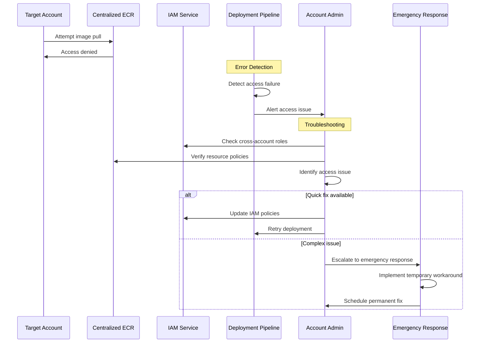
```mermaid
sequenceDiagram
    participant Target as Target Account
    participant ECR as Centralized ECR
    participant IAM as IAM Service
    participant Pipeline as Deployment Pipeline
    participant Admin as Account Admin
    participant Emergency as Emergency Response
    
    Target->>ECR: Attempt image pull
    ECR->>Target: Access denied
    
    Note over Pipeline: Error Detection
    Pipeline->>Pipeline: Detect access failure
    Pipeline->>Admin: Alert access issue
    
    Note over Admin: Troubleshooting
    Admin->>IAM: Check cross-account roles
    Admin->>ECR: Verify resource policies
    Admin->>Admin: Identify access issue
    
    alt Quick fix available
        Admin->>IAM: Update IAM policies
        Admin->>Pipeline: Retry deployment
    else Complex issue
        Admin->>Emergency: Escalate to emergency response
        Emergency->>Emergency: Implement temporary workaround
        Emergency->>Admin: Schedule permanent fix
    end
```

---

## Integration and Third-Party Flows

### 1. MongoDB Atlas Integration Flow

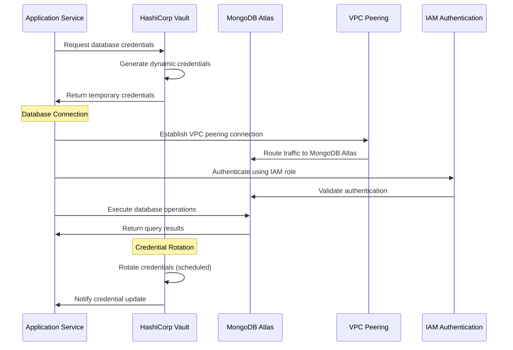
```mermaid
sequenceDiagram
    participant Service as Application Service
    participant Vault as HashiCorp Vault
    participant Atlas as MongoDB Atlas
    participant VPC as VPC Peering
    participant IAM as IAM Authentication
    
    Service->>Vault: Request database credentials
    Vault->>Vault: Generate dynamic credentials
    Vault->>Service: Return temporary credentials
    
    Note over Service: Database Connection
    Service->>VPC: Establish VPC peering connection
    VPC->>Atlas: Route traffic to MongoDB Atlas
    Service->>IAM: Authenticate using IAM role
    IAM->>Atlas: Validate authentication
    
    Service->>Atlas: Execute database operations
    Atlas->>Service: Return query results
    
    Note over Vault: Credential Rotation
    Vault->>Vault: Rotate credentials (scheduled)
    Vault->>Service: Notify credential update
```

### 2. HashiCorp Vault Secret Management

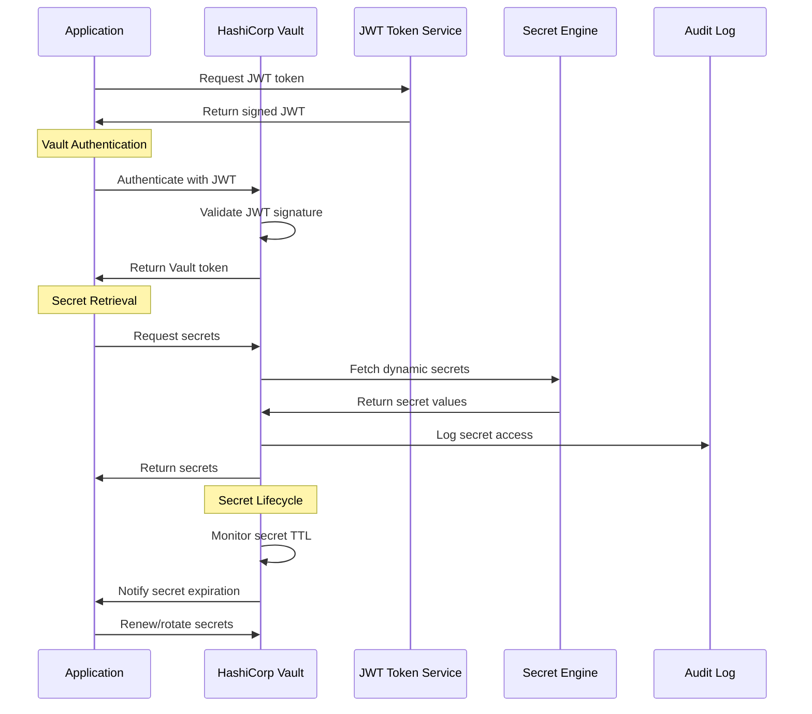
```mermaid
sequenceDiagram
    participant App as Application
    participant Vault as HashiCorp Vault
    participant JWT as JWT Token Service
    participant Secret as Secret Engine
    participant Audit as Audit Log
    
    App->>JWT: Request JWT token
    JWT->>App: Return signed JWT
    
    Note over App: Vault Authentication
    App->>Vault: Authenticate with JWT
    Vault->>Vault: Validate JWT signature
    Vault->>App: Return Vault token
    
    Note over App: Secret Retrieval
    App->>Vault: Request secrets
    Vault->>Secret: Fetch dynamic secrets
    Secret->>Vault: Return secret values
    Vault->>Audit: Log secret access
    Vault->>App: Return secrets
    
    Note over Vault: Secret Lifecycle
    Vault->>Vault: Monitor secret TTL
    Vault->>App: Notify secret expiration
    App->>Vault: Renew/rotate secrets
```

### 3. Customer Account Deployment Flow

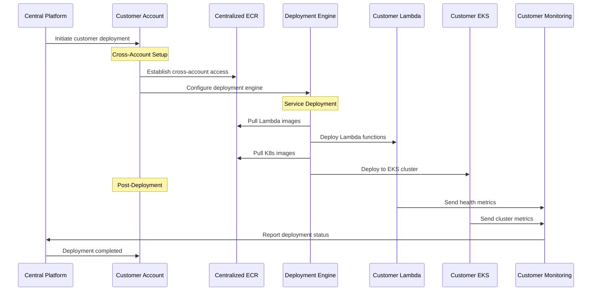
```mermaid
sequenceDiagram
    participant Central as Central Platform
    participant Customer as Customer Account
    participant ECR as Centralized ECR
    participant Deploy as Deployment Engine
    participant Lambda as Customer Lambda
    participant EKS as Customer EKS
    participant Monitor as Customer Monitoring
    
    Central->>Customer: Initiate customer deployment
    
    Note over Customer: Cross-Account Setup
    Customer->>ECR: Establish cross-account access
    Customer->>Deploy: Configure deployment engine
    
    Note over Deploy: Service Deployment
    Deploy->>ECR: Pull Lambda images
    Deploy->>Lambda: Deploy Lambda functions
    Deploy->>ECR: Pull K8s images
    Deploy->>EKS: Deploy to EKS cluster
    
    Note over Customer: Post-Deployment
    Lambda->>Monitor: Send health metrics
    EKS->>Monitor: Send cluster metrics
    Monitor->>Central: Report deployment status
    Central->>Customer: Deployment completed
```

---

## Summary

This comprehensive sequence diagram document covers all major deployment and process flows across the entire platform:

### Key Flow Categories:

1. **Manifest-Driven Flows**: Core deployment orchestration using version-specific manifests
2. **Lambda Deployments**: SAM-based and cross-account Lambda deployment patterns
3. **Kubernetes Deployments**: Helm-based deployment strategies with artifact management
4. **Cross-Account ECR**: Image promotion and cross-account access patterns
5. **DevSecOps Processes**: Service onboarding and infrastructure management
6. **Governance Flows**: MAP ticket workflow and approval processes
7. **Error Handling**: Failure detection, rollback, and recovery procedures
8. **Third-Party Integration**: External service connectivity and secret management

### Usage Guidelines:

- **Development Teams**: Reference deployment flows for implementation
- **DevSecOps Teams**: Use for process standardization and automation
- **Operations Teams**: Follow for troubleshooting and incident response
- **Architecture Teams**: Validate design decisions and integration patterns

These sequence diagrams serve as the definitive reference for understanding the complete end-to-end flows across the centralized ECR and manifest-driven deployment platform.

---

**Document Maintenance**
- **Review Frequency**: Monthly
- **Update Trigger**: Process changes or new integrations
- **Approval Required**: DevSecOps Architecture Team
- **Distribution**: All technical stakeholders
